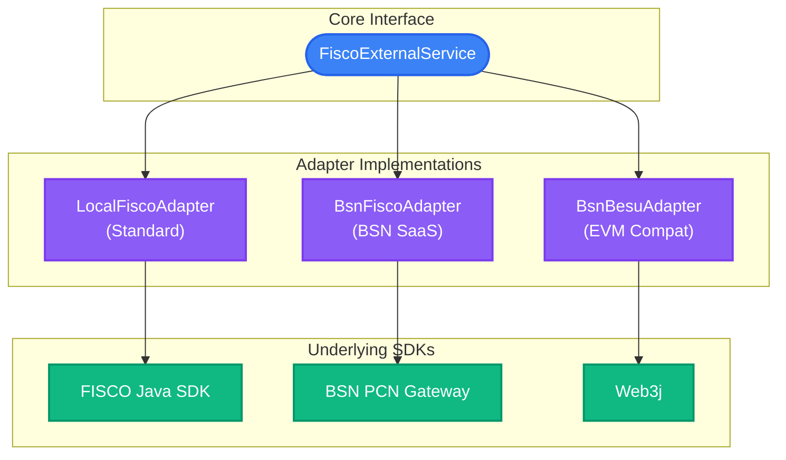
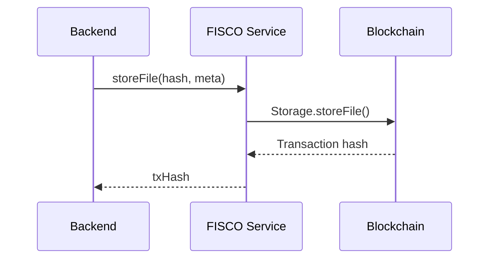

# Blockchain Integration

RecordPlatform uses FISCO BCOS blockchain for immutable file attestation.

## Smart Contracts

### Storage.sol

Stores and manages file metadata on-chain.

| Method       | Parameters         | Description            |
| ------------ | ------------------ | ---------------------- |
| `storeFile`  | fileHash, metadata | Store file attestation |
| `getFile`    | fileHash           | Query file metadata    |
| `deleteFile` | fileHash           | Mark file as deleted   |
| `exists`     | fileHash           | Check if file exists   |

### Sharing.sol

Manages file sharing with access control.

| Method              | Parameters                            | Description                         |
| ------------------- | ------------------------------------- | ----------------------------------- |
| `shareFiles`        | uploader, fileHashes[], expireMinutes | Create share, returns 6-char code   |
| `getSharedFiles`    | shareCode                             | Get shared files (validates expiry) |
| `cancelShare`       | shareCode                             | Cancel share (isValid=false)        |
| `getUserShareCodes` | uploader                              | Get all share codes for user        |
| `getShareInfo`      | shareCode                             | Get share details (no validation)   |

### Contract Events

| Event            | Parameters                                    | Trigger         |
| ---------------- | --------------------------------------------- | --------------- |
| `FileShared`     | shareCode, uploader, fileHashes[], expireTime | Share created   |
| `ShareCancelled` | shareCode, uploader                           | Share cancelled |

## Multi-Chain Adapters

RecordPlatform supports multiple blockchain networks through an adapter pattern.

### Supported Chains

| Chain            | Config Value  | Description                      |
| ---------------- | ------------- | -------------------------------- |
| Local FISCO      | `local-fisco` | Local FISCO BCOS node (default)  |
| BSN FISCO        | `bsn-fisco`   | Blockchain Service Network FISCO |
| Hyperledger Besu | `bsn-besu`    | EVM-compatible Besu network      |

### Configuration

```yaml
blockchain:
  active: ${BLOCKCHAIN_ACTIVE:local-fisco}

  local-fisco:
    peer-address: ${FISCO_PEER_ADDRESS:127.0.0.1:20200}
    storage-contract: ${FISCO_STORAGE_CONTRACT}
    sharing-contract: ${FISCO_SHARING_CONTRACT}

  bsn-fisco:
    node-id: <bsn-node-id>
    peers:
      - <peer-address>

  bsn-besu:
    rpc-url: https://<besu-rpc>
    chain-id: <chain-id>
```

### Adapter Architecture



### BlockChainAdapter Interface

All adapters implement the `BlockChainAdapter` interface:

```java
public interface BlockChainAdapter {
    // File operations
    Result<StoreFileResponse> storeFile(StoreFileRequest request);
    Result<List<FileVO>> getUserFiles(String uploader);
    Result<FileDetailVO> getFile(String uploader, String fileHash);
    Result<Boolean> deleteFiles(DeleteFilesRequest request);
    
    // Sharing operations
    Result<String> shareFiles(ShareFilesRequest request);
    Result<SharingVO> getSharedFiles(String shareCode);
    Result<Boolean> cancelShare(CancelShareRequest request);
    
    // Chain status
    Result<ChainStatusVO> getCurrentBlockChainMessage();
    Result<TransactionVO> getTransactionByHash(String txHash);
}
```

### Adapter Selection

Adapter selection is controlled by the `blockchain.active` configuration:

```java
@Configuration
public class BlockChainConfig {
    @Bean
    @ConditionalOnProperty(name = "blockchain.active", havingValue = "local-fisco")
    public BlockChainAdapter localFiscoAdapter() { ... }
    
    @Bean
    @ConditionalOnProperty(name = "blockchain.active", havingValue = "bsn-fisco")
    public BlockChainAdapter bsnFiscoAdapter() { ... }
    
    @Bean
    @ConditionalOnProperty(name = "blockchain.active", havingValue = "bsn-besu")
    public BlockChainAdapter bsnBesuAdapter() { ... }
}
```

## Certificate Management

### FISCO BCOS Certificates

Place certificates in `platform-fisco/src/main/resources/conf/`:

```txt
conf/
├── ca.crt        # CA certificate
├── sdk.crt       # SDK certificate
└── sdk.key       # SDK private key
```

### BSN Configuration

BSN networks require additional authentication:

- Node ID from BSN portal
- API key/secret for BSN gateway

## Transaction Flow

### File Attestation



### Transaction Verification

Query blockchain for attestation proof:

```java
// Get transaction by hash
TransactionReceipt receipt = fiscoService.getTransactionByHash(txHash);

// Verify file exists on-chain
boolean exists = fiscoService.fileExists(fileHash);
```

## Resilience

### Circuit Breaker

```yaml
resilience4j:
  circuitbreaker:
    instances:
      blockChainService:
        sliding-window-size: 50
        failure-rate-threshold: 50
        wait-duration-in-open-state: 30s
```

### Retry Policy

```yaml
resilience4j:
  retry:
    instances:
      blockChainService:
        max-attempts: 3
        wait-duration: 2s
        exponential-backoff-multiplier: 2
```

### Fallback Behavior

When blockchain service is unavailable:

1. Saga marks step as CHAIN_STORING
2. File storage continues (degraded mode)
3. Background job retries attestation
4. User notified when attestation succeeds

## Gas and Performance

### Optimization Tips

- Batch multiple files in single share transaction
- Use events for state queries (cheaper than storage reads)
- Cache frequently accessed on-chain data in Redis

### Typical Gas Costs

| Operation            | Approximate Gas |
| -------------------- | --------------- |
| storeFile            | ~50,000         |
| shareFiles (5 files) | ~100,000        |
| cancelShare          | ~30,000         |
