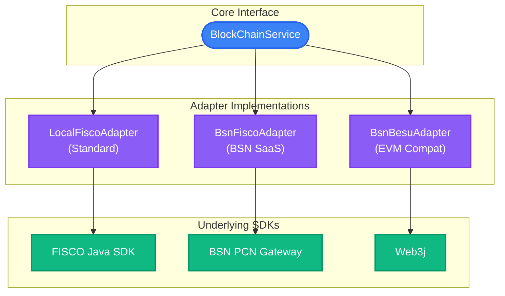
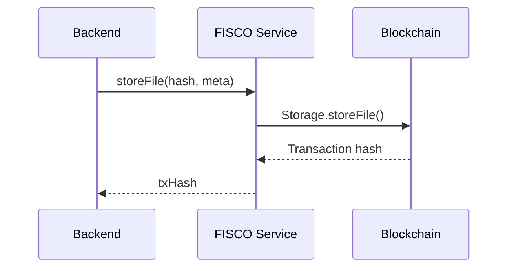

# Blockchain Integration

RecordPlatform uses FISCO BCOS blockchain for immutable file attestation.

## Smart Contracts

### Storage.sol

Stores and manages file metadata on-chain.

| Method       | Parameters         | Description            |
| ------------ | ------------------ | ---------------------- |
| `storeFile`  | fileHash, metadata | Store file attestation |
| `getFile`    | fileHash           | Query file metadata    |
| `deleteFile` | fileHash           | Mark file as deleted   |
| `exists`     | fileHash           | Check if file exists   |

### Sharing.sol

Manages file sharing with access control.

| Method              | Parameters                            | Description                         |
| ------------------- | ------------------------------------- | ----------------------------------- |
| `shareFiles`        | uploader, fileHashes[], expireMinutes | Create share, returns 6-char code   |
| `getSharedFiles`    | shareCode                             | Get shared files (validates expiry) |
| `cancelShare`       | shareCode                             | Cancel share (isValid=false)        |
| `getUserShareCodes` | uploader                              | Get all share codes for user        |
| `getShareInfo`      | shareCode                             | Get share details (no validation)   |

### Contract Events

| Event            | Parameters                                    | Trigger         |
| ---------------- | --------------------------------------------- | --------------- |
| `FileShared`     | shareCode, uploader, fileHashes[], expireTime | Share created   |
| `ShareCancelled` | shareCode, uploader                           | Share cancelled |

## Multi-Chain Adapters

RecordPlatform supports multiple blockchain networks through an adapter pattern.

### Supported Chains

| Chain            | Config Value  | Description                      |
| ---------------- | ------------- | -------------------------------- |
| Local FISCO      | `local-fisco` | Local FISCO BCOS node (default)  |
| BSN FISCO        | `bsn-fisco`   | Blockchain Service Network FISCO |
| Hyperledger Besu | `bsn-besu`    | EVM-compatible Besu network      |

### Configuration

```yaml
blockchain:
  active: ${BLOCKCHAIN_ACTIVE:local-fisco}

  # BSN FISCO BCOS (active=bsn-fisco)
  bsn-fisco:
    node-id: <bsn-node-id>
    chain-id: ${BSN_FISCO_CHAIN_ID:} # required when active=bsn-fisco
    peers:
      - <peer-address>

  # Hyperledger Besu (active=bsn-besu)
  bsn-besu:
    rpc-url: https://<besu-rpc>
    chain-id: <chain-id>

# Local FISCO BCOS (Java SDK)
bcos:
  network:
    peers[0]: ${FISCO_PEER_ADDRESS:127.0.0.1:20200}

system:
  chainId: ${FISCO_CHAIN_ID:chain0}
  groupId: ${FISCO_GROUP_ID:group0}

# Contract addresses (used by local-fisco and bsn)
contract:
  storageAddress: ${FISCO_STORAGE_CONTRACT:}
  sharingAddress: ${FISCO_SHARING_CONTRACT:}

contract-registry:
  catalog-location: classpath:contract-registry/artifacts.json
  deployment:
    sharing:
      transaction-hash: ${FISCO_SHARING_DEPLOYMENT_TX:}
      block-number: ${FISCO_SHARING_DEPLOYMENT_BLOCK:}
      effective-at: ${FISCO_SHARING_DEPLOYMENT_EFFECTIVE_AT:}
    storage:
      transaction-hash: ${FISCO_STORAGE_DEPLOYMENT_TX:}
      block-number: ${FISCO_STORAGE_DEPLOYMENT_BLOCK:}
      effective-at: ${FISCO_STORAGE_DEPLOYMENT_EFFECTIVE_AT:}
```

## Contract Registry and Artifact Fingerprints

`platform-fisco/src/main/resources/contract-registry/artifacts.json` is the version-controlled source of truth for the `Sharing` and `Storage` build artifacts. Each entry records its semantic version, lifecycle status, effective time, upgrade strategy, both Solidity source copies, canonical ABI fingerprint, and ECC/SM creation-bytecode fingerprints.

The supported lifecycle states are:

| Status | New chain writes | Historical evidence |
| ------ | ---------------- | ------------------- |
| `ACTIVE` | Allowed when exactly one entry exists for each required contract | Preserved in the batch snapshot |
| `DEPRECATED` | Not selected for new writes | Catalog entry and existing proof snapshots must be retained |
| `REVOKED` | Rejected | A proof snapshot carrying this status is rejected by export and verification |

The ABI algorithm is `ABI-CANONICAL-JSON-SHA256-V1`. It removes `internalType`, sorts object keys and top-level ABI entries, preserves parameter/component array order, emits compact UTF-8 JSON, and hashes those bytes with SHA-256. Bytecode uses `EVM-BYTECODE-SHA256-V1`, which decodes optional `0x`-prefixed hexadecimal before hashing. Creation bytecode and on-chain runtime code are recorded separately because they are different EVM artifacts and must not be compared as if they were identical.

At startup, `ContractRegistryService` fails closed unless all of the following hold:

1. the catalog schema and all signed source/ABI/ECC/SM fingerprints are valid;
2. exactly one `ACTIVE` artifact exists for both `Sharing` and `Storage`;
3. the active adapter's actual chain ID and FISCO group match configuration;
4. the selected address is a non-zero 20-byte address in the active chain's own configuration namespace;
5. the node returns non-empty runtime code and `contractIdentity()` exactly matches the selected catalog name/version; and
6. deployment transaction hash, block number, and actual activation time are either all present or all absent.

The resulting `record-platform-contract-registry-entry.v1` fingerprint binds chain type/ID/group, address, semantic version, ABI and creation-bytecode hashes, observed runtime-code hash, deployment evidence, status, effective time, and upgrade strategy. Catalog `effectiveAt` is the earliest artifact lifecycle time; when a complete deployment triplet exists, its `FISCO_*_DEPLOYMENT_EFFECTIVE_AT` is the actual active-chain time recorded in the runtime entry. `SharingService`, `StorageService`, and the Besu adapter only use the resolved registry address. Registry RPC reads and batch store/query RPCs remain protected by the backend-to-FISCO shared token.

The local FISCO deployment script queries official Console `getGroupInfo` before compilation and requires an exact match with `FISCO_CHAIN_ID`/`FISCO_GROUP_ID`. It fixes compilation to solc `0.8.35`, which must produce artifacts equivalent to the signed ABI/BIN, then checks both deployed addresses through `getCode` and catalog-derived `contractIdentity()`. After successful verification it generates one UTC effective time, atomically publishes a credential-free `record-platform-contract-deployment-receipt.v1` receipt with `chainType=LOCAL_FISCO`, and only then atomically writes both addresses and complete deployment triplets to `.env`. Receipt failure, parsing failure, chain/group mismatch, identity mismatch, or revert prevents activation. Dry-run performs no Console call and writes no receipt or environment file.

Every new attestation batch persists the complete `Sharing` registry entry. The provider checks the same entry before query or write, and retries refuse to cross to a different registry fingerprint. Proof export reads that immutable snapshot instead of current environment variables, so an address or ABI change cannot rewrite historical evidence. Legacy batches whose historical contract identity cannot be reconstructed remain unresolved and are not given fabricated registry metadata.

### Upgrade, Revocation, and Rollback

Contract upgrades use `REDEPLOY_ADDRESS`; proxy behavior is not assumed.

1. Add the reviewed source, ABI, ECC/SM bytecode, semantic version, and fingerprints to the catalog. Retain the previous entry and change it to `DEPRECATED`; never delete an entry referenced by a proof.
2. Run `contract_fingerprint.py verify`, then `scripts/contract-deploy.sh`. The Console must support solc `0.8.35`. The script validates chain/group and compiled artifacts before deployment, verifies runtime code plus exact catalog identity afterwards, publishes the structured deployment receipt, and atomically activates both addresses plus transaction/block/effective-time evidence.
3. Restart `platform-fisco`. New batches bind the new `ACTIVE` entry. An already-claimed batch remains bound to its old fingerprint and moves to manual review rather than silently switching contracts.
4. Use `REVOKED` only for a confirmed security or integrity incident. A status change is a reviewed catalog change; do not edit already-persisted batch snapshots to manufacture a different historical state.

For application rollback, first disable production batch creation, restore the previous reviewed catalog/artifact set, its two addresses, and both complete transaction/block/effective-time triplets as one unit, then restart `platform-fisco`. Retain every deployment receipt, migration `V1.13.0`, and all stored snapshots: dropping columns, deleting old catalog entries/receipts, or rewriting snapshots would destroy audit evidence.

### Adapter Architecture


```mermaid
flowchart TB
    %% Styles %%
    classDef interface fill:#3b82f6,stroke:#2563eb,stroke-width:2px,color:#ffffff
    classDef adapter fill:#8b5cf6,stroke:#7c3aed,stroke-width:2px,color:#ffffff
    classDef sdk fill:#10b981,stroke:#059669,stroke-width:2px,color:#ffffff

    subgraph API["Core Interface"]
        Interface([BlockChainService]):::interface
    end

    subgraph Impls["Adapter Implementations"]
        LocalAdapter["LocalFiscoAdapter<br/>(Standard)"]:::adapter
        BsnAdapter["BsnFiscoAdapter<br/>(BSN SaaS)"]:::adapter
        BesuAdapter["BsnBesuAdapter<br/>(EVM Compat)"]:::adapter
    end

    subgraph SDKs["Underlying SDKs"]
        FiscoSDK["FISCO Java SDK"]:::sdk
        BsnSDK["BSN PCN Gateway"]:::sdk
        Web3j["Web3j"]:::sdk
    end

    Interface --> LocalAdapter
    Interface --> BsnAdapter
    Interface --> BesuAdapter

    LocalAdapter --> FiscoSDK
    BsnAdapter --> BsnSDK
    BesuAdapter --> Web3j
```

### BlockChainAdapter Interface

All adapters implement the `BlockChainAdapter` interface:

```java
public interface BlockChainAdapter {
    // File operations
    Result<StoreFileResponse> storeFile(StoreFileRequest request);
    Result<List<FileVO>> getUserFiles(String uploader);
    Result<FileDetailVO> getFile(String uploader, String fileHash);
    Result<Boolean> deleteFiles(DeleteFilesRequest request);
    
    // Sharing operations
    Result<String> shareFiles(ShareFilesRequest request);
    Result<SharingVO> getSharedFiles(String shareCode);
    Result<Boolean> cancelShare(CancelShareRequest request);
    
    // Chain status
    Result<ChainStatusVO> getCurrentBlockChainMessage();
    Result<TransactionVO> getTransactionByHash(String txHash);
}
```

### Adapter Selection

Adapter selection is controlled by the `blockchain.active` configuration:

```java
@Configuration
public class BlockChainConfig {
    @Bean
    @ConditionalOnProperty(name = "blockchain.active", havingValue = "local-fisco")
    public BlockChainAdapter localFiscoAdapter() { ... }
    
    @Bean
    @ConditionalOnProperty(name = "blockchain.active", havingValue = "bsn-fisco")
    public BlockChainAdapter bsnFiscoAdapter() { ... }
    
    @Bean
    @ConditionalOnProperty(name = "blockchain.active", havingValue = "bsn-besu")
    public BlockChainAdapter bsnBesuAdapter() { ... }
}
```

## Certificate Management

### FISCO BCOS Certificates

Place certificates in `platform-fisco/src/main/resources/conf/`:

```txt
conf/
├── ca.crt        # CA certificate
├── sdk.crt       # SDK certificate
└── sdk.key       # SDK private key
```

### BSN Configuration

BSN networks require additional authentication:

- Node ID from BSN portal
- API key/secret for BSN gateway

## Transaction Flow

### File Attestation


```mermaid
sequenceDiagram
    participant Backend
    participant Fisco as FISCO Service
    participant Chain as Blockchain

    Backend->>Fisco: storeFile(hash, meta)
    Fisco->>Chain: Storage.storeFile()
    Chain-->>Fisco: Transaction hash
    Fisco-->>Backend: txHash
```

### Merkle Batch Foundation

P1 introduces a backend-side Merkle batch foundation for exportable proof metadata:

1. `AttestationBatchService` loads successful file records for the current tenant.
2. `MerkleTreeService` canonicalizes file hashes, calculates one Merkle root, and stores each leaf proof path.
3. `attestation_batch` and `attestation_leaf` persist the batch root, proof algorithm, leaf hash, leaf index, and proof path JSON.
4. `AttestationBatchPersistenceService` creates the batch and leaves in an independent short transaction, then records every submission claim with a lease and attempt audit.
5. Outside any local database transaction, `AttestationBatchService` first reconciles through `getAttestationBatch`; it invokes the dedicated authenticated `storeAttestationBatch` RPC and Sharing contract method only when the business key is absent on-chain.

The batch root chain write is intentionally separate from ordinary file attestation. It does not create `Storage.storeFile` records, so Merkle batch roots are not returned as user file entries by file-listing contract reads.

The chain-write state machine is `CHAIN_PENDING → CHAIN_SUBMITTING → COMPLETED/CHAIN_RETRY/MANUAL_REVIEW`. A stable tenant-scoped idempotency key is generated from the canonical file set. A lease and `claim_token` allow only one effective submitter at a time, and every completion or retry update must still own that token. Transparent RPC retry is deliberately disabled for the non-idempotent batch write.

After a timeout or lost response, the orchestrator queries the Sharing contract by `(tenantId, batchId)` again:

- an exact match confirms `COMPLETED`; query-based recovery may have no transaction hash and records its `confirmation_source`;
- an absent record or temporary query failure is retried after 5, 30, 120, 600, and 3,600 seconds, with at most five automatic attempts;
- a business-key collision with a different root, batch number, algorithm, or leaf count, and retry exhaustion, enter `MANUAL_REVIEW`;
- proof export still rejects every batch not in `COMPLETED`, so an unknown write outcome cannot become a false-success proof.

`attestation_batch_attempt` records the claim number, token, confirmation source, observed transaction/root, error, and final result for audit and manual recovery. Existing rows receive a forward-migrated `legacy:<batch-id>` idempotency key, preserving the existing `COMPLETED` proof contract.

### Production Batch Admission and Flush

Production batch creation is opt-in and disabled by default. It scans the persistent source of truth instead of depending on the earlier `file.stored` outbox event: a candidate is eligible only when the file is `SUCCESS` and exactly one active chunk manifest matches the current file version.

The evidence entering the Merkle tree is the canonical `manifest_hash`. `file.file_hash` remains a legacy single-file chain record identifier and is never substituted for manifest or content evidence. Each production leaf stores `file_version`, `manifest_id`, `evidence_type=MANIFEST_HASH`, `evidence_hash`, and the separate `chain_record_id`. Legacy leaves are forward-migrated as `LEGACY_CHAIN_RECORD_ID`.

`attestation_batch_candidate` provides a durable, tenant-scoped admission ledger:

- `(tenant_id, file_id, file_version)` is unique, so concurrent discovery cannot admit the same file version twice;
- candidates move through `READY → CLAIMED → BATCHED`, or to `DEAD_LETTER` after bounded failures;
- claims use a token, lease, and `FOR UPDATE SKIP LOCKED`; an expired claim can be recovered after a worker restart;
- batch, leaves, and the final `BATCHED` transition commit in one independent transaction;
- only after that transaction commits does the existing chain-write state machine submit or reconcile the batch.

Automatic flush uses size and maximum-wait thresholds. A tenant administrator may force a below-threshold flush, but both paths retain the configured seed, batch-size, and per-run limits. Scheduled execution has a distributed lock, explicitly enumerates tenants, and restores tenant context after each isolated run.

The `proof-bundle.v1.1` JSON exporter remains for compatibility, but still rejects production `MANIFEST_HASH` leaves. That legacy contract models a file digest as Merkle evidence and cannot safely represent manifest evidence, so the backend does not fabricate compatibility through field fallback.

### Proof Bundle Export

The canonical export surface is the signed ZIP pair:

- `GET /api/v1/files/{id}/proof-bundle.zip` exports by external file ID.
- `GET /api/v1/files/attestation-leaves/{leafId}/proof-bundle.zip` exports by external attestation leaf ID.

The two routes without `.zip` remain as deprecated, unsigned `proof-bundle.v1.1` JSON compatibility endpoints:

- `GET /api/v1/files/{id}/proof-bundle` exports by external file ID.
- `GET /api/v1/files/attestation-leaves/{leafId}/proof-bundle` exports by external attestation leaf ID.

Before issuance and every repeat export, `SignedProofArchiveService` revalidates tenant plus owner/admin authorization, a successful file version, the structured original-byte `contentHash` against its protected upload source, the canonical active chunk-manifest hash, every storage HEAD record, the `MANIFEST_HASH` leaf/path/root, the completed batch receipt, and the immutable contract-registry snapshot. A historical record without a trusted `contentHash` fails closed; it is never backfilled from `chainRecordId` or a manifest hash.

The completed-batch trust boundary also validates confirmation provenance: `CHAIN_WRITE` requires a valid 32-byte transaction hash, both chain-query recovery sources require an empty transaction hash, and the 32-byte chain root must equal the persisted Merkle root. Export resource amplification is bounded by one shared per-user route bucket, an eight-export process bulkhead, a 128-chunk proof limit, and a 60-second total storage HEAD budget. Bulkhead or dependency timeout failures remain retryable and do not mutate proof lifecycle state.

The ZIP permits exactly eight root entries with fixed order, timestamp, STORED method, CRC, and size:

1. `manifest.json`
2. `file.hash`
3. `chunk-manifest.json`
4. `merkle-proof.json`
5. `blockchain-receipt.json`
6. `issuer-signature.jws`
7. `verification-policy.json`
8. `README.verify.md`

Each entry is capped at 1 MiB and the logical payload total at 4 MiB. Extra entries, nested or absolute names, `..`, and oversized input fail closed. The six evidence entries are canonicalized and bound into `manifest.json` by SHA-256 and length before signing. `issuer-signature.jws` is compact JWS `EdDSA` whose decoded payload must equal the exact manifest bytes. The manifest does not recursively hash itself or the JWS, avoiding a circular reference.

The signed schema IDs are `record-platform-proof-manifest.v2`, `record-platform-proof-chunk-manifest.v2`, `record-platform-proof-merkle.v2`, `record-platform-proof-chain-receipt.v2`, and `record-platform-proof-verification-policy.v2`. Canonical JSON alphabetically sorts object keys and omits null optional fields. The policy embeds the exact confirmation-source/hash patterns, allowed registry values plus fingerprint field order, lifecycle boundary, and ZIP/text rules. `file.hash` is UTF-8 and the compact JWS is ASCII; each ends with exactly one LF byte. The complete field contract is frozen in the API documentation and repeated inside the signed `verification-policy.json`/`README.verify.md` evidence.

Evidence semantics are explicit: `contentHash`/`file.hash` is SHA-256 of the complete original bytes; `chainRecordId` identifies the historical single-file chain record; `manifestHash` is the canonical active chunk-manifest digest; `cipherHash` identifies one stored ciphertext object; `merkleRoot`/`batchChainRoot` is the committed batch root; and `abiFingerprint` comes from the immutable contract registry. Swapping any of these fields fails export validation.

Issuance uses dedicated Ed25519 configuration and never reuses JWT, file-envelope, or RPC secrets. The global `proof_signing_key` table permanently binds `(key_id, key_version)` to one SPKI/fingerprint under a unique constraint, including concurrent first registration. `proof_bundle_issuance` separates the immutable manifest/JWS/key/`issuedStatus` snapshot from mutable current status. Repeat export revalidates facts and rebuilds the same ZIP with the historical JWS; it never silently re-signs.

Current status is `ACTIVE`, `REVOKED`, `SUPERSEDED`, or `INVALID`. An older `ACTIVE` proof becomes `SUPERSEDED` only after a newer version upload reaches `SUCCESS`; PREPARE/FAIL does not trigger that irreversible transition. `INVALID` is terminal and is assigned only when a persisted canonical manifest, compact JWS, signing-key identity, or immutable issuance snapshot deterministically drifts; its fixed reason is `immutable_snapshot_validation_failed`. Storage HEAD, Merkle, registry, batch-receipt, or dependency/read failures reject only the current export and never mutate the lifecycle. A tenant owner or administrator may revoke idempotently through `POST /api/v1/files/attestation-leaves/{leafId}/proof-status/revoke`; `REVOKED` and `INVALID` cannot be restored or revoked again. Public status and historical key discovery are available at `/api/v1/public/proofs/{proofId}/status` and `/api/v1/public/proof-keys/{keyId}/versions/{keyVersion}` without JWT or a tenant header, and expose no tenant, internal file/leaf ID, or private key. `statusVersion` is serialized as a decimal JSON string. A verifier must resolve the manifest's `statusLocation`; signed `issuedStatus` is restricted to `ACTIVE/SUPERSEDED` and is not the current state.

The archive does not contain raw file bytes, decrypt keys, RPC tokens, database-only IDs, signing private keys, or full `file_param`.

### Independent Proof Verifier

P1-3 adds an offline verifier boundary for the `proof-bundle.v1.1` contract:

- `ProofBundleVerifier.verify(byte[] originalFile, ProofBundleVO bundle)` validates a parsed bundle without backend session state.
- `ProofBundleVerifier.verify(byte[] originalFile, String bundleJson)` parses exported JSON and returns the same structured result.
- `ProofVerificationResult` reports `valid`, machine-readable issue codes, computed file hash, computed leaf hash, computed Merkle root, chain receipt fields, and issuer status. `valid=true` is reserved for proof formats that establish both structural consistency and authenticity.

The verifier checks:

- required `verificationPolicy` suite metadata: `algorithmSuite`, `signatureSuite`, `kemSuite`, and `proofSuite`
- SHA-256 of the original file against `file.fileHash`
- `merkle.proofAlgorithm` against `SHA-256-MERKLE-V1`
- `merkle.leafHash` from the public `leaf\n{fileHash}` rule
- `merkle.proofPath` from leaf to `merkle.merkleRoot`
- `chain.batchChainFileHash` against the Merkle root when present
- when `chain.batchTransactionHash` is absent, whether `chain.batchConfirmationSource` is a supported business-key reconciliation source
- issuer batch status and storage metadata mismatch flags

Missing or unsupported suite metadata is reported as `UNSUPPORTED_ALGORITHM`; the verifier does not resolve absent fields with runtime defaults.

The verifier does not call platform APIs, query the database, read tenant context, or authenticate to FISCO. Direct transaction receipt validation remains a separate online verification step until a public chain gateway or signed receipt contract is introduced.

The current Java `ProofBundleVerifier` still handles only legacy `proof-bundle.v1.1`, so it reports `AUTHENTICITY_NOT_VERIFIED` even when structural checks pass. The public SDK/CLI/Web verifier for signed ZIP v2 is the following P1-3 task. Until it is delivered, integrations must apply the exact eight-entry, digest, JWS, Merkle, registry, and online-status rules in `verification-policy.json` and `README.verify.md`; legacy verifier results must not be applied to signed ZIPs.

### Transaction Verification

Query blockchain for attestation proof:

```java
// Get transaction by hash
TransactionReceipt receipt = fiscoService.getTransactionByHash(txHash);

// Verify file exists on-chain
boolean exists = fiscoService.fileExists(fileHash);
```

## Resilience

### Circuit Breaker

```yaml
resilience4j:
  circuitbreaker:
    instances:
      blockChainService:
        sliding-window-size: 50
        failure-rate-threshold: 50
        wait-duration-in-open-state: 30s
```

### Retry Policy

```yaml
resilience4j:
  retry:
    instances:
      blockChainService:
        max-attempts: 3
        wait-duration: 2s
        exponential-backoff-multiplier: 2
```

### Fallback Behavior

When blockchain service is unavailable:

1. Saga marks step as CHAIN_STORING
2. File storage continues (degraded mode)
3. Background job retries attestation
4. User notified when attestation succeeds

## Gas and Performance

### Optimization Tips

- Batch multiple files in single share transaction
- Use events for state queries (cheaper than storage reads)
- Cache frequently accessed on-chain data in Redis

### Typical Gas Costs

| Operation            | Approximate Gas |
| -------------------- | --------------- |
| storeFile            | ~50,000         |
| shareFiles (5 files) | ~100,000        |
| cancelShare          | ~30,000         |
