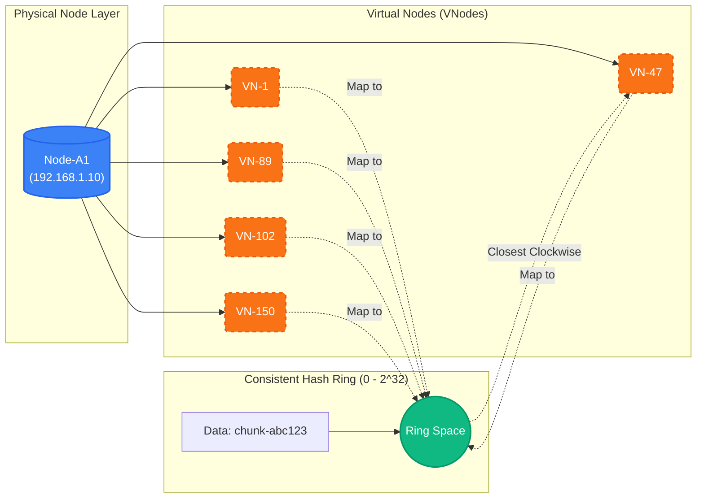
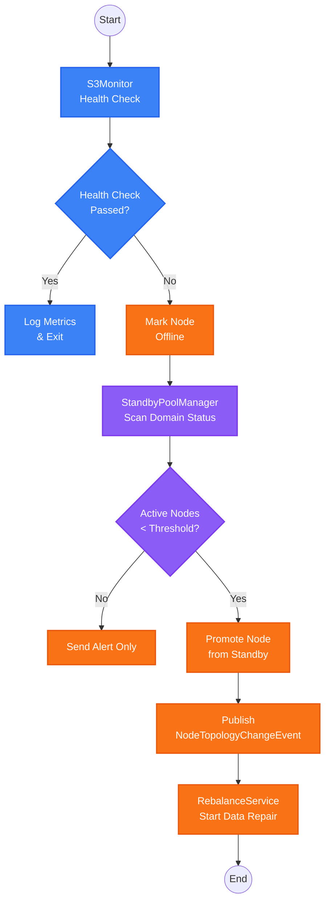

# Distributed Storage

RecordPlatform uses a fault-domain-aware distributed storage architecture for high availability.

## Fault Domain Architecture

### Domain Types

The system supports **N active domains + 1 optional standby domain** with flexible configuration:

| Domain Type | Description                                           | Accepts Writes | Purpose            |
| ----------- | ----------------------------------------------------- | -------------- | ------------------ |
| **Active**  | Configured via `active-domains`, supports 1~N domains | Yes            | Data write targets |
| **Standby** | Configured via `standby-domain` (optional)            | No             | Hot standby pool   |

### Deployment Modes

| Mode              | Active Domains | Replication Factor | Use Case                     |
| ----------------- | -------------- | ------------------ | ---------------------------- |
| **Single-domain** | 1              | 1                  | Development                  |
| **Dual-domain**   | 2              | 2                  | Standard production          |
| **Multi-domain**  | 3+             | Configurable       | High-availability production |

### How It Works

- Each file chunk is written to **N active domains** (one copy per domain)
- Replication factor defaults to active domain count, adjustable via `replication-factor`
- **N-1 domain tolerance**: System remains available if any N-1 domains fail
- Standby nodes are automatically promoted when active domain is degraded

## Consistent Hashing

### Virtual Node Mechanism



### Configuration

| Property              | Default             | Description                                    |
| --------------------- | ------------------- | ---------------------------------------------- |
| `virtualNodesPerNode` | 150                 | Virtual nodes per physical node                |
| `replicationFactor`   | Active domain count | Total replicas (capped at active domain count) |
| `weight`              | 100                 | Node weight (affects vnode count)              |

### Benefits

- **Even distribution**: Virtual nodes spread data uniformly
- **Minimal migration**: Adding/removing nodes only affects ~1/N keys
- **Weighted allocation**: Higher weight = more virtual nodes = more data

## Automatic Failover

### Failover Flow



### Event Types

| Event                 | Trigger             | Action           |
| --------------------- | ------------------- | ---------------- |
| `NODE_ONLINE`         | Health check passes | Update status    |
| `NODE_OFFLINE`        | Health check fails  | Trigger failover |
| `NODE_DOMAIN_CHANGED` | Standby promotion   | Data rebalancing |

## Data Rebalancing

### Rebalance Types

| Type                  | Trigger           | Operation                                    |
| --------------------- | ----------------- | -------------------------------------------- |
| `MIGRATE_FROM_FAILED` | Node goes offline | Copy from other active domains to new target |
| `COPY_TO_PROMOTED`    | Standby promoted  | Copy relevant data to new node               |
| `REBALANCE_TO_NEW`    | New node added    | Redistribute data                            |

### Rebalance Process

```java
// Triggered by NodeTopologyChangeEvent
@EventListener
public void onNodeTopologyChange(NodeTopologyChangeEvent event) {
    switch (event.getChangeType()) {
        case NODE_OFFLINE:
            migrateFromFailedNode(event.getNodeName());
            break;
        case NODE_DOMAIN_CHANGED:
            copyToPromotedNode(event.getNodeName());
            break;
    }
}
```

### Rate Limiting

- Default: 10 objects/second
- Prevents I/O saturation during rebalancing
- Configurable via Nacos

### Rebalance Configuration

```yaml
storage:
  rebalance:
    enabled: true # Enable automatic rebalancing
    rate-limit-per-second: 10 # Max objects copied per second (rate limiting)
    cleanup-source: false # Delete source data after rebalance (default: false)
```

### State Persistence

Rebalance status is persisted to Redis to ensure:

- Status synchronization across multiple instances
- State recovery after service restart
- Status TTL: 24 hours

## Replica Consistency Repair

Periodically scans domains to detect and repair cross-domain replica inconsistencies.

### Repair Process

1. Acquire distributed lock (prevents concurrent execution)
2. Iterate all active domains, collect object lists
3. Compare objects between domain pairs, identify missing replicas
4. Copy from healthy replicas to missing domains

### Consistency Configuration

```yaml
storage:
  consistency:
    repair:
      enabled: true # Enable scheduled repair
      cron: "0 0 * * * ?" # Cron expression (default: hourly)
      batch-size: 100 # Objects per batch
      lock-timeout-seconds: 600 # Distributed lock timeout (seconds)
```

## Node Configuration

### Required Configuration

```yaml
storage:
  # Required: List of active domains (in priority order)
  active-domains:
    - domain-a
    - domain-b

  # Optional: External endpoint (v3.2.0)
  # Used to replace internal endpoints when generating presigned URLs
  # Solves cross-network access issues (e.g., VPN)
  external-endpoint: http://10.1.0.2:9000

  # Optional: Standby domain (for failover)
  standby-domain: standby

  # Replication policy (v3.1.0)
  replication:
    factor: 2                     # Replica count, defaults to active domain count
    quorum: auto                  # Quorum strategy: auto|majority|all|number

  # Degraded write configuration (v3.1.0)
  degraded-write:
    enabled: true                 # Allow degraded writes
    min-replicas: 1               # Minimum replicas in degraded mode
    track-for-sync: true          # Track degraded writes for later sync
```

### NodeConfig Properties

```yaml
storage:
  nodes:
    - name: node-a1 # Unique name (also bucket name)
      endpoint: http://s3-a1:9000
      accessKey: ${S3_ACCESS_KEY}
      secretKey: ${S3_SECRET_KEY}
      faultDomain: domain-a # Must match active-domains or standby-domain
      weight: 100 # Affects data distribution
      enabled: true # Include in hash ring
      metricsPath: /minio/v2/metrics/node # Health metrics
```

### Domain Configuration (Optional)

```yaml
storage:
  domains:
    - name: domain-a
      minNodes: 1 # Min healthy nodes before promotion
      replicaCount: 1 # Replicas per chunk in this domain
      acceptsWrites: true
    - name: domain-b
      minNodes: 1
      replicaCount: 1
      acceptsWrites: true
    - name: standby
      minNodes: 0
      replicaCount: 0
      acceptsWrites: false
```

### Complete Configuration Examples

#### Development Environment (Single-domain Mode)

```yaml
storage:
  active-domains:
    - local
  nodes:
    - name: local-minio
      endpoint: http://localhost:9000
      accessKey: minioadmin
      secretKey: minioadmin
      faultDomain: local
```

#### Production Environment (Three Domains + Standby)

```yaml
storage:
  active-domains:
    - dc-us-east
    - dc-us-west
    - dc-eu-west
  standby-domain: standby
  replication-factor: 3

  nodes:
    - name: us-east-node1
      endpoint: http://s3-use:9000
      faultDomain: dc-us-east
    - name: us-west-node1
      endpoint: http://s3-usw:9000
      faultDomain: dc-us-west
    - name: eu-west-node1
      endpoint: http://s3-euw:9000
      faultDomain: dc-eu-west
    - name: standby-node1
      endpoint: http://s3-standby:9000
      faultDomain: standby
```

## Load-Aware Read Selection

When reading, the system selects the optimal node based on load score:

```txt
Load Score = (disk_usage × 0.4) + (inflight_requests × 0.35) + (waiting_requests × 0.25)
```

Lower score = preferred for reads.

## Monitoring

### Key Metrics

| Metric                     | Description                |
| -------------------------- | -------------------------- |
| `s3_node_online_status`    | Node online/offline status |
| `s3_node_load_score`       | Calculated load score      |
| `s3_node_operations_total` | Operation counter          |

### Health Check Intervals

- Node health check: 30 seconds
- Standby promotion check: 30 seconds
- Metrics cache TTL: 60 seconds
