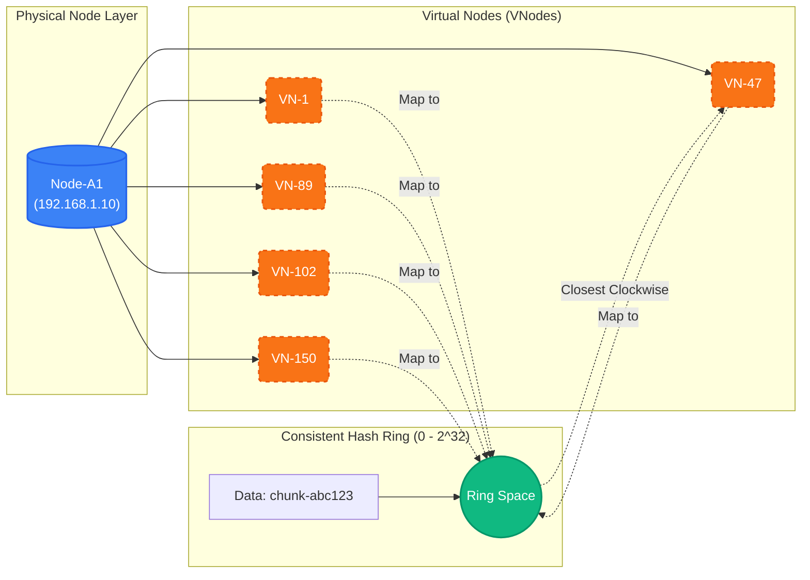
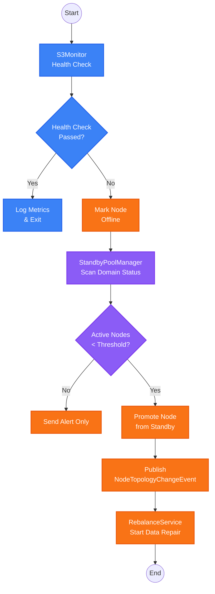

# Distributed Storage

RecordPlatform uses a fault-domain-aware distributed storage architecture for high availability.

## Fault Domain Architecture

### Domain Types

The system supports **N active domains + 1 optional standby domain** with flexible configuration:

| Domain Type | Description                                           | Accepts Writes | Purpose            |
| ----------- | ----------------------------------------------------- | -------------- | ------------------ |
| **Active**  | Configured via `active-domains`, supports 1~N domains | Yes            | Data write targets |
| **Standby** | Configured via `standby-domain` (optional)            | No             | Hot standby pool   |

### Deployment Modes

| Mode              | Active Domains | Replication Factor | Use Case                     |
| ----------------- | -------------- | ------------------ | ---------------------------- |
| **Single-domain** | 1              | 1                  | Development                  |
| **Dual-domain**   | 2              | 2                  | Standard production          |
| **Multi-domain**  | 3+             | Configurable       | High-availability production |

### How It Works

- Each file chunk is written to **N active domains** (one copy per domain)
- Replication factor defaults to active domain count, adjustable via `storage.replication.factor`
- **N-1 domain tolerance**: System remains available if any N-1 domains fail
- Standby nodes are automatically promoted when active domain is degraded

## Consistent Hashing

### Virtual Node Mechanism


```mermaid
flowchart LR
    %% Styles %%
    classDef physical fill:#3b82f6,stroke:#2563eb,stroke-width:2px,color:#ffffff
    classDef virtual fill:#f97316,stroke:#ea580c,stroke-width:2px,stroke-dasharray: 5 5,color:#ffffff
    classDef ring fill:#10b981,stroke:#059669,stroke-width:2px,color:#ffffff

    subgraph PhysicalLayer["Physical Node Layer"]
        N1[("Node-A1<br/>(192.168.1.10)")]:::physical
    end

    subgraph VNodeLayer["Virtual Nodes (VNodes)"]
        direction TB
        V1(VN-1):::virtual
        V2(VN-47):::virtual
        V3(VN-89):::virtual
        V4(VN-102):::virtual
        V5(VN-150):::virtual
    end

    subgraph HashRing["Consistent Hash Ring (0 - 2^32)"]
        R((Ring Space)):::ring
        File["Data: chunk-abc123"] --> R
    end

    %% Mappings
    N1 --> V1 & V2 & V3 & V4 & V5
    V1 & V2 & V3 & V4 & V5 -.->|Map to| R

    R -.->|Closest Clockwise| V2
```

### Configuration

| Property              | Default             | Description                                    |
| --------------------- | ------------------- | ---------------------------------------------- |
| `virtualNodesPerNode` | 150                 | Virtual nodes per physical node                |
| `replication.factor`  | Active domain count | Total replicas (capped at active domain count) |
| `weight`              | 100                 | Node weight (affects vnode count)              |

### Benefits

- **Even distribution**: Virtual nodes spread data uniformly
- **Minimal migration**: Adding/removing nodes only affects ~1/N keys
- **Weighted allocation**: Higher weight = more virtual nodes = more data

## Direct Multipart Promotion

Direct multipart upload sends bytes from the browser to tenant/session-scoped staging objects through presigned PUT URLs. Completion does not trust the URL or client path: `platform-storage` reconstructs the canonical staging identity, verifies declared size and SHA-256, and promotes the object to its content-addressed final key.

- A same-endpoint target uses conditional server-side copy and rechecks destination metadata.
- A cross-endpoint target uses a fixed-size, backpressured stream; it never aggregates a part in heap.
- Promotion satisfies the configured replica quorum. A degraded success persists repair work instead of claiming all replicas are healthy.
- A durable Redis receipt makes a repeated completion idempotent across process restarts.
- Complete, abort, and lifecycle cleanup share a per-part lock, immutable operation intent, and fencing token. A stale worker cannot delete or overwrite a newer generation.
- `staging/direct-upload` is owned by this lifecycle and is excluded from generic consistency repair.

### Limits and Lifecycle Defaults

| Property | Default | Effective boundary |
| --- | ---: | --- |
| `storage.direct-upload.max-file-size-bytes` | 4 GiB | Maximum direct-upload file |
| `storage.direct-upload.max-part-size-bytes` | 100 MiB | Maximum direct-upload part |
| `storage.direct-upload.stream-buffer-bytes` | 64 KiB | Clamped to 8 KiB–1 MiB |
| `storage.direct-upload.transfer-timeout-seconds` | 300 s | Capped at 1,800 s |
| `storage.direct-upload.lock-wait-seconds` | 5 s | Capped at 60 s |
| `storage.direct-upload.staging-retention-hours` | 48 h | Minimum 48 h; longer than presigned-URL lifetime |
| `storage.direct-upload.cleanup-enabled` | `true` | Enables bounded lifecycle reclamation |
| `storage.direct-upload.cleanup-interval-millis` | 3,600,000 | 1 hour |
| `storage.direct-upload.cleanup-initial-delay-millis` | 300,000 | 5 minutes |
| `storage.direct-upload.cleanup-batch-size` | 200 | Cluster claim batch |
| `storage.direct-upload.cleanup-claim-lease-seconds` | 600 s | Fenced cleanup claim lease |

Cleanup first claims an expired lifecycle record, reacquires the same part lock, validates the current fencing token, and treats provider 404 as idempotent success. Work that cannot finish inside the lease budget is rescheduled; failure retains the record for a later attempt. Abort creates a tombstone so a delayed completion cannot resurrect deleted staging content.

## Automatic Failover

### Failover Flow


```mermaid
flowchart TD
    %% Styles %%
    classDef mnt fill:#3b82f6,stroke:#2563eb,stroke-width:2px,color:#ffffff
    classDef act fill:#f97316,stroke:#ea580c,stroke-width:2px,color:#ffffff
    classDef st fill:#8b5cf6,stroke:#7c3aed,stroke-width:2px,color:#ffffff

    Start((Start)) --> Monitor[S3Monitor<br/>Health Check]:::mnt
    Monitor --> Check{Health Check<br/>Passed?}:::mnt

    Check -- Yes --> Log[Log Metrics<br/>& Exit]:::mnt
    Check -- No --> MarkOff[Mark Node<br/>Offline]:::act

    MarkOff --> Scan[StandbyPoolManager<br/>Scan Domain Status]:::st
    Scan --> NeedHelp{Active Nodes<br/>< Threshold?}:::st

    NeedHelp -- No --> Alert[Send Alert Only]:::act
    NeedHelp -- Yes --> Promote[Promote Node<br/>from Standby]:::act

    Promote --> Event[Publish<br/>NodeTopologyChangeEvent]:::act
    Event --> Rebalance[RebalanceService<br/>Start Data Repair]:::act

    Rebalance --> End((End))
```

### Event Types

| Event                 | Trigger             | Action           |
| --------------------- | ------------------- | ---------------- |
| `NODE_ONLINE`         | Health check passes | Update status    |
| `NODE_OFFLINE`        | Health check fails  | Trigger failover |
| `NODE_DOMAIN_CHANGED` | Standby promotion   | Data rebalancing |

## Data Rebalancing

### Rebalance Types

| Type                  | Trigger           | Operation                                    |
| --------------------- | ----------------- | -------------------------------------------- |
| `MIGRATE_FROM_FAILED` | Node goes offline | Copy from other active domains to new target |
| `COPY_TO_PROMOTED`    | Standby promoted  | Copy relevant data to new node               |
| `REBALANCE_TO_NEW`    | New node added    | Redistribute data                            |

### Rebalance Process

```java
// Triggered by NodeTopologyChangeEvent
@EventListener
public void onNodeTopologyChange(NodeTopologyChangeEvent event) {
    switch (event.getChangeType()) {
        case NODE_OFFLINE:
            migrateFromFailedNode(event.getNodeName());
            break;
        case NODE_DOMAIN_CHANGED:
            copyToPromotedNode(event.getNodeName());
            break;
    }
}
```

### Rate Limiting

- Default: 10 objects/second
- Prevents I/O saturation during rebalancing
- Configurable via Nacos

### Rebalance Configuration

```yaml
storage:
  rebalance:
    enabled: true # Enable automatic rebalancing
    rate-limit-per-second: 10 # Max objects copied per second (rate limiting)
    cleanup-source: false # Delete source data after rebalance (default: false)
```

### State Persistence

Rebalance status is persisted to Redis to ensure:

- Status synchronization across multiple instances
- State recovery after service restart
- Status TTL: 24 hours

## Replica Consistency Repair

Periodically scans domains to detect and repair cross-domain replica inconsistencies.

### Repair Process

1. Acquire distributed lock (prevents concurrent execution)
2. Iterate all active domains, collect object lists
3. Compare objects between domain pairs, identify missing replicas
4. Copy from healthy replicas to missing domains

### Consistency Configuration

```yaml
storage:
  consistency:
    repair:
      enabled: true # Enable scheduled repair
      cron: "0 */15 * * * ?" # Cron expression (default: every 15 minutes)
      batch-size: 100 # Objects per batch
      lock-timeout-seconds: 600 # Distributed lock timeout (seconds)
```

## Node Configuration

### Required Configuration

```yaml
storage:
  # Required: List of active domains (in priority order)
  active-domains:
    - domain-a
    - domain-b

  # Optional: External endpoint (v3.2.0)
  # Used to replace internal endpoints when generating presigned URLs
  # Solves cross-network access issues (e.g., VPN)
  external-endpoint: https://s3-secondary.example.com

  # Optional: Standby domain (for failover)
  standby-domain: standby

  # Replication policy (v3.1.0)
  replication:
    factor: 2                     # Replica count, defaults to active domain count
    quorum: auto                  # Quorum strategy: auto|majority|all|number

  # Degraded write configuration (v3.1.0)
  degraded-write:
    enabled: true                 # Allow degraded writes
    min-replicas: 1               # Minimum replicas in degraded mode
    track-for-sync: true          # Track degraded writes for later sync
```

### NodeConfig Properties

```yaml
storage:
  nodes:
    - name: node-a1 # Unique name (also bucket name)
      endpoint: http://s3-a1:9000
      accessKey: ${S3_ACCESS_KEY}
      secretKey: ${S3_SECRET_KEY}
      faultDomain: domain-a # Must match active-domains or standby-domain
      weight: 100 # Affects data distribution
      enabled: true # Include in hash ring
      metricsPath: /minio/v2/metrics/node # Health metrics
```

### Domain Configuration (Optional)

```yaml
storage:
  domains:
    - name: domain-a
      minNodes: 1 # Min healthy nodes before promotion
      replicaCount: 1 # Replicas per chunk in this domain
      acceptsWrites: true
    - name: domain-b
      minNodes: 1
      replicaCount: 1
      acceptsWrites: true
    - name: standby
      minNodes: 0
      replicaCount: 0
      acceptsWrites: false
```

### Complete Configuration Examples

#### Development Environment (Single-domain Mode)

```yaml
storage:
  active-domains:
    - local
  nodes:
    - name: local-minio
      endpoint: http://localhost:9000
      accessKey: ${S3_ACCESS_KEY:?Set S3_ACCESS_KEY in the deployment environment}
      secretKey: ${S3_SECRET_KEY:?Set S3_SECRET_KEY in the deployment environment}
      faultDomain: local
```

#### Production Environment (Three Domains + Standby)

```yaml
storage:
  active-domains:
    - dc-us-east
    - dc-us-west
    - dc-eu-west
  standby-domain: standby
  replication:
    factor: 3

  nodes:
    - name: us-east-node1
      endpoint: http://s3-use:9000
      faultDomain: dc-us-east
    - name: us-west-node1
      endpoint: http://s3-usw:9000
      faultDomain: dc-us-west
    - name: eu-west-node1
      endpoint: http://s3-euw:9000
      faultDomain: dc-eu-west
    - name: standby-node1
      endpoint: http://s3-standby:9000
      faultDomain: standby
```

## Load-Aware Read Selection

When reading, the system selects the optimal node based on load score:

```txt
Load Score = (disk_usage × 0.4) + (inflight_requests × 0.35) + (waiting_requests × 0.25)
```

Lower score = preferred for reads.

## Monitoring

### Key Metrics

| Metric                     | Description                |
| -------------------------- | -------------------------- |
| `s3_node_online_status`    | Node online/offline status |
| `s3_node_load_score`       | Calculated load score      |
| `s3_node_operations_total` | Operation counter          |

### Health Check Intervals

- Node health check: 30 seconds
- Standby promotion check: 30 seconds
- Metrics cache TTL: 60 seconds
