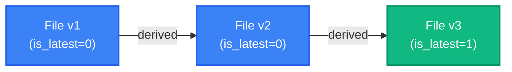
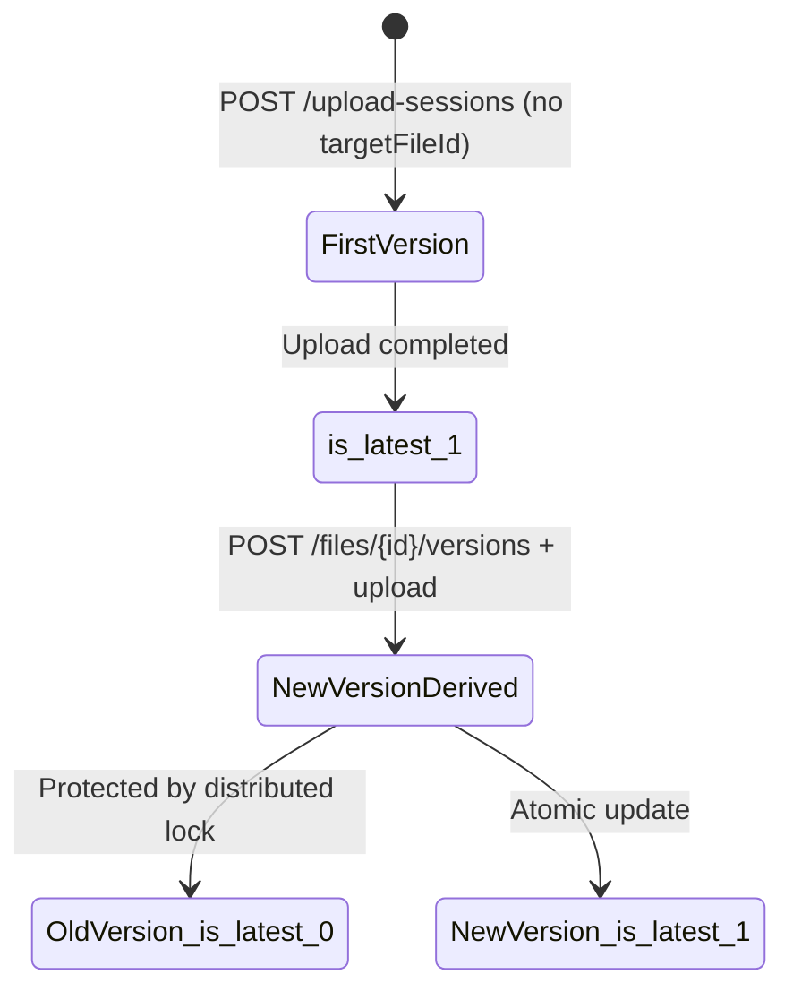

# File Version Chain

RecordPlatform supports file versioning, allowing users to derive new versions from existing files, forming a traceable version history chain.

## Concept Model



Files in the same version chain share the same `version_group_id` and are linked via `parent_version_id`. `is_latest=1` marks the newest version in the chain; file lists display only the latest version by default.

## Data Model

Version chain fields in the `file_record` table:

| Field | Type | Description |
|-------|------|-------------|
| `version` | INT | Current version number (starts at 1) |
| `parent_version_id` | BIGINT | Parent version file ID (NULL for first version) |
| `version_group_id` | BIGINT | Version group ID (shared by all in chain; equals chain-head file ID) |
| `is_latest` | TINYINT | Whether this is the current latest version (1=yes, 0=no) |

**Concurrency control**: A Redisson distributed lock (`version-chain:{versionGroupId}`) protects new version creation, preventing race conditions on the same version chain.

## REST API

### Get Version History

```http
GET /api/v1/files/{id}/versions
Authorization: Bearer <token>
```

**Response:**

```json
{
  "code": 200,
  "data": [
    { "id": "abc123", "version": 3, "fileName": "report_v3.pdf", "isLatest": true, "createdAt": "2026-03-14T10:00:00Z" },
    { "id": "abc122", "version": 2, "fileName": "report_v2.pdf", "isLatest": false, "createdAt": "2026-03-10T08:00:00Z" },
    { "id": "abc121", "version": 1, "fileName": "report_v1.pdf", "isLatest": false, "createdAt": "2026-03-01T06:00:00Z" }
  ]
}
```

**Permissions**: File owner can view full version history; admins can view history for any file.

### Create New Version

```http
POST /api/v1/files/{id}/versions
Authorization: Bearer <token>
```

Marks the target file as a "version continuation target". The frontend passes `targetFileId` when uploading a new file to trigger the version chain write. On upload completion:

1. Previous version's `is_latest` is set to 0
2. New version inherits the same `version_group_id`
3. New version's `parent_version_id` points to the previous version
4. New version's `is_latest` is set to 1

## Integration with Upload Flow

Pass `targetFileId` when calling `POST /api/v1/upload-sessions` to automatically append the new file to an existing version chain:

```http
POST /api/v1/upload-sessions
Content-Type: application/json

{
  "fileName": "report_v4.pdf",
  "fileSize": 1048576,
  "targetFileId": "abc123"
}
```

## Version Chain State Machine



## File List Filtering

The default file query (`GET /api/v1/files`) automatically filters for `is_latest=1`, so users see only the latest version of each chain. Full version history is accessible via the version history API.

## Database Migration

The version chain schema is managed by Flyway migration `V1.4.0__file_version_chain.sql`:

- Backfills existing files with `version=1`, `is_latest=1`, `version_group_id=id`
- Adds indexes on `(version_group_id, version)`, `(parent_version_id)`, and `is_latest`
