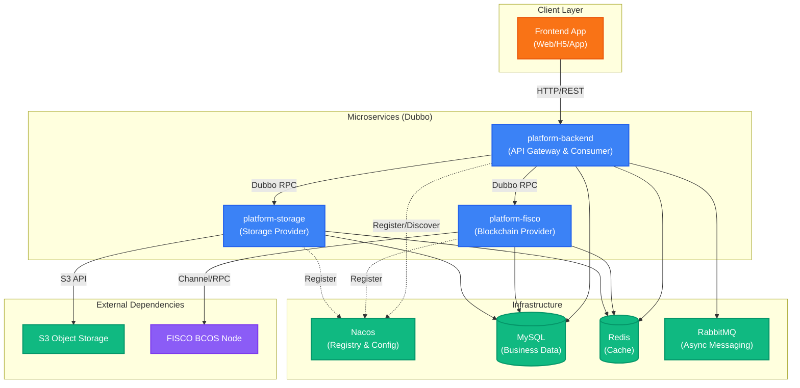
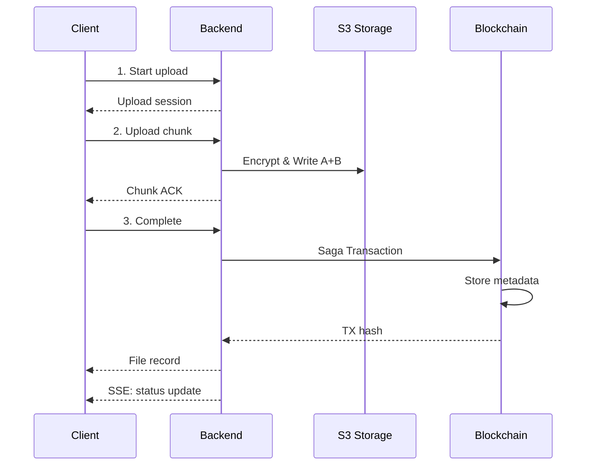
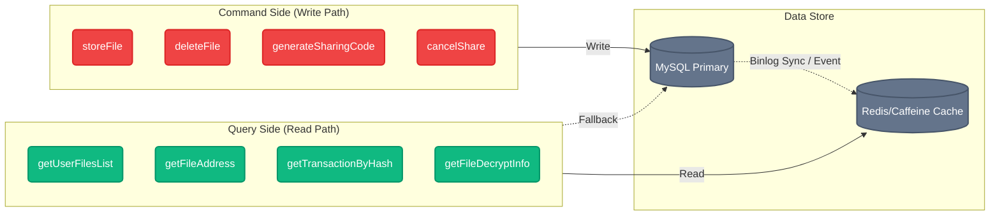

# System Overview

## Architecture Diagram



## Module Responsibilities

### platform-api

Shared Dubbo interface definitions that all modules depend on:

- `FiscoExternalService` - Blockchain operations
- `StorageExternalService` - Storage operations
- Common DTOs and response types

### platform-backend

Multi-module backend service (Dubbo Consumer):

| Submodule           | Responsibility                                        |
| ------------------- | ----------------------------------------------------- |
| **backend-web**     | REST controllers, JWT filters, rate limiting, CORS    |
| **backend-service** | Business logic, Saga orchestration, Outbox publishing |
| **backend-dao**     | MyBatis Plus mappers, entities, VOs                   |
| **backend-common**  | Utilities, constants, annotations                     |

### platform-fisco

Blockchain integration service (Dubbo Provider):

- Smart contract interaction (Storage.sol, Sharing.sol)
- Multi-chain adapters (Local FISCO, BSN FISCO, Besu)
- Certificate management

### platform-storage

Distributed storage service (Dubbo Provider):

- Multi-node S3 client management
- Fault domain management
- Consistent hashing and rebalancing
- File encryption/decryption

## Core Business Flow

### File Upload & Attestation



### Saga Compensation Flow

| Step          | Forward Action         | Compensation              |
| ------------- | ---------------------- | ------------------------- |
| PENDING       | Initialize             | -                         |
| S3_UPLOADING  | Store chunks           | Clean stored chunks       |
| S3_UPLOADED   | Chunks stored          | Delete S3 files           |
| CHAIN_STORING | Blockchain attestation | Mark chain record deleted |
| COMPLETED     | Commit                 | -                         |

**Compensation Strategy**: Exponential backoff (initial 1s, max 5 retries), then manual queue.

## CQRS Architecture

File module uses Command Query Responsibility Segregation:



### Virtual Thread Async Methods

Query service provides async methods using Java 21 Virtual Threads:

- `getUserFilesListAsync()`
- `getFileAddressAsync()`
- `getFileDecryptInfoAsync()`

## Multi-tenancy

### Isolation Strategy

| Layer      | Isolation Method                       |
| ---------- | -------------------------------------- |
| Database   | `tenant_id` field, MyBatis auto-inject |
| Redis      | Key prefix `tenant:{tenantId}:`        |
| S3 Storage | Path `/{tenantId}/{userId}/`           |
| Dubbo      | Context propagation `TenantContext`    |

### Tenant Context Control

`@TenantScope` annotation for declarative tenant isolation:

```java
// Cross-tenant query (scheduled tasks)
@TenantScope(ignoreIsolation = true)
@Scheduled(cron = "0 0 3 * * ?")
public void cleanupDeletedFiles() { ... }

// Switch to specific tenant
@TenantScope(tenantId = 1)
public void migrateDataForTenant() { ... }
```
