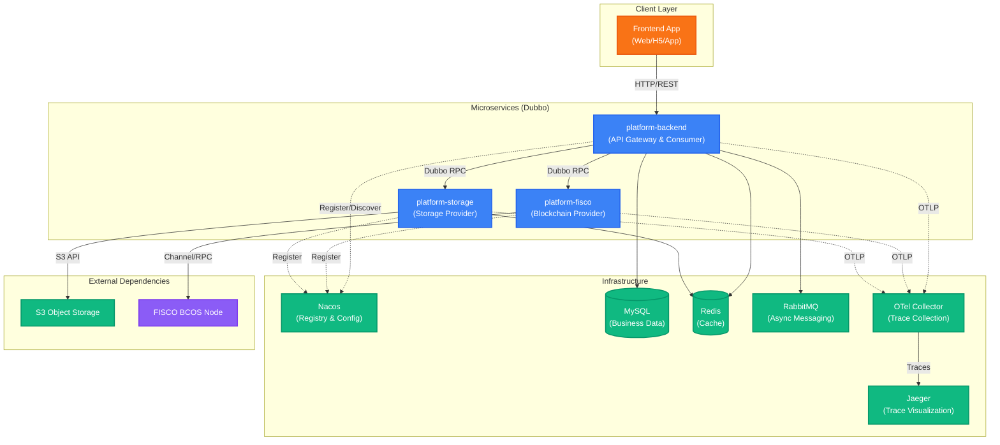
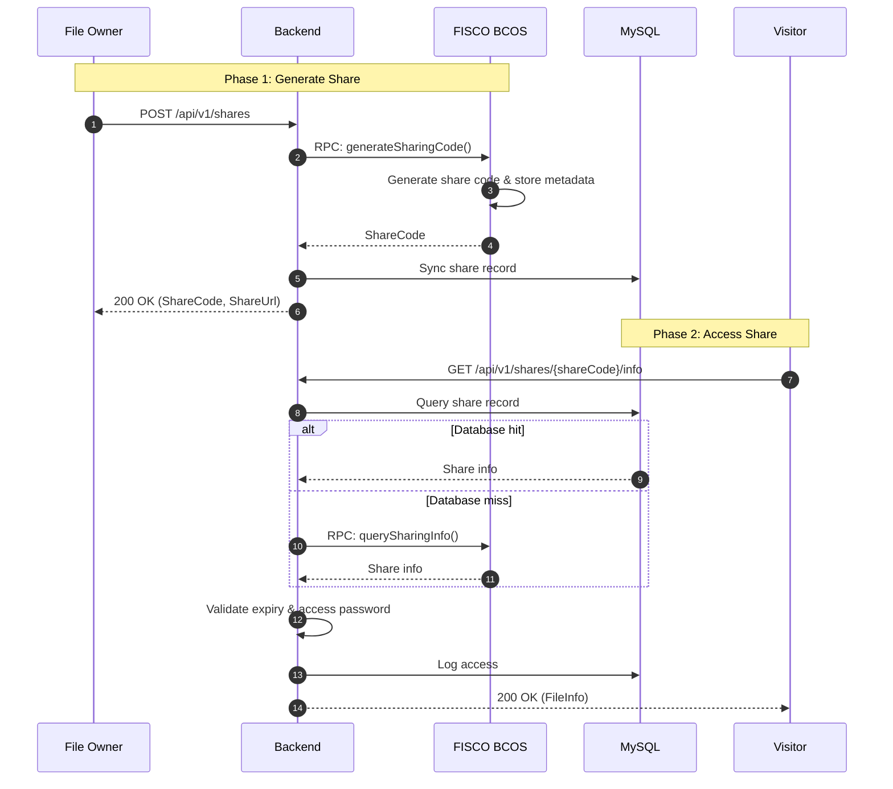
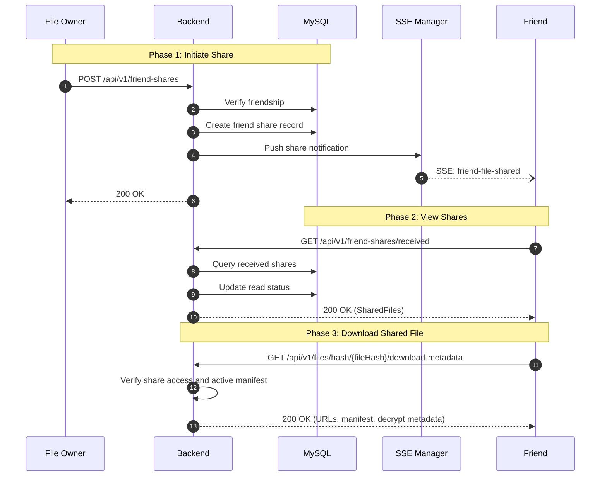
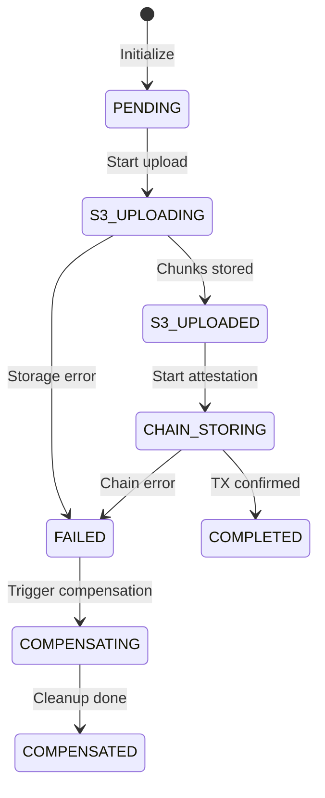
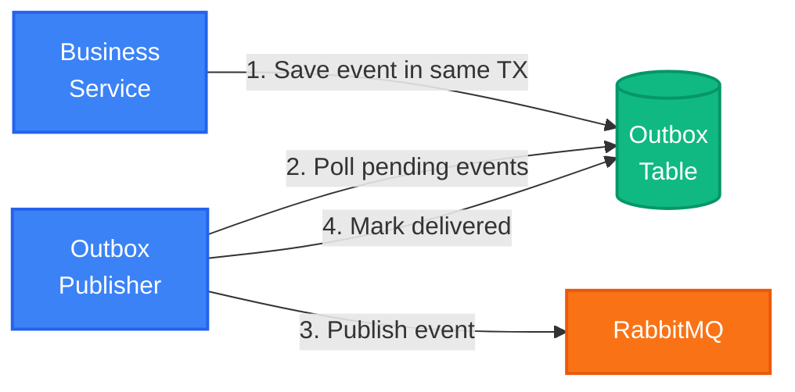
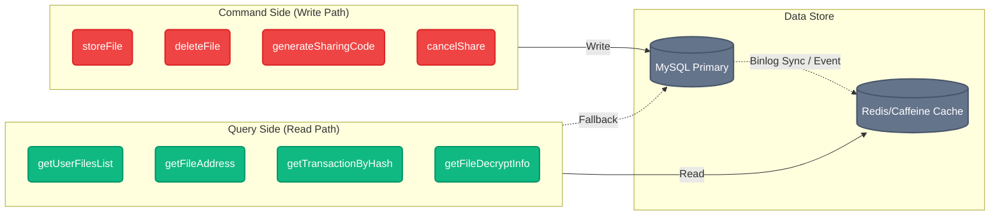
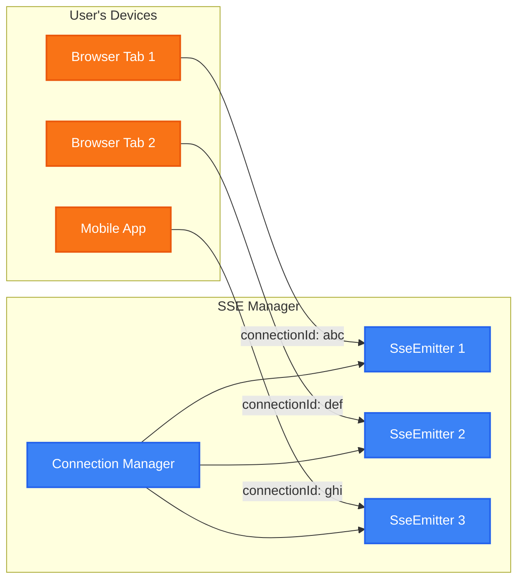

# System Overview

## Architecture Diagram


```mermaid
flowchart TB
    %% Style Definitions %%
    classDef service fill:#3b82f6,stroke:#2563eb,stroke-width:2px,color:#ffffff
    classDef infra fill:#10b981,stroke:#059669,stroke-width:2px,color:#ffffff
    classDef chain fill:#8b5cf6,stroke:#7c3aed,stroke-width:2px,color:#ffffff
    classDef client fill:#f97316,stroke:#ea580c,stroke-width:2px,color:#ffffff

    subgraph ClientLayer["Client Layer"]
        Frontend["Frontend App<br/>(Web/H5/App)"]:::client
    end

    subgraph ServiceLayer["Microservices (Dubbo)"]
        direction TB
        Backend["platform-backend<br/>(API Gateway & Consumer)"]:::service
        Fisco["platform-fisco<br/>(Blockchain Provider)"]:::service
        Storage["platform-storage<br/>(Storage Provider)"]:::service
    end

    subgraph InfraLayer["Infrastructure"]
        direction TB
        Nacos["Nacos<br/>(Registry & Config)"]:::infra
        MySQL[("MySQL<br/>(Business Data)")]:::infra
        Redis[("Redis<br/>(Cache)")]:::infra
        RabbitMQ["RabbitMQ<br/>(Async Messaging)"]:::infra
        OTel["OTel Collector<br/>(Trace Collection)"]:::infra
        Jaeger["Jaeger<br/>(Trace Visualization)"]:::infra
    end

    subgraph ExternalLayer["External Dependencies"]
        S3["S3 Object Storage"]:::infra
        BCOS["FISCO BCOS Node"]:::chain
    end

    %% Connections %%
    Frontend -->|HTTP/REST| Backend

    Backend -->|Dubbo RPC| Fisco
    Backend -->|Dubbo RPC| Storage

    %% Service to Infra %%
    Backend --> MySQL & Redis & RabbitMQ
    Fisco -->|Channel/RPC| BCOS
    Storage --> Redis

    %% Service Registry %%
    Backend -.->|Register/Discover| Nacos
    Fisco -.->|Register| Nacos
    Storage -.->|Register| Nacos

    %% Service to External %%
    Storage -->|S3 API| S3

    %% Tracing %%
    Backend -.->|OTLP| OTel
    Fisco -.->|OTLP| OTel
    Storage -.->|OTLP| OTel
    OTel -->|Traces| Jaeger
```

## Module Responsibilities

### platform-api

Shared Dubbo interface definitions that all modules depend on:

- `BlockChainService` - Blockchain operations
- `DistributedStorageService` - Storage operations
- Common DTOs and response types

### platform-backend

Multi-module backend service (Dubbo Consumer):

| Submodule           | Responsibility                                        |
| ------------------- | ----------------------------------------------------- |
| **backend-web**     | REST controllers, JWT filters, rate limiting, CORS    |
| **backend-service** | Business logic, Saga orchestration, Outbox publishing |
| **backend-dao**     | MyBatis Plus mappers, entities, VOs                   |
| **backend-api**     | Internal API interfaces                               |
| **backend-common**  | Utilities, constants, annotations                     |

### platform-fisco

Blockchain integration service (Dubbo Provider):

- Smart contract interaction (Storage.sol, Sharing.sol)
- Multi-chain adapters (Local FISCO, BSN FISCO, Besu)
- Certificate management

### platform-storage

Distributed storage service (Dubbo Provider):

- Multi-node S3 client management
- Fault domain management
- Consistent hashing and rebalancing
- File encryption/decryption

## Core Business Flow

### File Upload & Attestation

```mermaid
sequenceDiagram
    autonumber

    participant Client
    participant Backend as platform-backend
    participant Storage as platform-storage
    participant S3 as S3 Cluster
    participant Chain as FISCO BCOS

    alt Direct multipart upload
        Client->>Backend: POST /api/v1/upload-sessions/direct
        Backend->>Backend: Validate quota, chunk metadata, plainHash == cipherHash
        Backend->>Storage: RPC: createDirectMultipartUpload
        Storage->>S3: Create presigned staging PUT URLs
        Backend-->>Client: clientId, manifest schema, presigned URLs
        loop Each part
            Client->>S3: PUT presigned URL
            S3-->>Client: ETag
        end
        Client->>Backend: POST /api/v1/upload-sessions/{clientId}/direct/complete
        Backend->>Storage: RPC: completeDirectMultipartUpload
        Storage->>S3: Verify identity/hash and promote staging objects
        Note over Storage,S3: Same endpoint: conditional copy; cross endpoint: bounded stream
        Storage->>Storage: Persist receipt; schedule repair/cleanup if degraded
        Backend->>Backend: Persist file + active chunk manifest
    else Backend-proxied chunk upload
        Client->>Backend: POST /api/v1/upload-sessions
        Backend-->>Client: clientId, chunkSize, totalChunks
        loop Each chunk
            Client->>Backend: PUT /api/v1/upload-sessions/{clientId}/chunks/{chunkNumber}
            Backend->>Storage: RPC: storeChunk()
            Storage->>S3: PutObject
            Backend-->>Client: Chunk ACK
        end
        Client->>Backend: POST /api/v1/upload-sessions/{clientId}/complete
    end

    Backend->>Chain: Store file attestation
    Chain-->>Backend: TX hash
    Backend-->>Client: File record
    Backend-->>Client: SSE: status update
```

### File Download Flow

```mermaid
sequenceDiagram
    autonumber

    participant Client
    participant Backend
    participant Storage as platform-storage
    participant S3 as S3 Cluster

    Note over Client, Backend: Phase 1: Get Manifest-Backed Download Metadata
    Client->>Backend: GET /api/v1/files/hash/{fileHash}/download-metadata
    Backend->>Backend: Verify permissions & require active chunk manifest
    Backend->>Storage: RPC: getFileUrlListByHash(storagePath[], cipherHash[])
    Storage->>S3: Generate presigned URLs
    S3-->>Storage: Presigned URL list
    Storage-->>Backend: Ordered URL list
    Backend-->>Client: 200 OK (URLs, manifest, hashes, decrypt metadata)

    Note over Client, S3: Phase 2: Bounded Ordered Read
    loop Each manifest part in index order
        Client->>S3: GET presigned URL
        S3-->>Client: Backpressured response chunks (max 1 MiB each)
        Client->>Client: Verify length/hash; decrypt framed or legacy format
        Client->>Client: Write to selected sink with backpressure
    end

    Note over Client: Phase 3: Commit or Abort
    Client->>Client: Close sink only after complete integrity success
    Note over Client: Any fetch/decrypt/hash/write failure aborts the sink
```

**Download Strategy Comparison**:

| Strategy | Use Case | Characteristics |
|----------|----------|-----------------|
| **Memory sink** | Files up to 64 MiB | Guarded `Blob` fallback; total output cannot exceed the hard ceiling |
| **File-system stream sink** | Files above 64 MiB | Requires File System Access API plus Streams; bounded reader writes directly to the chosen file |
| **Unsupported browser** | Files above 64 MiB without a stream sink | Fails closed with a browser-capability message; there is no unbounded backend-proxy fallback |

The bounded reader accepts explicit `NONE`, legacy v1 AEAD, and framed AEAD v2 formats. Legacy ciphertext parts are capped at about 80 MiB + 4 KiB, every file at 10,000 parts, and each response chunk at 1 MiB. A fetch has at most three attempts; 401/403 requires fresh download metadata immediately, while only 5xx responses receive finite retry. Every length, order, hash, key, decrypt, cancellation, or sink error aborts the sink.

### File Sharing Flow

#### Link Sharing


```mermaid
sequenceDiagram
    autonumber

    participant Owner as File Owner
    participant Backend
    participant Chain as FISCO BCOS
    participant DB as MySQL
    participant Visitor

    Note over Owner, Chain: Phase 1: Generate Share
    Owner->>Backend: POST /api/v1/shares
    Backend->>Chain: RPC: generateSharingCode()
    Chain->>Chain: Generate share code & store metadata
    Chain-->>Backend: ShareCode
    Backend->>DB: Sync share record
    Backend-->>Owner: 200 OK (ShareCode, ShareUrl)

    Note over Visitor, DB: Phase 2: Access Share
    Visitor->>Backend: GET /api/v1/shares/{shareCode}/info
    Backend->>DB: Query share record
    alt Database hit
        DB-->>Backend: Share info
    else Database miss
        Backend->>Chain: RPC: querySharingInfo()
        Chain-->>Backend: Share info
    end
    Backend->>Backend: Validate expiry & access password
    Backend->>DB: Log access
    Backend-->>Visitor: 200 OK (FileInfo)
```

#### Friend Sharing


```mermaid
sequenceDiagram
    autonumber

    participant Owner as File Owner
    participant Backend
    participant DB as MySQL
    participant SSE as SSE Manager
    participant Friend

    Note over Owner, DB: Phase 1: Initiate Share
    Owner->>Backend: POST /api/v1/friend-shares
    Backend->>DB: Verify friendship
    Backend->>DB: Create friend share record
    Backend->>SSE: Push share notification
    SSE--)Friend: SSE: friend-file-shared
    Backend-->>Owner: 200 OK

    Note over Friend, DB: Phase 2: View Shares
    Friend->>Backend: GET /api/v1/friend-shares/received
    Backend->>DB: Query received shares
    Backend->>DB: Update read status
    Backend-->>Friend: 200 OK (SharedFiles)

    Note over Friend, Backend: Phase 3: Download Shared File
    Friend->>Backend: GET /api/v1/files/hash/{fileHash}/download-metadata
    Backend->>Backend: Verify share access and active manifest
    Backend-->>Friend: 200 OK (URLs, manifest, decrypt metadata)
```

**Share Type Comparison**:

| Type | Access Control | Expiry | Characteristics |
|------|----------------|--------|-----------------|
| **Public Share** | None | Configurable | Anyone can access via link |
| **Private Share** | Password | Configurable | Password required for access |
| **Friend Share** | Friendship | Permanent | Only specified friend can view, supports read status |

### Saga Compensation Flow

| Step          | Forward Action         | Compensation              |
| ------------- | ---------------------- | ------------------------- |
| PENDING       | Initialize             | -                         |
| S3_UPLOADING  | Store chunks           | Clean stored chunks       |
| S3_UPLOADED   | Chunks stored          | Delete S3 files           |
| CHAIN_STORING | Blockchain attestation | Mark chain record deleted |
| COMPLETED     | Commit                 | -                         |

**Compensation Strategy**: Exponential backoff (initial 1s, max 5 retries), then manual queue.

### Saga State Machine

The `FileSagaOrchestrator` manages the complete state machine:


```mermaid
stateDiagram-v2
    [*] --> PENDING: Initialize
    PENDING --> S3_UPLOADING: Start upload
    S3_UPLOADING --> S3_UPLOADED: Chunks stored
    S3_UPLOADING --> FAILED: Storage error
    S3_UPLOADED --> CHAIN_STORING: Start attestation
    CHAIN_STORING --> COMPLETED: TX confirmed
    CHAIN_STORING --> FAILED: Chain error
    FAILED --> COMPENSATING: Trigger compensation
    COMPENSATING --> COMPENSATED: Cleanup done
```

## Transactional Outbox Pattern

RecordPlatform uses the Outbox pattern for reliable event publishing to RabbitMQ.

### How It Works


```mermaid
flowchart LR
    classDef service fill:#3b82f6,stroke:#2563eb,stroke-width:2px,color:#ffffff
    classDef db fill:#10b981,stroke:#059669,stroke-width:2px,color:#ffffff
    classDef mq fill:#f97316,stroke:#ea580c,stroke-width:2px,color:#ffffff

    Service["Business<br/>Service"]:::service
    Outbox[("Outbox<br/>Table")]:::db
    Publisher["Outbox<br/>Publisher"]:::service
    MQ["RabbitMQ"]:::mq

    Service -->|1. Save event in same TX| Outbox
    Publisher -->|2. Poll pending events| Outbox
    Publisher -->|3. Publish event| MQ
    Publisher -->|4. Mark delivered| Outbox
```

### Components

| Component | Responsibility |
|-----------|----------------|
| `OutboxService` | Appends events within business transaction |
| `OutboxPublisher` | Background polling and publishing (2s interval) |
| `outbox_event` table | Persistent event store with tenant isolation |

### Guarantees

- **At-least-once delivery**: Events survive broker unavailability
- **Transactional consistency**: Event created in same DB transaction as business data
- **Tenant-aware polling**: Each tenant's events processed independently

### Configuration

```yaml
outbox:
  publisher:
    batch-size: 100
    poll-interval-ms: 2000
    max-retries: 5
  cleanup:
    sent-retention-days: 7
    failed-retention-days: 30
    cron: 0 0 3 * * ?
```

## CQRS Architecture

File module uses Command Query Responsibility Segregation:


```mermaid
flowchart LR
    %% Styles %%
    classDef cmd fill:#ef4444,stroke:#dc2626,stroke-width:2px,color:#ffffff
    classDef qry fill:#10b981,stroke:#059669,stroke-width:2px,color:#ffffff
    classDef db fill:#64748b,stroke:#475569,stroke-width:2px,color:#ffffff

    subgraph Command["Command Side (Write Path)"]
        direction TB
        C1(storeFile):::cmd
        C2(deleteFile):::cmd
        C3(generateSharingCode):::cmd
        C4(cancelShare):::cmd
    end

    subgraph Query["Query Side (Read Path)"]
        direction TB
        Q1(getUserFilesList):::qry
        Q2(getFileAddress):::qry
        Q3(getTransactionByHash):::qry
        Q4(getFileDecryptInfo):::qry
    end

    subgraph Store["Data Store"]
        DB[("MySQL Primary")]:::db
        Cache[("Redis/Caffeine Cache")]:::db
    end

    %% Wiring %%
    Command -->|Write| DB
    DB -.->|Binlog Sync / Event| Cache
    Query -->|Read| Cache
    Query -.->|Fallback| DB
```

### Virtual Thread Async Methods

Query service provides async methods using Java 21 Virtual Threads:

- `getUserFilesListAsync()`
- `getFileAddressAsync()`
- `getFileDecryptInfoAsync()`

## File Version Chain

The file version chain allows a single logical file to have multiple historical versions, linked together in a chain structure. See the dedicated [File Version Chain](file-version-chain) page for detailed design.

### Core Fields

| Field | Description |
|-------|-------------|
| `version_group_id` | Shared group ID across all versions of the same logical file |
| `parent_version_id` | Parent version ID (`null` for first version) |
| `is_latest` | Marks the latest version in the chain (only one `true` per group) |

### Version API

- `GET /api/v1/files/{id}/versions` — List the version chain for a file
- `POST /api/v1/files/{id}/versions` — Mark an existing file as parent for a new upload (via `targetFileId`)

## Multi-tenancy

### Isolation Strategy

| Layer      | Isolation Method                       |
| ---------- | -------------------------------------- |
| Database   | `tenant_id` field, MyBatis auto-inject |
| Redis      | Key prefix `tenant:{tenantId}:`        |
| S3 Storage | Path `/{tenantId}/{userId}/`           |
| Dubbo      | Context propagation `TenantContext`    |

### Tenant Context Control

`@TenantScope` annotation for declarative tenant isolation:

```java
// Cross-tenant query (scheduled tasks)
@TenantScope(ignoreIsolation = true)
@Scheduled(cron = "0 0 3 * * ?")
public void cleanupDeletedFiles() { ... }

// Switch to specific tenant
@TenantScope(tenantId = 1)
public void migrateDataForTenant() { ... }
```

## Real-time Notifications (SSE)

Server-Sent Events provide real-time updates to connected clients.

### Multi-Connection Architecture

The system supports multiple simultaneous connections per user:


```mermaid
flowchart LR
    classDef browser fill:#f97316,stroke:#ea580c,stroke-width:2px,color:#ffffff
    classDef server fill:#3b82f6,stroke:#2563eb,stroke-width:2px,color:#ffffff

    subgraph User["User's Devices"]
        Tab1["Browser Tab 1"]:::browser
        Tab2["Browser Tab 2"]:::browser
        Mobile["Mobile App"]:::browser
    end

    subgraph Backend["SSE Manager"]
        Manager["Connection Manager"]:::server
        Emitter1["SseEmitter 1"]:::server
        Emitter2["SseEmitter 2"]:::server
        Emitter3["SseEmitter 3"]:::server
    end

    Tab1 -->|connectionId: abc| Emitter1
    Tab2 -->|connectionId: def| Emitter2
    Mobile -->|connectionId: ghi| Emitter3

    Manager --> Emitter1 & Emitter2 & Emitter3
```

### Connection Configuration

| Parameter | Default | Description |
|-----------|---------|-------------|
| Max connections per user | 5 | Oldest connection closed when exceeded |
| Heartbeat interval | 30s | Keep-alive signal |
| Connection timeout | 30m | Auto-close after inactivity |
| Reconnect delay (base) | 2s | Base delay for exponential client reconnect |
| Reconnect delay (max) | 30s | Upper bound for reconnect backoff |
| Max reconnect attempts | 5 | Falls back to manual reconnect after limit |

### Event Types

| Event | Payload | Description |
|-------|---------|-------------|
| `connected` | `{ connectionId }` | Initial connection confirmation |
| `notification` | `{ title, content }` | General notification |
| `message-received` | `{ conversationId, preview }` | New message in conversation |
| `file-record-success` | `{ fileName, fileHash, status }` | File attestation success notification |
| `file-record-failed` | `{ fileName, status, reason }` | File attestation failure notification |
| `announcement-published` | `{ id, title }` | System announcement |
| `ticket-updated` | `{ ticketId, status }` | Ticket status change |
| `badge-update` | `{ unreadMessages, tickets }` | UI badge count update |
| `friend-request` | `{ requesterName, ... }` | New friend request |
| `friend-accepted` | `{ friendName, ... }` | Friend request accepted |
| `friend-share` | `{ sharerName, fileCount, ... }` | Friend file sharing |
| `audit-alert` | `{ type, message, details, severity }` | Audit anomaly alert (admin/monitor) |
| `integrity-alert` | `{ alertType, fileHash, details }` | Storage integrity anomaly alert (admin) |

### SSE Authentication Handshake

SSE connections use a short-lived one-time token:

1. Call `POST /api/v1/auth/tokens/sse` with regular JWT auth
2. Connect via `GET /api/v1/sse/connect?token={sseToken}&x-tenant-id={tenantHint}`

> `GET /api/v1/sse/connect` is publicly exposed in Spring Security but still requires valid short-lived token authentication. The tenant value is only a Redis namespace hint; validated token tenant/user/role data is authoritative.

### Monitoring Capacity Semantics

System monitoring now includes:

- `GET /api/v1/system/storage-capacity`

Response shape includes:

- Cluster totals: `totalCapacityBytes`, `usedCapacityBytes`, `availableCapacityBytes`
- Data quality flags: `degraded`, `source`
- Detailed aggregates: `nodes[]`, `domains[]`

`GET /api/v1/system/stats` now uses this capacity result for `totalStorage`. Only when Dubbo capacity RPC fails does it fall back to `totalFiles * 1MB`, logging marker `MONITOR_STORAGE_CAPACITY_FALLBACK`.

### Download Strategy (Frontend)

Frontend selects a bounded sink by file size and browser capability. The 64 MiB threshold is a hard memory ceiling, not a tuning suggestion. Larger files require File System Access API plus Streams; unsupported browsers are rejected before transfer rather than routed through an unbounded proxy.

Default thresholds (`platform-frontend/src/lib/utils/fileSize.ts`):

| Threshold Constant | Default |
|--------------------|---------|
| `MAX_SAFE_INMEMORY_SIZE` / `LARGE_FILE_WARNING_THRESHOLD` | 64 MiB |
| `STREAMING_RECOMMENDED_THRESHOLD` | 500 MiB |
| `VERY_LARGE_FILE_THRESHOLD` | 2 GiB |
| `MAX_DOWNLOADABLE_SIZE` | 100 GiB |

Owned downloads require an active chunk manifest and expose structured governance fields. Missing metadata returns `FILE_RECORD_ERROR` with `ManifestErrorDetail` under `data.detail`; clients use `manifestStatus`, `manifestClassification`, `manifestErrorCode`, and `legacyDownloadAllowed` instead of parsing `message`. See [Chunk Manifest and Legacy Governance](./chunk-manifest.md).

### Quota Governance

The platform enforces per-user and per-tenant storage quotas with two enforcement modes:

- **SHADOW** (default): Quota violations are logged and alerted but uploads are not blocked. Use during rollout to observe impact.
- **ENFORCE**: Uploads exceeding quota are rejected with `50013 QUOTA_EXCEEDED`.

**Rollout Strategy:**

| Property | Description |
|----------|-------------|
| `quota.enforcement-mode` | Global mode: `SHADOW` or `ENFORCE` |
| `quota.rollout.strategy` | `TENANT_WHITELIST` — non-empty whitelist limits ENFORCE to listed tenants |
| `quota.rollout.enforce-tenant-whitelist` | Comma-separated tenant IDs for ENFORCE mode; empty means all tenants when global mode is `ENFORCE` |
| `quota.rollout.force-shadow` | Override to force SHADOW for all tenants |

**Reconciliation**: A scheduled job (`quota.reconcile.cron`, default every 30 minutes) recalculates usage snapshots to correct any drift between cached and actual usage.

**API Endpoints:**

- `GET /api/v1/files/quota` — Current user quota status
- `POST /api/v1/admin/quota/rollout/audits` — Write rollout audit record (admin)
- `GET /api/v1/admin/quota/rollout/audits` — Query rollout audit record (admin)

### Batch Download

The frontend supports selecting multiple files for batch download:

1. **Select**: User selects files from the file list
2. **Parallel Download**: Files are downloaded concurrently (up to configurable concurrency limit)
3. **Auto-Retry**: Failed downloads are automatically retried
4. **Metrics Report**: After completion, the frontend reports batch quality metrics via `POST /api/v1/files/download-batches/report`

The report payload includes total files, successful/failed counts, retry count, total duration, and error type breakdown — used for backend quality observability.

### Keyword Search Modes

File queries (`GET /api/v1/files`) support a `keywordMode` parameter that controls how the `keyword` is matched:

| Mode | File Name Matching | File Hash Matching | Use Case |
|------|--------------------|--------------------|----------|
| `FUZZY` (default) | `LIKE %keyword%` | `LIKE %keyword%` | General search |
| `PREFIX` | `LIKE keyword%` | Exact match | Faster indexed lookup |
| `EXACT_HASH` | Not searched | Exact match only | Direct hash lookup |
| `AUTO` | Depends on keyword | Depends on keyword | Smart detection |

**AUTO mode** inspects the keyword: if it matches the hex hash pattern (`/^[0-9a-fA-F]{32,128}$/`), it resolves to `EXACT_HASH`; otherwise it resolves to `PREFIX`.

### Frontend Leader Election

For multi-tab scenarios, frontend uses `BroadcastChannel` for leader election:

- **Leader tab**: Maintains single SSE connection
- **Follower tabs**: Receive events via BroadcastChannel
- **Failover**: Auto-elect new leader when leader tab closes

This prevents multiple SSE connections from same browser, reducing server load.
