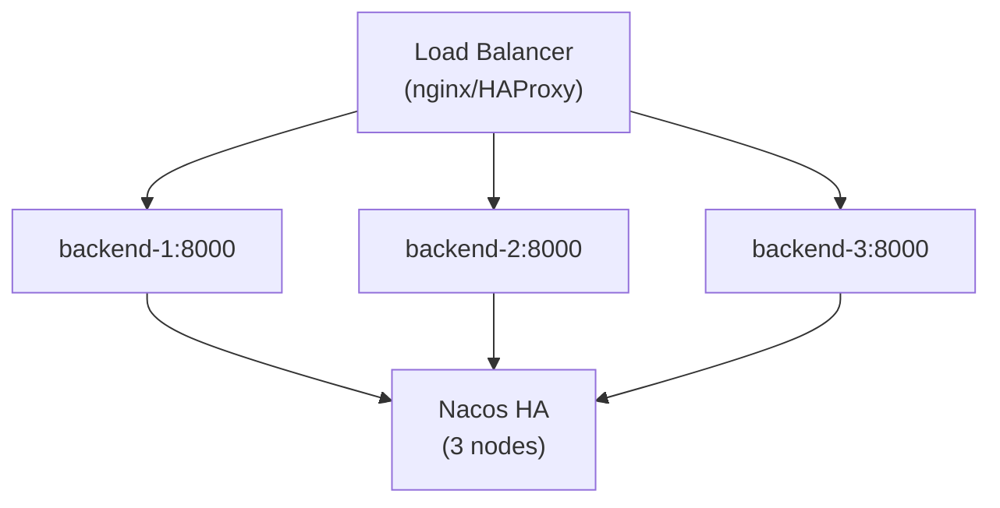

# Production Deployment

Best practices for deploying RecordPlatform in production.

## Pre-deployment Checklist

- [ ] All environment variables configured
- [ ] `JWT_KEY` has high entropy (≥32 chars)
- [ ] SSL certificates installed
- [ ] Database backups configured
- [ ] Monitoring and alerting set up
- [ ] Log aggregation configured

## Using Deployment Scripts

RecordPlatform provides ready-to-use scripts in the `scripts/` directory.

### Available Scripts

| Script | Purpose |
|--------|---------|
| `start.sh` | Unified service management (start/stop/restart/status) |

### Start All Services (Production)

```bash
./scripts/start.sh start all --skywalking --profile=prod
```

This starts services in the correct order with SkyWalking agent attached.

### Start Individual Service

```bash
./scripts/start.sh start <service> --skywalking --profile=prod

# Examples
./scripts/start.sh start storage --skywalking --profile=prod
./scripts/start.sh start fisco --skywalking --profile=prod
./scripts/start.sh start backend --skywalking --profile=prod
```

### Stop All Services

```bash
./scripts/start.sh stop all
```

## High Availability Setup

### Recommended Architecture


```mermaid
flowchart TB
    LB["Load Balancer<br/>(nginx/HAProxy)"]

    LB --> B1["backend-1:8000"]
    LB --> B2["backend-2:8000"]
    LB --> B3["backend-3:8000"]

    B1 --> Nacos["Nacos HA<br/>(3 nodes)"]
    B2 --> Nacos
    B3 --> Nacos
```

### Component Recommendations

| Component | Minimum HA | Recommended |
|-----------|------------|-------------|
| backend | 2 instances | 3+ instances |
| storage | 2 instances | 3+ instances |
| fisco | 1 active writer per signer | BSN Besu same-signer mode: 1 active + fenced cold standby |
| MySQL | 1 primary + 1 replica | 1 primary + 2 replicas + MHA |
| Redis | Sentinel (3 nodes) | Cluster (6 nodes) |
| S3 Storage | 2 nodes (A/B domains) | 3+ nodes (A/B/STANDBY) |
| Nacos | 3 nodes | 3 nodes |
| RabbitMQ | 3 nodes (cluster) | 3 nodes (mirrored) |

The `fisco` recommendation is chain-mode dependent. With `BLOCKCHAIN_ACTIVE=bsn-besu` and one local signer key, only one active writer may own that `(chainId, signer)`. It must use a durable `BSN_BESU_NONCE_STATE_DIRECTORY`; a cold standby can start only after the old writer is externally fenced and the same reliable lock/state volume is available. Do not place two same-signer instances behind a load balancer or perform a rolling update with overlap. Multi-host active-active requires different signers or a separate distributed nonce/lease design and is not supported by the file-lock gate.

### Storage Fault Domains

For production, configure at least 3 storage nodes across 2 active domains + standby:

```yaml
storage:
  # Active domains (in priority order)
  active-domains:
    - A
    - B
  standby-domain: STANDBY

  # Replication strategy
  replication:
    factor: 2              # Number of replicas (default = active domain count)
    quorum: auto           # Quorum policy: auto|majority|all|number

  # Degraded write (allow partial writes when a domain fails)
  degraded-write:
    enabled: true
    min-replicas: 1        # Minimum replicas in degraded mode
    track-for-sync: true   # Track for later sync when domain recovers

  # Storage nodes
  nodes:
    - name: s3-a1
      endpoint: http://s3-node-a1:9000
      accessKey: ${S3_ACCESS_KEY}
      secretKey: ${S3_SECRET_KEY}
      faultDomain: A
      weight: 100
      enabled: true
    - name: s3-b1
      endpoint: http://s3-node-b1:9000
      accessKey: ${S3_ACCESS_KEY}
      secretKey: ${S3_SECRET_KEY}
      faultDomain: B
      weight: 100
      enabled: true
    - name: s3-standby
      endpoint: http://s3-node-standby:9000
      accessKey: ${S3_ACCESS_KEY}
      secretKey: ${S3_SECRET_KEY}
      faultDomain: STANDBY
      weight: 100
      enabled: true

  # Domain configuration (optional, uses defaults if omitted)
  domains:
    - name: A
      minNodes: 1          # Min healthy nodes before standby promotion
      replicaCount: 1
      acceptsWrites: true
    - name: B
      minNodes: 1
      replicaCount: 1
      acceptsWrites: true
    - name: STANDBY
      minNodes: 0
      replicaCount: 0
      acceptsWrites: false
```

> For complete configuration options, see [Nacos Config Template](/nacos-config-template.yaml)

## Trusted Client IP for Public Proof Rate Limiting

The two public proof status/key endpoints share one fixed 120-request/60-second Redis bucket per canonical trusted client IP. The bucket is global: it does not include a tenant, endpoint method, user, or JWT role.

### Direct deployment

Keep `RATE_LIMIT_TRUSTED_PROXY_CIDRS=` empty. The backend uses the direct socket peer and ignores every forwarding header. This is also the safe setting whenever the production proxy topology or header-cleaning behavior has not been verified. If an unconfigured reverse proxy is the immediate peer, all clients safely share that proxy's 120/60 bucket and may be rejected earlier; configure a verified allowlist or enforce an equivalent edge limit before production traffic.

### Controlled reverse proxy

Before setting the variable, record every platform-controlled immediate/multi-hop proxy IP or CIDR and verify that each proxy overwrites caller-supplied forwarding headers or appends only socket-derived hops. For example:

```dotenv
RATE_LIMIT_TRUSTED_PROXY_CIDRS=10.20.0.0/16,2001:db8:20::/48
```

Only a matching immediate peer can activate header parsing. The backend accepts one bounded `X-Forwarded-For` chain, walks it right-to-left, skips configured trusted hops, and selects the first untrusted numeric address. It uses a single `X-Real-IP` only when XFF is absent; invalid, duplicate, overlong, or over-hop headers fall back to the immediate peer. `Forwarded`, hostnames, ports, and DNS resolution are not supported.

`server.forward-headers-strategy` is fixed to `none` so Spring/Tomcat cannot rewrite `request.getRemoteAddr()` before this resolver. Startup also rejects `server.tomcat.remoteip.remote-ip-header` and `server.tomcat.remoteip.protocol-header`, because either can install a `RemoteIpValve` independently. Do not configure a `ForwardedHeaderFilter`, external `RemoteIpValve`, ingress sidecar, or servlet-container equivalent that rewrites the remote address. Because framework forwarding inference is disabled, proxy TLS termination and absolute URL/scheme handling must be configured and verified independently; do not re-enable forwarded-header processing to solve those concerns.

Before production rollout, verify both public endpoints alternately: requests 1–120 from one client must succeed, request 121 must be rejected, a second client must have an independent bucket, and the Redis TTL must be within 60 seconds. The new key namespace is `rate:limit:public:proof-verification:v2:ip:<canonical-ip>`. No old counters are copied; deploy and rollback can each reset one 60-second window. Roll out at low traffic with edge limiting retained. Rollback restores the old forwarding-header bypass, so enable an edge direct-source limit of 120/60 or stricter before reverting.

## SSL/TLS Configuration

### Generate Self-Signed Certificate (Testing)

```bash
keytool -genkeypair -alias recordplatform \
  -keyalg RSA -keysize 2048 \
  -storetype PKCS12 \
  -keystore keystore.p12 \
  -validity 365
```

### Configure SSL

```yaml
server:
  port: 443
  ssl:
    enabled: ${SSL_ENABLED:true}
    key-store: ${SSL_KEY_STORE:classpath:keystore.p12}
    key-store-password: ${SSL_KEY_STORE_PASSWORD}
    key-store-type: ${SSL_KEY_STORE_TYPE:PKCS12}

security:
  require-ssl: ${REQUIRE_SSL:true}
  http-redirect-port: ${HTTP_REDIRECT_PORT:80}
```

## JVM Tuning

### Recommended JVM Options

```bash
JAVA_OPTS="-Xms2g -Xmx4g \
  -XX:+UseG1GC \
  -XX:MaxGCPauseMillis=200 \
  -XX:+HeapDumpOnOutOfMemoryError \
  -XX:HeapDumpPath=/var/log/recordplatform/ \
  -Djava.security.egd=file:/dev/./urandom"
```

### Service-Specific Recommendations

| Service | Heap Min | Heap Max | Notes |
|---------|----------|----------|-------|
| backend | 2GB | 4GB | Main workload |
| storage | 1GB | 2GB | I/O bound |
| fisco | 512MB | 1GB | Lightweight |

## Logging

### Log Locations

```
/var/log/recordplatform/
├── backend/
│   ├── app.log
│   └── error.log
├── storage/
│   └── app.log
└── fisco/
    └── app.log
```

### Log Rotation

Configure logrotate for production:

```
/var/log/recordplatform/*/*.log {
    daily
    rotate 30
    compress
    delaycompress
    missingok
    notifempty
    create 0640 app app
}
```

## Backup Strategy

### Database Backups

```bash
# Daily full backup
mysqldump -h <mysql-host> -u <mysql-user> -p \
  --single-transaction --routines --triggers \
  RecordPlatform > backup_$(date +%Y%m%d).sql

# Compress
gzip backup_$(date +%Y%m%d).sql
```

### S3 Data Sync

Enable cross-region replication or periodic sync for S3 data.
