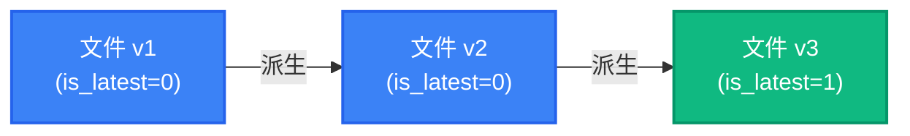
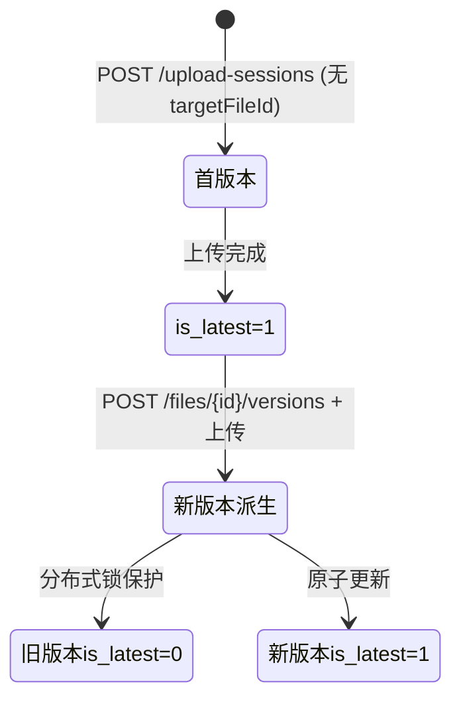
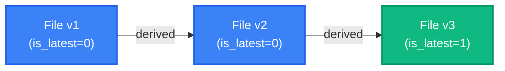
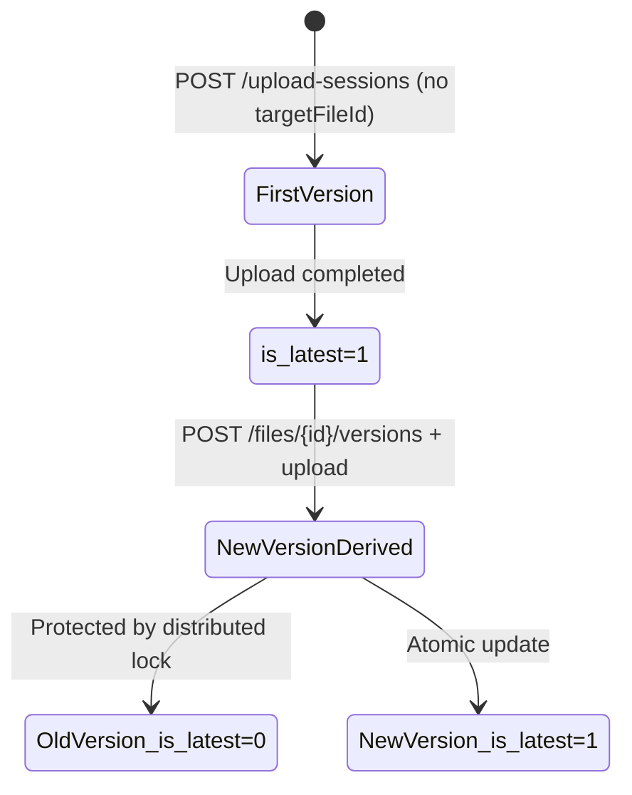

# README & Documentation Overhaul Implementation Plan

> **For agentic workers:** REQUIRED: Use superpowers:executing-plans to implement this plan. Steps use checkbox (`- [ ]`) syntax for tracking.

**Goal:** Fully rewrite README.md/README_CN.md in visual-rich style (Tauri/NestJS), restructure docs by adding a Development section and File Version Chain architecture page, and fill API documentation gaps.

**Architecture:** Two work streams: (1) README rewrite — pure markdown, no build dependency; (2) Doc restructure — VitePress `config.mts` navigation update + new/modified `.md` pages. Both streams are independent; README can be done without building docs.

**Tech Stack:** Markdown, VitePress 1.6.x, Mermaid diagrams

---

## File Map

| Action | File |
|--------|------|
| **Rewrite** | `README.md` |
| **Rewrite** | `README_CN.md` |
| **Create** | `docs/en/architecture/file-version-chain.md` |
| **Create** | `docs/zh/architecture/file-version-chain.md` |
| **Create** | `docs/en/development/index.md` |
| **Create** | `docs/zh/development/index.md` |
| **Create** | `docs/en/development/contributing.md` |
| **Create** | `docs/zh/development/contributing.md` |
| **Create** | `docs/en/development/testing.md` |
| **Create** | `docs/zh/development/testing.md` |
| **Create** | `docs/en/development/local-dev.md` |
| **Create** | `docs/zh/development/local-dev.md` |
| **Modify** | `docs/en/architecture/index.md` — add version chain entry |
| **Modify** | `docs/zh/architecture/index.md` — 添加版本链条目 |
| **Modify** | `docs/en/architecture/system-overview.md` — add version chain section |
| **Modify** | `docs/zh/architecture/system-overview.md` — 添加版本链章节 |
| **Modify** | `docs/en/api/index.md` — add version chain endpoints |
| **Modify** | `docs/zh/api/index.md` — 补充版本链 API |
| **Modify** | `docs/.vitepress/config.mts` — add development section + architecture entry |

---

## Chunk 1: README Rewrite

### Task 1: Rewrite README.md (English)

**Files:**
- Rewrite: `README.md`

- [ ] **Step 1: Write the new README.md**

Write the following content to `README.md`:

```markdown
<div align="center">

# RecordPlatform

**Enterprise-grade file attestation platform powered by blockchain and distributed storage**

[](https://github.com/SoarCollab/RecordPlatform/actions/workflows/test.yml)
[](LICENSE)
[](https://openjdk.org/projects/jdk/21/)
[](https://spring.io/projects/spring-boot)
[](https://svelte.dev)

[中文文档](README_CN.md) · [Documentation](https://soarcollab.github.io/RecordPlatform/) · [API Reference](docs/en/api/index.md)

</div>

---

## What is RecordPlatform?

RecordPlatform is an open-source, enterprise-grade file attestation platform that combines **blockchain immutability** with **fault-domain-aware distributed storage**. Upload files, have their metadata recorded on-chain via FISCO BCOS, and share them securely — with cryptographic proof of origin, integrity, and full access audit.

Built for teams that need:
- 📜 **Auditable provenance** — every upload, share, and download tracked and verifiable on-chain
- 🏢 **Multi-tenant isolation** — separate storage, cache, and data paths per tenant
- 🔒 **End-to-end encryption** — AES-GCM/ChaCha20-Poly1305 with per-chunk key chains

---

## ✨ Features

<table>
<tr>
<td width="50%" valign="top">

### 🔐 Attestation & Security
- **Blockchain Attestation** — file metadata stored on FISCO BCOS, immutable and traceable
- **File Encryption** — AES-GCM / ChaCha20-Poly1305, per-chunk independent key chains
- **RBAC + Ownership** — fine-grained resource-level access control
- **ID Obfuscation** — AES-256-CTR external↔internal ID mapping

</td>
<td width="50%" valign="top">

### 📦 Storage & Transfer
- **Distributed Storage** — 1~N active fault domains, quorum writes, N-1 fault tolerance, auto-promotion from standby
- **Chunked Upload** — resumable, concurrent, dynamic chunk sizing
- **Streaming Download** — StreamSaver.js for large files; auto strategy selection
- **File Version Chain** — track history, derive new versions from existing files

</td>
</tr>
<tr>
<td width="50%" valign="top">

### 👥 Collaboration & Sharing
- **File Sharing** — generate share codes with access limits, expiry, and password protection
- **Share Audit & Provenance** — multi-level chain tracking (A→B→C), full access logs
- **Friend System** — direct file sharing with friends, real-time SSE notifications
- **Support Tickets** — built-in ticket system with categories, priorities, admin management

</td>
<td width="50%" valign="top">

### 📊 Governance & Observability
- **Quota Governance** — per-user and per-tenant limits, SHADOW/ENFORCE modes, gradual rollout
- **Real-time Notifications** — SSE push for file attestation, tickets, friend events, announcements
- **Storage Capacity API** — cluster/domain/node capacity aggregates with `degraded`+`source` semantics
- **Multi-tenancy** — DB, cache, and storage path isolation per tenant

</td>
</tr>
</table>

---

## 🏗 Architecture

```
┌─────────────────────────────────────────────────────────────────┐
│                       Infrastructure                            │
│  Nacos    MySQL    RabbitMQ    Redis    S3 Storage Cluster     │
└─────────────────────────────────────────────────────────────────┘
                              │
              ┌───────────────┴───────────────┐
              │         platform-api          │
              │    (Shared Dubbo Interfaces)  │
              └───────────────┬───────────────┘
                              │
         ┌────────────────────┼────────────────────┐
         │                    │                    │
         ▼                    │                    ▼
┌─────────────────┐           │           ┌─────────────────┐
│ platform-fisco  │           │           │ platform-storage│
│ Blockchain Svc  │           │           │ Storage Service │
│ (Port 8091)     │           │           │ (Port 8092)     │
└────────┬────────┘           │           └────────┬────────┘
         │         Dubbo RPC  │  Dubbo RPC         │
         │                    ▼                    │
         │          ┌─────────────────┐            │
         │          │ platform-backend│            │
         │          │ REST API :8000  │            │
         │          └─────────────────┘            │
         │                                         │
         ▼                                         ▼
  ┌─────────────┐                        ┌────────────────┐
  │ FISCO BCOS  │                        │   S3 Cluster   │
  │    Node     │                        │ (MinIO / S3)   │
  └─────────────┘                        └────────────────┘
```

> For detailed architecture with Mermaid diagrams and data flow sequences, see [Architecture Guide](docs/en/architecture/index.md)

---

## ⚡ Quick Start

### 1. Prerequisites

Ensure the following services are running before starting:

| Service               | Port  | Purpose                    |
| --------------------- | ----- | -------------------------- |
| Nacos                 | 8848  | Service discovery & config |
| MySQL                 | 3306  | Database                   |
| Redis                 | 6379  | Cache & distributed locks  |
| RabbitMQ              | 5672  | Message queue              |
| S3-compatible storage | 9000  | Object storage             |
| FISCO BCOS            | 20200 | Blockchain node            |

Start infrastructure with Docker Compose:

```bash
docker compose -f docker-compose.infra.yml up -d
```

Copy `.env.example` to `.env` and configure `JWT_KEY`, `S3_*`, and `FISCO_*` before starting services.

### 2. Build

```bash
# Install shared interfaces (required first)
mvn -f platform-api/pom.xml clean install

# Build all backend services
mvn -f platform-backend/pom.xml clean package -DskipTests
mvn -f platform-fisco/pom.xml clean package -DskipTests
mvn -f platform-storage/pom.xml clean package -DskipTests
```

### 3. Run

```bash
# Start in order: providers before consumer
java -jar "$(ls platform-storage/target/platform-storage-*.jar)" --spring.profiles.active=local
java -jar "$(ls platform-fisco/target/platform-fisco-*.jar)" --spring.profiles.active=local
java -jar "$(ls platform-backend/backend-web/target/backend-web-*.jar)" --spring.profiles.active=local

# Frontend dev server
cd platform-frontend && pnpm install && pnpm dev
```

Or use the unified start script:

```bash
./scripts/start.sh start all
```

Verify the installation at:
- **Swagger UI**: http://localhost:8000/record-platform/swagger-ui.html
- **Health check**: http://localhost:8000/record-platform/actuator/health
- **Frontend**: http://localhost:5173

> For detailed setup, see [Getting Started Guide](docs/en/getting-started/index.md)

---

## 🧱 Tech Stack

| Category      | Technology                                              | Version               |
| ------------- | ------------------------------------------------------- | --------------------- |
| Backend       | Java + Spring Boot + Virtual Threads                    | 21, 3.5.11            |
| Microservices | Apache Dubbo (Triple protocol), Nacos                   | 3.3.6                 |
| Blockchain    | FISCO BCOS, Solidity                                    | 3.8.0, ^0.8.11        |
| Storage       | S3-compatible (AWS SDK v2), MySQL, Redis (Redisson)     | 2.x, 8.0+, 7.0+       |
| Frontend      | Svelte 5 (Runes), SvelteKit, Tailwind CSS 4, bits-ui   | 5.53+, 2.53+, 4.2+    |
| Resilience    | Resilience4j (circuit breaker, retry)                   | 2.3.0                 |
| Monitoring    | Micrometer, Prometheus                                  | —                     |
| Testing       | JUnit 5, Mockito, Testcontainers, Vitest                | —                     |

---

## 📚 Documentation

| Guide | Description |
| ----- | ----------- |
| [Getting Started](docs/en/getting-started/index.md) | Prerequisites, installation, configuration |
| [Architecture](docs/en/architecture/index.md) | System overview, distributed storage, blockchain, security |
| [Deployment](docs/en/deployment/index.md) | Docker Compose, production setup, monitoring |
| [API Reference](docs/en/api/index.md) | REST endpoints, authentication, error codes |
| [Development](docs/en/development/index.md) | Contributing, local dev, testing strategy |
| [Troubleshooting](docs/en/troubleshooting/index.md) | Common issues and solutions |

---

## 🗂 Project Structure

```
RecordPlatform/
├── platform-api/          # Shared Dubbo interface definitions
├── platform-backend/      # REST API service (Dubbo Consumer, :8000)
│   ├── backend-web/       # Controllers, JWT filters, rate limiting
│   ├── backend-service/   # Business logic, Saga orchestration, Outbox
│   ├── backend-dao/       # MyBatis Plus mappers and entities
│   ├── backend-api/       # Internal interface definitions
│   └── backend-common/    # Shared utilities and constants
├── platform-fisco/        # Blockchain service (Dubbo Provider, :8091)
├── platform-storage/      # Storage service (Dubbo Provider, :8092)
├── platform-frontend/     # Svelte 5 + SvelteKit frontend
├── scripts/               # Start/stop scripts, env-check
├── tools/                 # k6 load tests, security PoC, doc consistency
├── docs/                  # VitePress documentation site (en/zh)
└── docker-compose.infra.yml  # Infrastructure services (Nacos, MySQL, Redis, RabbitMQ, MinIO)
```

---

## 🛠 Contributing

We welcome contributions! Please read the [Contributing Guide](docs/en/development/contributing.md) before getting started.

```bash
# 1. Fork and clone the repository
git clone https://github.com/<your-fork>/RecordPlatform.git

# 2. Create a feature branch
git checkout -b feat/your-feature

# 3. Make changes, run tests
mvn -f platform-backend/pom.xml test

# 4. Open a Pull Request against main
```

**Branch naming:** `feat/`, `fix/`, `refactor/`, `docs/`, `chore/`

All PRs must pass CI gates: backend tests, frontend tests, contract consistency check, and build verification. See [CI Gates](docs/en/development/contributing.md#ci-gates) for details.

---

## 📄 License

This project is licensed under the Apache License 2.0 — see the [LICENSE](LICENSE) file for details.
```

- [ ] **Step 2: Verify markdown renders correctly**

```bash
# Spot-check for broken markdown syntax (mismatched backticks, unclosed tags)
grep -c '```' README.md
# Count should be even
```

- [ ] **Step 3: Commit**

```bash
git add README.md
git commit -m "docs: rewrite README with visual-rich Tauri/NestJS style"
```

---

### Task 2: Rewrite README_CN.md (Chinese)

**Files:**
- Rewrite: `README_CN.md`

- [ ] **Step 1: Write the new README_CN.md**

Write the following content to `README_CN.md` (mirrors README.md structure, Chinese):

```markdown
<div align="center">

# RecordPlatform

**基于区块链和分布式存储的企业级文件存证平台**

[](https://github.com/SoarCollab/RecordPlatform/actions/workflows/test.yml)
[](LICENSE)
[](https://openjdk.org/projects/jdk/21/)
[](https://spring.io/projects/spring-boot)
[](https://svelte.dev)

[English](README.md) · [在线文档](https://soarcollab.github.io/RecordPlatform/) · [API 参考](docs/zh/api/index.md)

</div>

---

## 什么是 RecordPlatform？

RecordPlatform 是一个开源的企业级文件存证平台，将**区块链不可篡改性**与**故障域感知的分布式存储**相结合。上传文件，将元数据通过 FISCO BCOS 链上存证，并以安全方式分享 — 具备来源可验证、完整性可证明、访问全程可审计的能力。

专为以下需求而构建：
- 📜 **可审计的溯源链** — 每次上传、分享、下载均可追踪并链上可验证
- 🏢 **多租户隔离** — 按租户隔离存储、缓存和数据路径
- 🔒 **端到端加密** — AES-GCM/ChaCha20-Poly1305，每个分片独立密钥链

---

## ✨ 核心特性

<table>
<tr>
<td width="50%" valign="top">

### 🔐 存证与安全
- **区块链存证** — 文件元数据上链至 FISCO BCOS，不可篡改可追溯
- **文件加密** — AES-GCM / ChaCha20-Poly1305，分片独立密钥链
- **RBAC + 归属校验** — 细粒度资源级权限控制
- **ID 混淆** — AES-256-CTR 外部↔内部 ID 映射

</td>
<td width="50%" valign="top">

### 📦 存储与传输
- **分布式存储** — 1~N 活跃故障域，仲裁写入，N-1 容错，备用域自动提升
- **分片上传** — 断点续传、并发上传、动态分片大小
- **流式下载** — 大文件使用 StreamSaver.js，自动策略选择
- **文件版本链** — 追踪文件历史，从已有文件派生新版本

</td>
</tr>
<tr>
<td width="50%" valign="top">

### 👥 协作与分享
- **文件分享** — 生成带访问次数、有效期、密码保护的分享码
- **分享审计与溯源** — 多级溯源链（A→B→C），完整访问日志
- **好友系统** — 好友间直接分享，SSE 实时通知
- **工单系统** — 内置工单系统，支持分类、优先级、管理员处理

</td>
<td width="50%" valign="top">

### 📊 治理与可观测性
- **配额治理** — 用户/租户级存储限额，SHADOW/ENFORCE 两种模式，灰度发布
- **实时通知** — SSE 推送存证结果、工单动态、好友事件、系统公告
- **存储容量 API** — 集群/域/节点容量聚合，含 `degraded`+`source` 语义
- **多租户隔离** — 数据库、缓存、存储路径按租户独立隔离

</td>
</tr>
</table>

---

## 🏗 系统架构

```
┌─────────────────────────────────────────────────────────────────┐
│                          基础设施层                               │
│  Nacos    MySQL    RabbitMQ    Redis    S3 存储集群               │
└─────────────────────────────────────────────────────────────────┘
                              │
              ┌───────────────┴───────────────┐
              │         platform-api          │
              │      (共享 Dubbo 接口)         │
              └───────────────┬───────────────┘
                              │
         ┌────────────────────┼────────────────────┐
         │                    │                    │
         ▼                    │                    ▼
┌─────────────────┐           │           ┌─────────────────┐
│ platform-fisco  │           │           │ platform-storage│
│ 区块链服务        │           │           │  存储服务        │
│ (端口 8091)      │           │           │ (端口 8092)     │
└────────┬────────┘           │           └────────┬────────┘
         │         Dubbo RPC  │  Dubbo RPC         │
         │                    ▼                    │
         │          ┌─────────────────┐            │
         │          │ platform-backend│            │
         │          │ REST API :8000  │            │
         │          └─────────────────┘            │
         │                                         │
         ▼                                         ▼
  ┌─────────────┐                        ┌────────────────┐
  │ FISCO BCOS  │                        │   S3 集群      │
  │    节点      │                        │ (MinIO / S3)  │
  └─────────────┘                        └────────────────┘
```

> 含 Mermaid 流程图和数据流时序图的完整架构文档请参阅 [架构设计文档](docs/zh/architecture/index.md)

---

## ⚡ 快速开始

### 1. 前置依赖

启动前确保以下服务已运行：

| 服务          | 端口  | 用途               |
| ------------- | ----- | ------------------ |
| Nacos         | 8848  | 服务发现与配置中心 |
| MySQL         | 3306  | 数据库             |
| Redis         | 6379  | 缓存与分布式锁     |
| RabbitMQ      | 5672  | 消息队列           |
| S3 兼容存储   | 9000  | 对象存储           |
| FISCO BCOS    | 20200 | 区块链节点         |

通过 Docker Compose 启动基础设施：

```bash
docker compose -f docker-compose.infra.yml up -d
```

复制 `.env.example` 为 `.env`，配置 `JWT_KEY`、`S3_*` 和 `FISCO_*` 后再启动服务。

### 2. 构建

```bash
# 安装共享接口（必须首先执行）
mvn -f platform-api/pom.xml clean install

# 构建所有后端模块
mvn -f platform-backend/pom.xml clean package -DskipTests
mvn -f platform-fisco/pom.xml clean package -DskipTests
mvn -f platform-storage/pom.xml clean package -DskipTests
```

### 3. 启动

```bash
# 按顺序启动（Provider 先于 Consumer）
java -jar "$(ls platform-storage/target/platform-storage-*.jar)" --spring.profiles.active=local
java -jar "$(ls platform-fisco/target/platform-fisco-*.jar)" --spring.profiles.active=local
java -jar "$(ls platform-backend/backend-web/target/backend-web-*.jar)" --spring.profiles.active=local

# 启动前端开发服务
cd platform-frontend && pnpm install && pnpm dev
```

或使用统一启动脚本：

```bash
./scripts/start.sh start all
```

验证安装：
- **Swagger UI**：http://localhost:8000/record-platform/swagger-ui.html
- **健康检查**：http://localhost:8000/record-platform/actuator/health
- **前端**：http://localhost:5173

> 详细配置请参阅 [快速开始指南](docs/zh/getting-started/index.md)

---

## 🧱 技术栈

| 分类     | 技术                                                    | 版本               |
| -------- | ------------------------------------------------------- | ------------------ |
| 后端     | Java + Spring Boot + Virtual Threads                    | 21, 3.5.11         |
| 微服务   | Apache Dubbo (Triple 协议), Nacos                       | 3.3.6              |
| 区块链   | FISCO BCOS, Solidity                                    | 3.8.0, ^0.8.11     |
| 存储     | S3 兼容存储 (AWS SDK v2), MySQL, Redis (Redisson)        | 2.x, 8.0+, 7.0+    |
| 前端     | Svelte 5 (Runes), SvelteKit, Tailwind CSS 4, bits-ui   | 5.53+, 2.53+, 4.2+ |
| 弹性设计 | Resilience4j（熔断、重试）                               | 2.3.0              |
| 监控     | Micrometer, Prometheus                                  | —                  |
| 测试     | JUnit 5, Mockito, Testcontainers, Vitest                | —                  |

---

## 📚 文档导航

| 指南 | 说明 |
| ---- | ---- |
| [快速开始](docs/zh/getting-started/index.md) | 前置依赖、安装部署、配置说明 |
| [架构设计](docs/zh/architecture/index.md) | 系统架构、分布式存储、区块链、安全机制 |
| [部署运维](docs/zh/deployment/index.md) | Docker Compose、生产环境、监控告警 |
| [API 参考](docs/zh/api/index.md) | REST 端点、认证规则、错误码 |
| [开发指南](docs/zh/development/index.md) | 贡献指南、本地开发、测试策略 |
| [故障排查](docs/zh/troubleshooting/index.md) | 常见问题与解决方案 |

---

## 🗂 项目结构

```
RecordPlatform/
├── platform-api/          # 共享 Dubbo 接口定义
├── platform-backend/      # REST API 服务（Dubbo Consumer, :8000）
│   ├── backend-web/       # 控制器、JWT 过滤器、限流
│   ├── backend-service/   # 业务逻辑、Saga 编排、Outbox
│   ├── backend-dao/       # MyBatis Plus 映射与实体
│   ├── backend-api/       # 内部接口定义
│   └── backend-common/    # 共享工具类与常量
├── platform-fisco/        # 区块链服务（Dubbo Provider, :8091）
├── platform-storage/      # 存储服务（Dubbo Provider, :8092）
├── platform-frontend/     # Svelte 5 + SvelteKit 前端
├── scripts/               # 启停脚本、环境预检
├── tools/                 # k6 压测、安全 PoC、文档一致性校验
├── docs/                  # VitePress 文档站（en/zh）
└── docker-compose.infra.yml  # 基础设施服务（Nacos/MySQL/Redis/RabbitMQ/MinIO）
```

---

## 🛠 参与贡献

欢迎贡献！请在开始前阅读 [贡献指南](docs/zh/development/contributing.md)。

```bash
# 1. Fork 并克隆仓库
git clone https://github.com/<your-fork>/RecordPlatform.git

# 2. 创建功能分支
git checkout -b feat/your-feature

# 3. 修改代码，运行测试
mvn -f platform-backend/pom.xml test

# 4. 向 main 分支发起 Pull Request
```

**分支命名规范：** `feat/`、`fix/`、`refactor/`、`docs/`、`chore/`

所有 PR 必须通过 CI 门禁：后端测试、前端测试、契约一致性检查、构建验证。详见 [CI 门禁](docs/zh/development/contributing.md#ci-门禁)。

---

## 📄 许可证

本项目基于 Apache License 2.0 开源 — 详见 [LICENSE](LICENSE) 文件。
```

- [ ] **Step 2: Verify markdown renders correctly**

```bash
grep -c '```' README_CN.md
# Count should be even
```

- [ ] **Step 3: Commit**

```bash
git add README_CN.md
git commit -m "docs: rewrite README_CN with visual-rich style"
```

---

## Chunk 2: Architecture Doc — File Version Chain

### Task 3: Create file-version-chain.md (ZH)

**Files:**
- Create: `docs/zh/architecture/file-version-chain.md`

- [ ] **Step 1: Create the Chinese version chain architecture page**

```markdown
# 文件版本链

RecordPlatform 支持文件版本管理，允许用户从已有文件派生新版本，形成可追溯的版本历史链。

## 概念模型



同一版本链中的文件共享相同的 `version_group_id`，通过 `parent_version_id` 形成链式引用。`is_latest=1` 标记链中最新版本，文件列表默认只展示最新版本。

## 数据模型

版本链相关字段（`file_record` 表）：

| 字段 | 类型 | 说明 |
|------|------|------|
| `version` | INT | 当前版本号（从 1 开始） |
| `parent_version_id` | BIGINT | 父版本文件 ID（首版本为 NULL） |
| `version_group_id` | BIGINT | 版本组 ID（同组文件共享，等于链首文件 ID） |
| `is_latest` | TINYINT | 是否为当前最新版本（1=是，0=否） |

**并发控制**：创建新版本时使用 Redisson 分布式锁（锁 Key = `version-chain:{versionGroupId}`），防止同一版本链并发写入导致数据竞争。

## REST API

### 查询版本历史

```http
GET /api/v1/files/{id}/versions
Authorization: Bearer <token>
```

**响应示例：**

```json
{
  "code": 200,
  "data": [
    { "id": "abc123", "version": 3, "fileName": "report_v3.pdf", "isLatest": true, "createdAt": "2026-03-14T10:00:00Z" },
    { "id": "abc122", "version": 2, "fileName": "report_v2.pdf", "isLatest": false, "createdAt": "2026-03-10T08:00:00Z" },
    { "id": "abc121", "version": 1, "fileName": "report_v1.pdf", "isLatest": false, "createdAt": "2026-03-01T06:00:00Z" }
  ]
}
```

权限规则：文件所有者可查询完整版本历史；管理员可查询所有文件的版本历史。

### 创建新版本

```http
POST /api/v1/files/{id}/versions
Authorization: Bearer <token>
```

该接口将目标文件标记为"待续写版本"，前端在上传新文件时携带 `targetFileId` 参数触发版本续写流程。新版本上传完成后：

1. 原版本 `is_latest` 置为 0
2. 新版本继承相同的 `version_group_id`
3. 新版本 `parent_version_id` 指向前一版本
4. 新版本 `is_latest` 置为 1

## 与上传流程的集成

前端在调用 `POST /api/v1/upload-sessions` 时可传入 `targetFileId`，后端据此将新文件自动归入对应版本链：

```http
POST /api/v1/upload-sessions
Content-Type: application/json

{
  "fileName": "report_v4.pdf",
  "fileSize": 1048576,
  "targetFileId": "abc123"  // 可选，触发版本续写
}
```

## 版本链状态机



## 文件列表过滤

默认文件查询（`GET /api/v1/files`）自动过滤 `is_latest=1`，用户只看到每条版本链的最新版本。通过版本历史 API 可查看完整链。

## 数据库迁移

版本链 schema 由 Flyway 迁移 `V1.4.0__file_version_chain.sql` 负责：
- 为现有文件回填 `version=1`、`is_latest=1`、`version_group_id=id`
- 添加索引：`(version_group_id, version)`、`(parent_version_id)`、`is_latest`
```

- [ ] **Step 2: Commit**

```bash
git add docs/zh/architecture/file-version-chain.md
git commit -m "docs: add file version chain architecture page (zh)"
```

---

### Task 4: Create file-version-chain.md (EN)

**Files:**
- Create: `docs/en/architecture/file-version-chain.md`

- [ ] **Step 1: Create the English version chain architecture page**

```markdown
# File Version Chain

RecordPlatform supports file versioning, allowing users to derive new versions from existing files, forming a traceable version history chain.

## Concept Model



Files in the same version chain share the same `version_group_id` and are linked via `parent_version_id`. `is_latest=1` marks the newest version; file lists display only the latest version by default.

## Data Model

Version chain fields in the `file_record` table:

| Field | Type | Description |
|-------|------|-------------|
| `version` | INT | Current version number (starts at 1) |
| `parent_version_id` | BIGINT | Parent version file ID (NULL for first version) |
| `version_group_id` | BIGINT | Version group ID (shared by chain; equals chain-head file ID) |
| `is_latest` | TINYINT | Whether this is the current latest version (1=yes, 0=no) |

**Concurrency control**: A Redisson distributed lock (`version-chain:{versionGroupId}`) protects new version creation, preventing race conditions on the same version chain.

## REST API

### Get Version History

```http
GET /api/v1/files/{id}/versions
Authorization: Bearer <token>
```

**Response:**

```json
{
  "code": 200,
  "data": [
    { "id": "abc123", "version": 3, "fileName": "report_v3.pdf", "isLatest": true, "createdAt": "2026-03-14T10:00:00Z" },
    { "id": "abc122", "version": 2, "fileName": "report_v2.pdf", "isLatest": false, "createdAt": "2026-03-10T08:00:00Z" },
    { "id": "abc121", "version": 1, "fileName": "report_v1.pdf", "isLatest": false, "createdAt": "2026-03-01T06:00:00Z" }
  ]
}
```

Permissions: file owner can view full version history; admins can view history for any file.

### Create New Version

```http
POST /api/v1/files/{id}/versions
Authorization: Bearer <token>
```

Marks the target file as a "version continuation target". The frontend passes `targetFileId` when uploading a new file to trigger the version chain write. On upload completion:

1. Previous version's `is_latest` is set to 0
2. New version inherits the same `version_group_id`
3. New version's `parent_version_id` points to the previous version
4. New version's `is_latest` is set to 1

## Integration with Upload Flow

Pass `targetFileId` when calling `POST /api/v1/upload-sessions` to automatically append the new file to an existing version chain:

```http
POST /api/v1/upload-sessions
Content-Type: application/json

{
  "fileName": "report_v4.pdf",
  "fileSize": 1048576,
  "targetFileId": "abc123"  // optional, triggers version chain write
}
```

## Version Chain State Machine



## File List Filtering

The default file query (`GET /api/v1/files`) automatically filters `is_latest=1`, so users see only the latest version of each chain. Full version history is accessible via the version history API.

## Database Migration

The version chain schema is managed by Flyway migration `V1.4.0__file_version_chain.sql`:
- Backfills existing files with `version=1`, `is_latest=1`, `version_group_id=id`
- Adds indexes on `(version_group_id, version)`, `(parent_version_id)`, and `is_latest`
```

- [ ] **Step 2: Commit**

```bash
git add docs/en/architecture/file-version-chain.md
git commit -m "docs: add file version chain architecture page (en)"
```

---

## Chunk 3: Development Section (New)

### Task 5: Create Development section — ZH

**Files:**
- Create: `docs/zh/development/index.md`
- Create: `docs/zh/development/contributing.md`
- Create: `docs/zh/development/testing.md`
- Create: `docs/zh/development/local-dev.md`

- [ ] **Step 1: Create `docs/zh/development/index.md`**

```markdown
# 开发指南

本节面向希望为 RecordPlatform 贡献代码或在本地进行开发的工程师。

## 目录

- [本地开发环境](local-dev) — 搭建完整的本地开发栈
- [贡献指南](contributing) — 分支规范、PR 流程、CI 门禁
- [测试策略](testing) — 测试分层、覆盖率要求、运行命令

## 技术决策速查

| 问题 | 答案 |
|------|------|
| 依赖注入方式 | 优先 `@RequiredArgsConstructor`，禁止 `@Autowired` |
| DTO/VO | 优先使用 Java Records |
| REST 路径风格 | kebab-case（如 `/upload-sessions`） |
| 异常处理 | `GeneralException(ResultEnum)` 标准业务异常 |
| 跨租户操作 | `@TenantScope(ignoreIsolation = true)` |
| 前端状态管理 | Svelte 5 Runes（`$state`、`$derived`、`$effect`） |
| 审计追踪 | Controller 必须加 `@OperationLog` 注解 |
```

- [ ] **Step 2: Create `docs/zh/development/contributing.md`**

```markdown
# 贡献指南

## 开始贡献

1. Fork 本仓库
2. 创建功能分支：`git checkout -b feat/your-feature`
3. 遵循代码规范进行修改
4. 确保测试通过：`mvn -f platform-backend/pom.xml test`
5. 向 `main` 分支发起 Pull Request

## 分支命名规范

| 前缀 | 用途 |
|------|------|
| `feat/` | 新功能 |
| `fix/` | Bug 修复 |
| `refactor/` | 重构（不改变行为） |
| `docs/` | 文档更新 |
| `chore/` | 构建、依赖等维护性变更 |

## 提交信息规范

格式：`<type>: <subject>` （英文，~80 字符）

```bash
# 正确
feat: add file version chain support
fix: resolve chunk decryption order issue
docs: add distributed storage architecture page

# 错误（不含 AI 作者标注）
feat: add feature
Co-Authored-By: Claude <...>  # ❌ 禁止
```

## CI 门禁

所有 PR 必须通过以下检查才能合并：

| 检查项 | 说明 |
|--------|------|
| **Backend Tests** | 单元测试 + 集成测试，含覆盖率阈值 |
| **Frontend Tests** | lint + type check + vitest 覆盖率 |
| **Contract Consistency** | OpenAPI ↔ `generated.ts` 无差异 |
| **Build Verification** | 后端构建 + 前端 `pnpm build` |

### 修改 REST 接口后必须更新契约

```bash
# 选项 1：后端本地运行时
cd platform-frontend && pnpm types:gen

# 选项 2：使用导出的 openapi.json
cd platform-frontend && OPENAPI_SOURCE=path/to/openapi.json pnpm types:gen
```

更新后提交 `platform-frontend/src/lib/api/types/generated.ts`。

## 覆盖率要求

**后端 JaCoCo：**

| 模块 | 最低行覆盖率 |
|------|------------|
| backend-web | 40% |
| backend-service | 45% |
| backend-common | 40% |

**前端 Vitest：**

| 路径 | 行/函数/分支/语句 |
|------|----------------|
| `src/lib/utils/**` | 70% / 70% / 60% / 70% |
| `src/lib/api/endpoints/**` | 90% / 90% / 85% / 90% |
| `src/lib/stores/**` | 90% / 90% / 80% / 90% |
| `src/lib/services/**` | 90% / 90% / 85% / 90% |

## 代码规范速查

- **DI 方式**：优先 `@RequiredArgsConstructor`，禁止生产代码中使用 `@Autowired`
- **DTO/VO**：优先使用 Java Records
- **REST 路径**：kebab-case（`/upload-sessions`，非 `/uploadSessions`）
- **Controller**：必须加 `@OperationLog(module, operationType, description)`
- **SQL 参数**：MyBatis 使用 `#{}`，禁止 `${}` 接收用户输入
- **前端**：使用 Svelte 5 Runes（禁止 Svelte 4 stores）
```

- [ ] **Step 3: Create `docs/zh/development/testing.md`**

```markdown
# 测试策略

## 测试分层

| 命名约定 | 类型 | 说明 |
|----------|------|------|
| `*Test.java` | 单元测试 | 无外部依赖（DB/Redis/MQ/Nacos），Surefire 执行 |
| `*IT.java` | 集成测试 | Testcontainers（MySQL + RabbitMQ 自动启动），Failsafe 执行，需 Docker |

## 运行测试

### 后端

```bash
# 首次或依赖变更时安装共享接口
mvn -f platform-api/pom.xml clean install -DskipTests

# 单元测试（无需 Docker）
mvn -f platform-backend/pom.xml test -pl backend-common,backend-service,backend-web -am

# 集成测试（需 Docker）
mvn -f platform-backend/pom.xml verify -pl backend-service,backend-web -am -Pit

# 单个测试类
mvn -f platform-backend/pom.xml -pl backend-service test -Dtest=FileUploadServiceTest

# FISCO 服务测试
mvn -f platform-fisco/pom.xml test

# 存储服务测试
mvn -f platform-storage/pom.xml test
```

### 前端

```bash
cd platform-frontend
pnpm test                                           # 全部测试
pnpm test:coverage                                  # 带覆盖率报告
pnpm test -- src/lib/stores/auth.svelte.test.ts     # 单个文件
```

## 测试工具类

测试构造器（位于 `backend-service/src/test/.../builders/`）：

| 构造器 | 使用方式 |
|--------|----------|
| `FileTestBuilder` | `FileTestBuilder.aFile()` |
| `AccountTestBuilder` | `AccountTestBuilder.anAccount(a -> a.setUsername("test"))` |
| `FileUploadStateTestBuilder` | `FileUploadStateTestBuilder.aState()` |
| `FriendRequestTestBuilder` | `FriendRequestTestBuilder.aRequest()` |
| `FileShareTestBuilder` | `FileShareTestBuilder.aShare()` |
| `TicketTestBuilder` | `TicketTestBuilder.aTicket()` |

**重要**：在测试类上添加 `@ExtendWith(BuilderResetExtension.class)` 以隔离 ID 计数器。

## Controller 集成测试

基类 `BaseControllerIntegrationTest`（`backend-web/src/test/.../support/`）：

```java
@SpringBootTest
@AutoConfigureMockMvc
@ExtendWith(BuilderResetExtension.class)
class FileControllerIT extends BaseControllerIntegrationTest {

    @Test
    void getFiles_returnsLatestVersionsOnly() throws Exception {
        setTestUser(1L, 1L);  // userId, tenantId
        performGet("/api/v1/files")
            .andExpect(status().isOk())
            .andExpect(jsonPath("$.code").value(200));
    }
}
```

基类提供：`performGet/Post/Put/Delete(url)` 自动注入 JWT 和 tenant header；`expectOk()`、`extractData()` 断言工具。

## JDK 21 Mockito 配置

JDK 21+ 需要 Byte Buddy agent 用于 Mockito inline mocking。已在 `maven-surefire-plugin` argLine 中配置。

IDE 中运行时需添加 JVM 参数：
```
-javaagent:<path>/byte-buddy-agent-1.14.19.jar -Djdk.attach.allowAttachSelf=true
```
```

- [ ] **Step 4: Create `docs/zh/development/local-dev.md`**

```markdown
# 本地开发环境

## 环境要求

| 工具 | 版本 | 说明 |
|------|------|------|
| JDK | 21（enforced `[21,22)`） | [OpenJDK 21](https://adoptium.net/) |
| Maven | 3.8+ | 构建后端模块 |
| Node.js | 20+ | 前端开发 |
| pnpm | 10+ | 前端包管理器 |
| Docker | 20+ | 运行 Testcontainers 集成测试 |

## 快速启动基础设施

```bash
# 启动 Nacos、MySQL、Redis、RabbitMQ、MinIO
docker compose -f docker-compose.infra.yml up -d

# 验证环境（检查所有前置条件）
./scripts/env-check.sh

# 单项检查
./scripts/env-check.sh --service nacos
./scripts/env-check.sh --service mysql
```

## 配置文件

配置分为两层：

1. **profile 配置**（`application-local.yml`）：数据库地址、端口等本地配置
2. **Nacos 配置**：敏感配置（密钥、S3 凭据等）存储在 Nacos

复制并填写 `.env`：

```bash
cp .env.example .env
# 必填：JWT_KEY、S3_ACCESS_KEY、S3_SECRET_KEY、FISCO 合约地址
```

## IDE 配置（IntelliJ IDEA）

1. 以 Maven 项目导入（选择根目录）
2. 设置 Project SDK 为 JDK 21
3. 为各服务创建运行配置：
   - Main class: `cn.flying.StorageApplication` / `cn.flying.FiscoApplication` / `cn.flying.WebApplication`
   - Active profiles: `local`
   - VM options: `-javaagent:<path>/byte-buddy-agent-1.14.19.jar -Djdk.attach.allowAttachSelf=true`（测试需要）

## 前端开发

```bash
cd platform-frontend
pnpm install

# 启动开发服务器
pnpm dev

# 重新生成 API 类型（后端变更后执行）
pnpm types:gen

# 代码检查
pnpm lint        # ESLint
pnpm check       # svelte-check 类型检查
pnpm format      # Prettier 格式化
```

## 多模块构建顺序

```bash
# 1. 共享接口（所有其他模块的依赖）
mvn -f platform-api/pom.xml clean install

# 2. 后端服务（顺序无关）
mvn -f platform-backend/pom.xml clean package -DskipTests
mvn -f platform-fisco/pom.xml clean package -DskipTests
mvn -f platform-storage/pom.xml clean package -DskipTests

# 3. 前端
cd platform-frontend && pnpm build
```

## Swagger UI

后端启动后访问：
- **Swagger UI**：http://localhost:8000/record-platform/swagger-ui.html（认证：admin/123456）
- **OpenAPI JSON**：http://localhost:8000/record-platform/v3/api-docs
- **Druid 监控**：http://localhost:8000/record-platform/druid/
```

- [ ] **Step 5: Commit**

```bash
git add docs/zh/development/
git commit -m "docs: add development section (zh) with contributing, testing, local-dev"
```

---

### Task 6: Create Development section — EN

**Files:**
- Create: `docs/en/development/index.md`
- Create: `docs/en/development/contributing.md`
- Create: `docs/en/development/testing.md`
- Create: `docs/en/development/local-dev.md`

- [ ] **Step 1: Create `docs/en/development/index.md`**

```markdown
# Development Guide

This section is for engineers who want to contribute to RecordPlatform or set up a local development environment.

## Contents

- [Local Development](local-dev) — set up the full local dev stack
- [Contributing](contributing) — branch conventions, PR workflow, CI gates
- [Testing](testing) — test layers, coverage requirements, run commands

## Quick Reference

| Question | Answer |
|----------|--------|
| Dependency injection | Prefer `@RequiredArgsConstructor`; never use `@Autowired` in production |
| DTOs/VOs | Prefer Java Records |
| REST path style | kebab-case (e.g., `/upload-sessions`) |
| Exception handling | `GeneralException(ResultEnum)` for business errors |
| Cross-tenant operations | `@TenantScope(ignoreIsolation = true)` |
| Frontend state | Svelte 5 Runes (`$state`, `$derived`, `$effect`) |
| Audit tracking | Controllers must have `@OperationLog` annotation |
```

- [ ] **Step 2: Create `docs/en/development/contributing.md`**

```markdown
# Contributing Guide

## Getting Started

1. Fork the repository
2. Create a feature branch: `git checkout -b feat/your-feature`
3. Follow the code style guidelines
4. Ensure tests pass: `mvn -f platform-backend/pom.xml test`
5. Open a Pull Request against `main`

## Branch Naming

| Prefix | Purpose |
|--------|---------|
| `feat/` | New feature |
| `fix/` | Bug fix |
| `refactor/` | Refactoring (no behavior change) |
| `docs/` | Documentation update |
| `chore/` | Build, dependency, or maintenance changes |

## Commit Message Convention

Format: `<type>: <subject>` (English, ~80 chars)

```bash
# Good
feat: add file version chain support
fix: resolve chunk decryption order issue
docs: add distributed storage architecture page

# Bad (no AI author annotations)
Co-Authored-By: Claude <...>  # ❌ prohibited
```

## CI Gates

All PRs must pass these checks before merging:

| Check | Description |
|-------|-------------|
| **Backend Tests** | Unit + integration tests with coverage thresholds |
| **Frontend Tests** | lint + type check + vitest coverage |
| **Contract Consistency** | OpenAPI ↔ `generated.ts` diff must be empty |
| **Build Verification** | Backend build + frontend `pnpm build` |

### After modifying REST endpoints

```bash
# Option 1: Backend running locally
cd platform-frontend && pnpm types:gen

# Option 2: Using exported openapi.json
cd platform-frontend && OPENAPI_SOURCE=path/to/openapi.json pnpm types:gen
```

Commit the updated `platform-frontend/src/lib/api/types/generated.ts`.

## Coverage Requirements

**Backend JaCoCo:**

| Module | Min line coverage |
|--------|------------------|
| backend-web | 40% |
| backend-service | 45% |
| backend-common | 40% |

**Frontend Vitest:**

| Path | Lines/Functions/Branches/Statements |
|------|-------------------------------------|
| `src/lib/utils/**` | 70% / 70% / 60% / 70% |
| `src/lib/api/endpoints/**` | 90% / 90% / 85% / 90% |
| `src/lib/stores/**` | 90% / 90% / 80% / 90% |
| `src/lib/services/**` | 90% / 90% / 85% / 90% |

## Code Style Quick Reference

- **DI**: Prefer `@RequiredArgsConstructor`; never `@Autowired` in production code
- **DTO/VO**: Prefer Java Records
- **REST paths**: kebab-case (`/upload-sessions`, not `/uploadSessions`)
- **Controllers**: Must have `@OperationLog(module, operationType, description)`
- **SQL params**: MyBatis `#{}` only; never `${}` for user input
- **Frontend**: Svelte 5 Runes only (no Svelte 4 stores)
```

- [ ] **Step 3: Create `docs/en/development/testing.md`**

```markdown
# Testing Strategy

## Test Layers

| Naming Convention | Type | Description |
|-------------------|------|-------------|
| `*Test.java` | Unit tests | No external dependencies (DB/Redis/MQ/Nacos); run by Maven Surefire |
| `*IT.java` | Integration tests | Testcontainers (MySQL + RabbitMQ auto-start); run by Maven Failsafe with `-Pit`; requires Docker |

## Running Tests

### Backend

```bash
# Install shared interfaces first (one-time / when dependencies change)
mvn -f platform-api/pom.xml clean install -DskipTests

# Unit tests only (no Docker needed)
mvn -f platform-backend/pom.xml test -pl backend-common,backend-service,backend-web -am

# Integration tests (requires Docker)
mvn -f platform-backend/pom.xml verify -pl backend-service,backend-web -am -Pit

# Single test class
mvn -f platform-backend/pom.xml -pl backend-service test -Dtest=FileUploadServiceTest

# FISCO service tests
mvn -f platform-fisco/pom.xml test

# Storage service tests
mvn -f platform-storage/pom.xml test
```

### Frontend

```bash
cd platform-frontend
pnpm test                                           # all tests
pnpm test:coverage                                  # with coverage report
pnpm test -- src/lib/stores/auth.svelte.test.ts     # single file
```

## Test Builders

Test builders (in `backend-service/src/test/.../builders/`):

| Builder | Usage |
|---------|-------|
| `FileTestBuilder` | `FileTestBuilder.aFile()` |
| `AccountTestBuilder` | `AccountTestBuilder.anAccount(a -> a.setUsername("test"))` |
| `FileUploadStateTestBuilder` | `FileUploadStateTestBuilder.aState()` |
| `FriendRequestTestBuilder` | `FriendRequestTestBuilder.aRequest()` |
| `FileShareTestBuilder` | `FileShareTestBuilder.aShare()` |
| `TicketTestBuilder` | `TicketTestBuilder.aTicket()` |

**Important**: Add `@ExtendWith(BuilderResetExtension.class)` to test classes to isolate ID counters between tests.

## Controller Integration Tests

Base class `BaseControllerIntegrationTest` (`backend-web/src/test/.../support/`):

```java
@SpringBootTest
@AutoConfigureMockMvc
@ExtendWith(BuilderResetExtension.class)
class FileControllerIT extends BaseControllerIntegrationTest {

    @Test
    void getFiles_returnsLatestVersionsOnly() throws Exception {
        setTestUser(1L, 1L);  // userId, tenantId
        performGet("/api/v1/files")
            .andExpect(status().isOk())
            .andExpect(jsonPath("$.code").value(200));
    }
}
```

Provides: `performGet/Post/Put/Delete(url)` auto-injects JWT and tenant header; `expectOk()` and `extractData()` assertion helpers; `setTestUser(userId, tenantId)` and `setTestAdmin(userId, tenantId)` for identity setup.

## JDK 21 Mockito Setup

JDK 21+ requires the Byte Buddy agent for Mockito inline mocking. Already configured in `maven-surefire-plugin` argLine.

For IDE runs, add JVM args:
```
-javaagent:<path>/byte-buddy-agent-1.14.19.jar -Djdk.attach.allowAttachSelf=true
```
```

- [ ] **Step 4: Create `docs/en/development/local-dev.md`**

```markdown
# Local Development

## Requirements

| Tool | Version | Notes |
|------|---------|-------|
| JDK | 21 (enforced `[21,22)`) | [Adoptium OpenJDK 21](https://adoptium.net/) |
| Maven | 3.8+ | Build backend modules |
| Node.js | 20+ | Frontend development |
| pnpm | 10+ | Frontend package manager |
| Docker | 20+ | Run Testcontainers integration tests |

## Start Infrastructure

```bash
# Start Nacos, MySQL, Redis, RabbitMQ, MinIO
docker compose -f docker-compose.infra.yml up -d

# Validate all prerequisites
./scripts/env-check.sh

# Check a single service
./scripts/env-check.sh --service nacos
./scripts/env-check.sh --service mysql
```

## Configuration

Configuration is split into two layers:

1. **Profile config** (`application-local.yml`): DB addresses, ports, local settings
2. **Nacos config**: Sensitive config (secrets, S3 credentials) stored in Nacos

Copy and fill in `.env`:

```bash
cp .env.example .env
# Required: JWT_KEY, S3_ACCESS_KEY, S3_SECRET_KEY, FISCO contract addresses
```

## IntelliJ IDEA Setup

1. Import as Maven project (select root directory)
2. Set Project SDK to JDK 21
3. Create run configurations for each service:
   - Main class: `cn.flying.StorageApplication` / `cn.flying.FiscoApplication` / `cn.flying.WebApplication`
   - Active profiles: `local`
   - VM options: `-javaagent:<path>/byte-buddy-agent-1.14.19.jar -Djdk.attach.allowAttachSelf=true` (for tests)

## Frontend Development

```bash
cd platform-frontend
pnpm install

# Start dev server
pnpm dev

# Regenerate API types (run after backend endpoint changes)
pnpm types:gen

# Code quality
pnpm lint        # ESLint
pnpm check       # svelte-check type checking
pnpm format      # Prettier formatting
```

## Multi-module Build Order

```bash
# 1. Shared interfaces (required by all other modules)
mvn -f platform-api/pom.xml clean install

# 2. Backend services (order among these doesn't matter)
mvn -f platform-backend/pom.xml clean package -DskipTests
mvn -f platform-fisco/pom.xml clean package -DskipTests
mvn -f platform-storage/pom.xml clean package -DskipTests

# 3. Frontend
cd platform-frontend && pnpm build
```

## Swagger UI

After starting the backend:
- **Swagger UI**: http://localhost:8000/record-platform/swagger-ui.html (auth: admin/123456)
- **OpenAPI JSON**: http://localhost:8000/record-platform/v3/api-docs
- **Druid Monitor**: http://localhost:8000/record-platform/druid/
```

- [ ] **Step 5: Commit**

```bash
git add docs/en/development/
git commit -m "docs: add development section (en) with contributing, testing, local-dev"
```

---

## Chunk 4: Update Existing Pages & Navigation

### Task 7: Update architecture index pages

**Files:**
- Modify: `docs/zh/architecture/index.md`
- Modify: `docs/en/architecture/index.md`

- [ ] **Step 1: Update `docs/zh/architecture/index.md`**

Add version chain entry to the 目录 section and update 快速参考 table:

In the "目录" section, add:
```markdown
- [文件版本链](file-version-chain) - 版本历史管理与版本派生机制
```

In the "快速参考" table, add row:
```markdown
| 版本链 | Redisson 分布式锁 + Flyway V1.4.0 | 文件历史追踪 |
```

- [ ] **Step 2: Update `docs/en/architecture/index.md`**

Add version chain entry to the Contents section and update Quick Reference table:

In the "Contents" section, add:
```markdown
- [File Version Chain](file-version-chain) - Version history management and version derivation
```

In the "Quick Reference" table, add row:
```markdown
| Version Chain | Redisson distributed lock + Flyway V1.4.0 | File history tracking |
```

- [ ] **Step 3: Commit**

```bash
git add docs/zh/architecture/index.md docs/en/architecture/index.md
git commit -m "docs: add file version chain entry to architecture index"
```

---

### Task 8: Update system-overview.md — add version chain section

**Files:**
- Modify: `docs/zh/architecture/system-overview.md`
- Modify: `docs/en/architecture/system-overview.md`

- [ ] **Step 1: Add version chain section to `docs/zh/architecture/system-overview.md`**

Add the following section before `## 多租户` (around line 391):

```markdown
## 文件版本链

系统支持文件版本管理，允许用户在保留历史版本的同时派生新版本。

### 核心机制

- `version_group_id` 标识同一版本链中的所有文件
- `parent_version_id` 形成链式引用
- `is_latest=1` 标记链中最新版本；文件列表默认只展示最新版本
- Redisson 分布式锁防止同一版本链并发写入

### REST API

| 方法 | 端点 | 说明 |
|------|------|------|
| GET | `/api/v1/files/{id}/versions` | 查询文件版本历史 |
| POST | `/api/v1/files/{id}/versions` | 基于现有文件派生新版本 |

详细设计请参阅 [文件版本链](file-version-chain) 专页。
```

- [ ] **Step 2: Add version chain section to `docs/en/architecture/system-overview.md`**

Add before the `## Multi-tenancy` section:

```markdown
## File Version Chain

The system supports file versioning, allowing users to derive new versions while retaining history.

### Core Mechanism

- `version_group_id` identifies all files in the same version chain
- `parent_version_id` forms the chain linkage
- `is_latest=1` marks the latest version; file lists display only latest versions by default
- Redisson distributed lock prevents concurrent writes to the same chain

### REST API

| Method | Endpoint | Description |
|--------|----------|-------------|
| GET | `/api/v1/files/{id}/versions` | Query file version history |
| POST | `/api/v1/files/{id}/versions` | Derive a new version from an existing file |

See the [File Version Chain](file-version-chain) page for full details.
```

- [ ] **Step 3: Commit**

```bash
git add docs/zh/architecture/system-overview.md docs/en/architecture/system-overview.md
git commit -m "docs: add file version chain section to system overview"
```

---

### Task 9: Update API docs — add version chain endpoints

**Files:**
- Modify: `docs/zh/api/index.md`
- Modify: `docs/en/api/index.md`

- [ ] **Step 1: Update `docs/zh/api/index.md`**

In the "文件与分享（`/api/v1/files`）" table, add two rows after the `provenance` row:

```markdown
| GET | `/api/v1/files/{id}/versions` | 查询文件版本历史 |
| POST | `/api/v1/files/{id}/versions` | 派生新版本（需上传流触发） |
```

- [ ] **Step 2: Update `docs/en/api/index.md`**

In the "Files and Sharing" table, add two rows after the `provenance` row:

```markdown
| GET | `/api/v1/files/{id}/versions` | Query file version history |
| POST | `/api/v1/files/{id}/versions` | Derive new version (triggers upload flow) |
```

- [ ] **Step 3: Commit**

```bash
git add docs/zh/api/index.md docs/en/api/index.md
git commit -m "docs: add file version chain API endpoints"
```

---

### Task 10: Update VitePress config.mts

**Files:**
- Modify: `docs/.vitepress/config.mts`

- [ ] **Step 1: Add Development nav item and sidebar for both locales**

In the English locale `nav` array, add after the `API` entry:
```typescript
{ text: "Development", link: "/en/development/", activeMatch: "/en/development/" },
```

In the English locale `sidebar` object, add new key:
```typescript
"/en/development/": [
  {
    text: "Development",
    collapsed: false,
    items: [
      { text: "Overview", link: "/en/development/" },
      { text: "Local Development", link: "/en/development/local-dev" },
      { text: "Contributing", link: "/en/development/contributing" },
      { text: "Testing", link: "/en/development/testing" },
    ],
  },
],
```

In the Chinese locale `nav` array, add after `API` entry:
```typescript
{ text: "开发指南", link: "/zh/development/", activeMatch: "/zh/development/" },
```

In the Chinese locale `sidebar` object, add new key:
```typescript
"/zh/development/": [
  {
    text: "开发指南",
    collapsed: false,
    items: [
      { text: "概述", link: "/zh/development/" },
      { text: "本地开发", link: "/zh/development/local-dev" },
      { text: "贡献指南", link: "/zh/development/contributing" },
      { text: "测试策略", link: "/zh/development/testing" },
    ],
  },
],
```

Also add `file-version-chain` to both architecture sidebars:

In English architecture sidebar items, add:
```typescript
{ text: "File Version Chain", link: "/en/architecture/file-version-chain" },
```

In Chinese architecture sidebar items, add:
```typescript
{ text: "文件版本链", link: "/zh/architecture/file-version-chain" },
```

- [ ] **Step 2: Verify docs build**

```bash
cd docs && pnpm build
# Expected: Build successful, no dead-link errors
```

- [ ] **Step 3: Commit**

```bash
git add docs/.vitepress/config.mts
git commit -m "docs: add development section and version chain to VitePress navigation"
```

---

## Chunk 5: Final Verification

### Task 11: Final verification and PR

- [ ] **Step 1: Run full docs build**

```bash
cd /path/to/RecordPlatform/docs && pnpm build 2>&1 | tail -20
# Expected: "build complete" with no errors
```

- [ ] **Step 2: Verify README markdown**

```bash
# Both counts should be even (balanced code fences)
grep -c '```' README.md
grep -c '```' README_CN.md
```

- [ ] **Step 3: Check all new files exist**

```bash
ls docs/en/development/ docs/zh/development/ \
   docs/en/architecture/file-version-chain.md \
   docs/zh/architecture/file-version-chain.md
```

- [ ] **Step 4: Create feature branch and open PR**

```bash
# (if not already on a branch)
git checkout -b docs/readme-doc-overhaul
git push -u origin docs/readme-doc-overhaul
gh pr create --title "docs: README visual-rich rewrite and doc structure overhaul" \
  --body "$(cat <<'EOF'
## Summary
- Rewrite README.md and README_CN.md in visual-rich Tauri/NestJS style with grouped feature table, improved architecture diagram, Docker Compose quick start, and contributing section
- Add Development section (en+zh): contributing guide, testing strategy, local dev setup
- Add File Version Chain architecture page (en+zh) documenting P2-1 completed feature
- Update API docs with version chain endpoints
- Update system-overview with version chain section
- Update VitePress navigation for new pages

## Test plan
- [ ] `cd docs && pnpm build` completes without errors
- [ ] README renders correctly on GitHub (check balanced code fences)
- [ ] All new navigation links resolve in VitePress preview
EOF
)"
```
