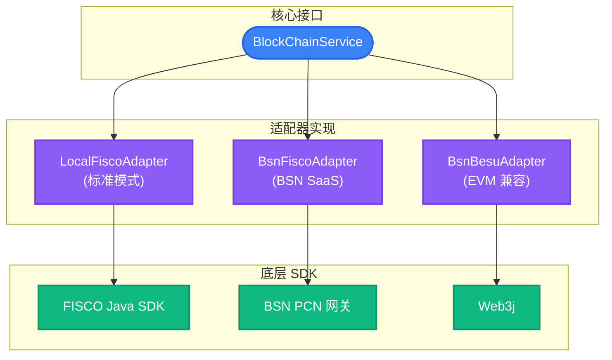
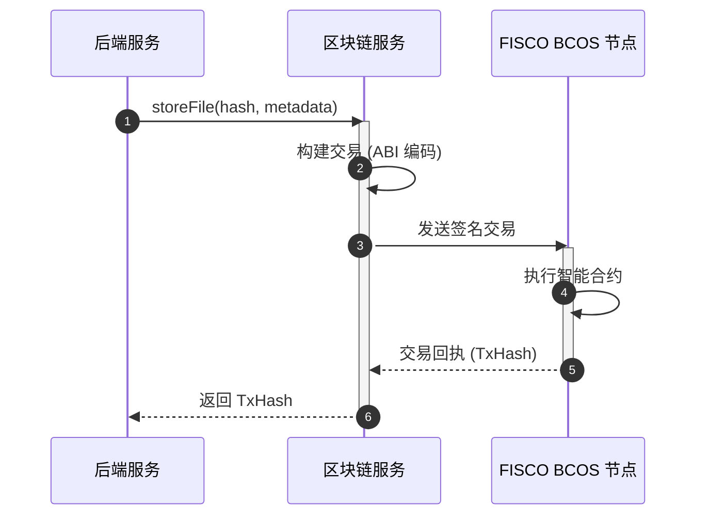

# 区块链集成

RecordPlatform 使用 FISCO BCOS 区块链实现不可篡改的文件存证。

## 智能合约

### Storage.sol

在链上存储和管理文件元数据。

| 方法         | 参数               | 说明             |
| ------------ | ------------------ | ---------------- |
| `storeFile`  | fileHash, metadata | 存储文件存证     |
| `getFile`    | fileHash           | 查询文件元数据   |
| `deleteFile` | fileHash           | 标记文件删除     |
| `exists`     | fileHash           | 检查文件是否存在 |

### Sharing.sol

管理带访问控制的文件分享。

| 方法                | 参数                                  | 说明                         |
| ------------------- | ------------------------------------- | ---------------------------- |
| `shareFiles`        | uploader, fileHashes[], expireMinutes | 创建分享，返回 6 位分享码    |
| `getSharedFiles`    | shareCode                             | 获取分享文件（校验有效期）   |
| `cancelShare`       | shareCode                             | 取消分享（isValid=false）    |
| `getUserShareCodes` | uploader                              | 获取用户所有分享码           |
| `getShareInfo`      | shareCode                             | 获取分享详情（不校验有效性） |

### 合约事件

| 事件             | 参数                                          | 触发时机   |
| ---------------- | --------------------------------------------- | ---------- |
| `FileShared`     | shareCode, uploader, fileHashes[], expireTime | 创建分享时 |
| `ShareCancelled` | shareCode, uploader                           | 取消分享时 |

## 多链适配器

RecordPlatform 通过适配器模式支持多种区块链网络。

### 支持的链

| 链               | 配置值        | 说明                         |
| ---------------- | ------------- | ---------------------------- |
| 本地 FISCO       | `local-fisco` | 本地 FISCO BCOS 节点（默认） |
| BSN FISCO        | `bsn-fisco`   | 区块链服务网络 FISCO         |
| Hyperledger Besu | `bsn-besu`    | EVM 兼容的 Besu 网络         |

### 配置

```yaml
blockchain:
  active: ${BLOCKCHAIN_ACTIVE:local-fisco}

  # BSN FISCO BCOS（active=bsn-fisco）
  bsn-fisco:
    node-id: <bsn-node-id>
    peers:
      - <peer-address>

  # Hyperledger Besu（active=bsn-besu）
  bsn-besu:
    rpc-url: https://<besu-rpc>
    chain-id: <chain-id>

# 本地 FISCO BCOS（Java SDK）
bcos:
  network:
    peers[0]: ${FISCO_PEER_ADDRESS:127.0.0.1:20200}

# 合约地址（local-fisco 与 bsn 共用）
contract:
  storageAddress: ${FISCO_STORAGE_CONTRACT:}
  sharingAddress: ${FISCO_SHARING_CONTRACT:}
```

### 适配器架构



### BlockChainAdapter 接口

所有适配器实现 `BlockChainAdapter` 接口：

```java
public interface BlockChainAdapter {
    // 文件操作
    Result<StoreFileResponse> storeFile(StoreFileRequest request);
    Result<List<FileVO>> getUserFiles(String uploader);
    Result<FileDetailVO> getFile(String uploader, String fileHash);
    Result<Boolean> deleteFiles(DeleteFilesRequest request);
    
    // 分享操作
    Result<String> shareFiles(ShareFilesRequest request);
    Result<SharingVO> getSharedFiles(String shareCode);
    Result<Boolean> cancelShare(CancelShareRequest request);
    
    // 链状态
    Result<ChainStatusVO> getCurrentBlockChainMessage();
    Result<TransactionVO> getTransactionByHash(String txHash);
}
```

### 适配器选择

适配器选择由 `blockchain.active` 配置控制：

```java
@Configuration
public class BlockChainConfig {
    @Bean
    @ConditionalOnProperty(name = "blockchain.active", havingValue = "local-fisco")
    public BlockChainAdapter localFiscoAdapter() { ... }
    
    @Bean
    @ConditionalOnProperty(name = "blockchain.active", havingValue = "bsn-fisco")
    public BlockChainAdapter bsnFiscoAdapter() { ... }
    
    @Bean
    @ConditionalOnProperty(name = "blockchain.active", havingValue = "bsn-besu")
    public BlockChainAdapter bsnBesuAdapter() { ... }
}
```

## 证书管理

### FISCO BCOS 证书

将证书放置于 `platform-fisco/src/main/resources/conf/`：

```txt
conf/
├── ca.crt        # CA 证书
├── sdk.crt       # SDK 证书
└── sdk.key       # SDK 私钥
```

### BSN 配置

BSN 网络需要额外认证：

- BSN 门户的节点 ID
- BSN 网关的 API 密钥/密码

## 交易流程

### 文件存证



### 交易验证

查询区块链获取存证证明：

```java
// 通过哈希获取交易
TransactionReceipt receipt = fiscoService.getTransactionByHash(txHash);

// 验证文件是否在链上存在
boolean exists = fiscoService.fileExists(fileHash);
```

## 弹性设计

### 熔断器

```yaml
resilience4j:
  circuitbreaker:
    instances:
      blockChainService:
        sliding-window-size: 50
        failure-rate-threshold: 50
        wait-duration-in-open-state: 30s
```

### 重试策略

```yaml
resilience4j:
  retry:
    instances:
      blockChainService:
        max-attempts: 3
        wait-duration: 2s
        exponential-backoff-multiplier: 2
```

### 降级行为

当区块链服务不可用时：

1. Saga 标记步骤为 CHAIN_STORING
2. 文件存储继续（降级模式）
3. 后台任务重试存证
4. 存证成功后通知用户

## Gas 和性能

### 优化建议

- 在单个分享交易中批量处理多个文件
- 使用事件进行状态查询（比存储读取更便宜）
- 在 Redis 中缓存频繁访问的链上数据

### 典型 Gas 消耗

| 操作                  | 大约 Gas |
| --------------------- | -------- |
| storeFile             | ~50,000  |
| shareFiles (5 个文件) | ~100,000 |
| cancelShare           | ~30,000  |
