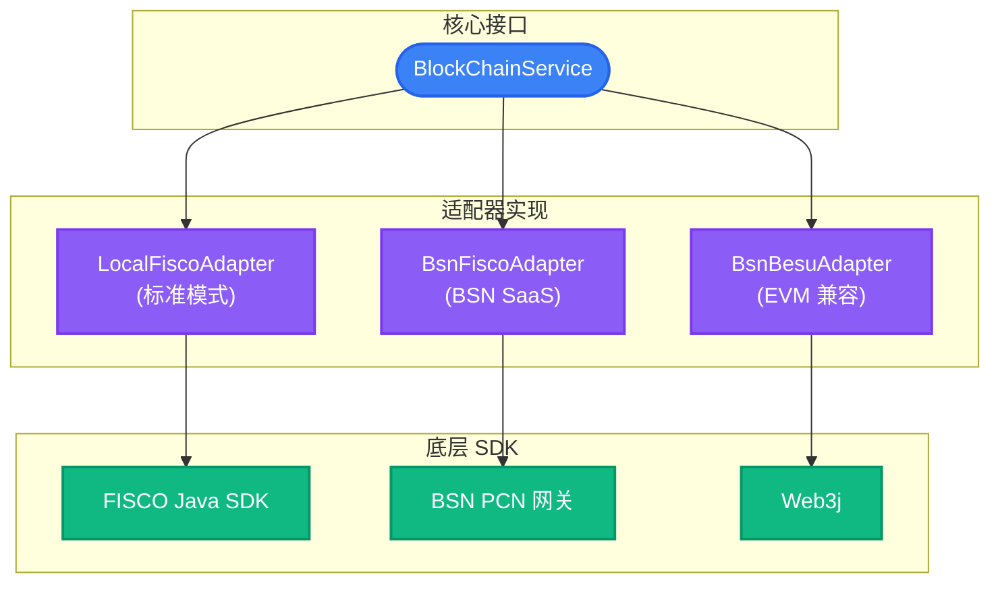
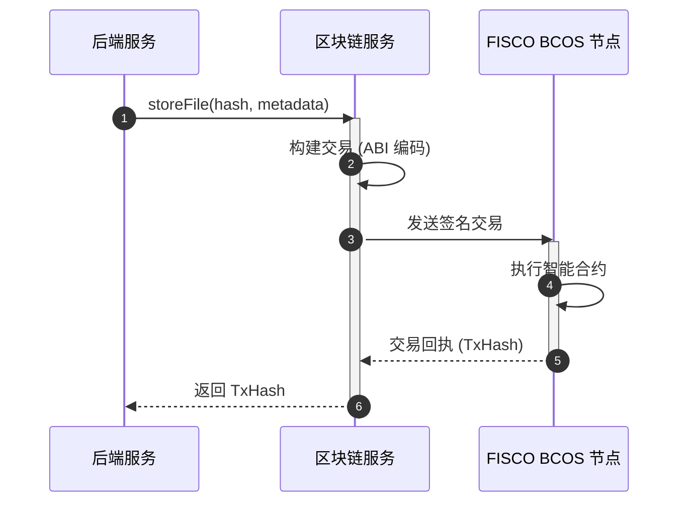

# 区块链集成

RecordPlatform 使用 FISCO BCOS 区块链实现不可篡改的文件存证。

## 智能合约

### Storage.sol

在链上存储和管理文件元数据。

| 方法         | 参数               | 说明             |
| ------------ | ------------------ | ---------------- |
| `storeFile`  | fileHash, metadata | 存储文件存证     |
| `getFile`    | fileHash           | 查询文件元数据   |
| `deleteFile` | fileHash           | 标记文件删除     |
| `exists`     | fileHash           | 检查文件是否存在 |

### Sharing.sol

管理带访问控制的文件分享。

| 方法                | 参数                                  | 说明                         |
| ------------------- | ------------------------------------- | ---------------------------- |
| `shareFiles`        | uploader, fileHashes[], expireMinutes | 创建分享，返回 6 位分享码    |
| `getSharedFiles`    | shareCode                             | 获取分享文件（校验有效期）   |
| `cancelShare`       | shareCode                             | 取消分享（isValid=false）    |
| `getUserShareCodes` | uploader                              | 获取用户所有分享码           |
| `getShareInfo`      | shareCode                             | 获取分享详情（不校验有效性） |

### 合约事件

| 事件             | 参数                                          | 触发时机   |
| ---------------- | --------------------------------------------- | ---------- |
| `FileShared`     | shareCode, uploader, fileHashes[], expireTime | 创建分享时 |
| `ShareCancelled` | shareCode, uploader                           | 取消分享时 |

## 多链适配器

RecordPlatform 通过适配器模式支持多种区块链网络。

### 支持的链

| 链               | 配置值        | 说明                         |
| ---------------- | ------------- | ---------------------------- |
| 本地 FISCO       | `local-fisco` | 本地 FISCO BCOS 节点（默认） |
| BSN FISCO        | `bsn-fisco`   | 区块链服务网络 FISCO         |
| Hyperledger Besu | `bsn-besu`    | EVM 兼容的 Besu 网络         |

### 配置

```yaml
blockchain:
  active: ${BLOCKCHAIN_ACTIVE:local-fisco}

  # BSN FISCO BCOS（active=bsn-fisco）
  bsn-fisco:
    node-id: <bsn-node-id>
    chain-id: ${BSN_FISCO_CHAIN_ID:} # active=bsn-fisco 时必填
    peers:
      - <peer-address>

  # Hyperledger Besu（active=bsn-besu）
  bsn-besu:
    rpc-url: https://<besu-rpc>
    chain-id: <chain-id>

# 本地 FISCO BCOS（Java SDK）
bcos:
  network:
    peers[0]: ${FISCO_PEER_ADDRESS:127.0.0.1:20200}

system:
  chainId: ${FISCO_CHAIN_ID:chain0}
  groupId: ${FISCO_GROUP_ID:group0}

# 合约地址（local-fisco 与 bsn 共用）
contract:
  storageAddress: ${FISCO_STORAGE_CONTRACT:}
  sharingAddress: ${FISCO_SHARING_CONTRACT:}

contract-registry:
  catalog-location: classpath:contract-registry/artifacts.json
  deployment:
    sharing:
      transaction-hash: ${FISCO_SHARING_DEPLOYMENT_TX:}
      block-number: ${FISCO_SHARING_DEPLOYMENT_BLOCK:}
      effective-at: ${FISCO_SHARING_DEPLOYMENT_EFFECTIVE_AT:}
    storage:
      transaction-hash: ${FISCO_STORAGE_DEPLOYMENT_TX:}
      block-number: ${FISCO_STORAGE_DEPLOYMENT_BLOCK:}
      effective-at: ${FISCO_STORAGE_DEPLOYMENT_EFFECTIVE_AT:}
```

## 合约 Registry 与制品指纹

`platform-fisco/src/main/resources/contract-registry/artifacts.json` 是 `Sharing`、`Storage` 构建制品的版本控制事实源。每个条目记录语义版本、生命周期状态、生效时间、升级策略、两份 Solidity 源码、canonical ABI 指纹，以及 ECC/SM creation 与 deployed runtime bytecode 指纹。

支持的生命周期状态如下：

| 状态 | 新链写入 | 历史证据 |
| ---- | -------- | -------- |
| `ACTIVE` | 每个必需合约恰好存在一个条目时允许 | 固化在 batch 快照中 |
| `DEPRECATED` | 不再用于新写入 | 必须保留 catalog 条目和已有 proof 快照 |
| `REVOKED` | 禁止使用 | proof 快照携带该状态时，导出和校验均拒绝 |

ABI 使用 `ABI-CANONICAL-JSON-SHA256-V1`：移除 `internalType`，排序 object key 和顶层 ABI entry，保留参数/component 数组顺序，输出紧凑 UTF-8 JSON 后计算 SHA-256。Bytecode 使用 `EVM-BYTECODE-SHA256-V1`，先把可选 `0x` 前缀的十六进制解码为 bytes 再计算哈希。Creation bytecode 与链上 runtime code 是不同的 EVM 制品，分别记录，禁止把二者错误地直接比较。

`ContractRegistryService` 启动时执行 fail-closed 校验，以下条件必须全部成立：

1. catalog schema 以及签入源码、ABI、ECC/SM creation/runtime 指纹全部有效；
2. `Sharing`、`Storage` 各自恰好存在一个 `ACTIVE` artifact；
3. active adapter 返回的真实 chain ID 和 FISCO group 与配置一致；
4. 从 active chain 自己的配置命名空间选出的地址是非零 20-byte 地址；
5. 每个合约都完整配置交易哈希、区块号和实际激活时间，legacy 空证据或部分证据均被拒绝；
6. 活动链客户端从显式成功的部署回执（FISCO 状态 `0`、Besu 状态 `1`）返回相同交易哈希、配置合约地址和区块号；
7. 节点在该地址返回的完整 runtime code 指纹与实际链/crypto 变体的签入 runtime 制品一致，且 `contractIdentity()` 与选中 catalog 名称/版本完全一致。

最终的 `record-platform-contract-registry-entry.v1` 指纹绑定 chain type/ID/group、地址、语义版本、ABI/creation-bytecode hash、观测到的 runtime-code hash、部署证据、状态、生效时间和升级策略。Catalog `effectiveAt` 表示 artifact 生命周期最早时间；必填的 `FISCO_*_DEPLOYMENT_EFFECTIVE_AT` 表示实际 active-chain 时间。回执查询复用已经核验 chain/group 身份的活动客户端，因此配置三元组不能从另一个链命名空间取得证明。回执缺失、JSON-RPC 错误、失败或未知状态、交易/地址/区块不一致、重复地址或重复部署交易都会阻止发布不可变 registry map。`SharingService`、`StorageService` 与 Besu adapter 只使用 registry 解析出的地址。Registry 查询以及 batch store/query RPC 继续由 backend-to-FISCO 共享令牌保护。

本地 FISCO 部署脚本在编译前和每笔链写前通过官方 Console `getGroupInfo` 查询唯一的 chain/group/crypto/VM 元组，要求与 `FISCO_CHAIN_ID`/`FISCO_GROUP_ID` 及 EVM 目标完全一致。脚本固定使用 FISCO solc `0.8.11+commit.6b4cc280`、EVM London、optimizer disabled、metadata IPFS，并分别使用 keccak256/sm3 编译器重建 ECC/SM creation/runtime；所有产物都必须与签入 artifact 等价。每条 deploy 命令完成后，脚本在同一个 Console 会话中执行 `getGroupInfo` 和 `getTransactionReceipt`，只接受一份显式状态 `0` 的结构化回执，并把其中交易哈希、合约地址与唯一部署输出交叉核对；最终 tx/address/block 全部来自该回执。随后先用 `getCode` 按节点实际 crypto 变体严格核验完整 runtime bytes，再执行从 catalog 派生的 `contractIdentity()`。链上验证成功后只生成一次 UTC 生效时间，先原子发布不含凭据、`chainType=LOCAL_FISCO` 且每个合约含 `receiptStatus=SUCCESS` 的 `record-platform-contract-deployment-receipt.v2` 回执，再原子写回两个地址和完整部署三元组。历史 `v1` 文件仍作为旧审计记录保留，但不能绕过启动 RPC 核验。回执缺失/失败/歧义、解析或字段不一致、chain/group/crypto/VM、runtime 或身份不一致、revert 都会阻断激活。Dry-run 不调用 Console，也不写回回执或环境文件。

每个新存证 batch 都会持久化完整的 `Sharing` registry entry。Provider 在查询或写入前再次校验同一条目，重试不得跨越不同 registry fingerprint。Proof 导出读取该不可变快照，而不是当前环境变量，因此地址或 ABI 变更不能改写历史证据。无法还原历史合约身份的 legacy batch 保持 unresolved，不伪造 registry 元数据。

### 升级、撤销与回滚

合约升级固定采用 `REDEPLOY_ADDRESS`，不假设 proxy 行为。

1. 将经审查的源码、ABI、ECC/SM creation/runtime bytecode、语义版本和指纹加入 catalog。保留旧条目并改为 `DEPRECATED`，禁止删除已被 proof 引用的条目。
2. 先运行 `contract_fingerprint.py verify`，再运行 `scripts/contract-deploy.sh`。Console 必须支持 solc `0.8.11` 并提供 keccak256/sm3 两套官方编译器。脚本部署前验证 chain/group/crypto/VM 和编译制品，把每次部署绑定到一份显式成功回执，部署后验证完整 runtime code 与精确 catalog 身份，发布结构化部署回执，最后原子激活两个地址及其交易/区块/生效时间证据。
3. 重启 `platform-fisco`。新 batch 绑定新的 `ACTIVE` 条目；已被领取的 batch 保持旧 fingerprint，并进入人工处理，禁止静默切换合约。
4. 只有确认发生安全或完整性事件时才使用 `REVOKED`。状态变更必须经过 catalog 代码审查；不得修改已持久化 batch 快照来伪造不同的历史状态。

应用回滚时，先关闭生产批次创建，把上一版本已审查的 catalog/制品集合、两个地址和两组完整交易/区块/生效时间三元组作为一个整体恢复，再重启 `platform-fisco`。启动过程必须能从当前配置链重新读取两份成功回执才接受回滚；任一历史回执无法证明时应保持服务停止并重新部署，禁止伪造三元组或放宽启动门禁。必须保留全部部署回执、`V1.13.0` 迁移和全部快照；删除列、删除旧 catalog 条目/回执或改写快照都会破坏审计证据。

### 适配器架构


```mermaid
flowchart TB
    %% Styles %%
    classDef interface fill:#3b82f6,stroke:#2563eb,stroke-width:2px,color:#ffffff
    classDef adapter fill:#8b5cf6,stroke:#7c3aed,stroke-width:2px,color:#ffffff
    classDef sdk fill:#10b981,stroke:#059669,stroke-width:2px,color:#ffffff

    subgraph API["核心接口"]
        Interface([BlockChainService]):::interface
    end

    subgraph Impls["适配器实现"]
        LocalAdapter["LocalFiscoAdapter<br/>(标准模式)"]:::adapter
        BsnAdapter["BsnFiscoAdapter<br/>(BSN SaaS)"]:::adapter
        BesuAdapter["BsnBesuAdapter<br/>(EVM 兼容)"]:::adapter
    end

    subgraph SDKs["底层 SDK"]
        FiscoSDK["FISCO Java SDK"]:::sdk
        BsnSDK["BSN PCN 网关"]:::sdk
        Web3j["Web3j"]:::sdk
    end

    Interface --> LocalAdapter
    Interface --> BsnAdapter
    Interface --> BesuAdapter

    LocalAdapter --> FiscoSDK
    BsnAdapter --> BsnSDK
    BesuAdapter --> Web3j
```

### BlockChainAdapter 接口

所有适配器实现 `BlockChainAdapter` 接口：

```java
public interface BlockChainAdapter {
    // 文件操作
    Result<StoreFileResponse> storeFile(StoreFileRequest request);
    Result<List<FileVO>> getUserFiles(String uploader);
    Result<FileDetailVO> getFile(String uploader, String fileHash);
    Result<Boolean> deleteFiles(DeleteFilesRequest request);
    
    // 分享操作
    Result<String> shareFiles(ShareFilesRequest request);
    Result<SharingVO> getSharedFiles(String shareCode);
    Result<Boolean> cancelShare(CancelShareRequest request);
    
    // 链状态
    Result<ChainStatusVO> getCurrentBlockChainMessage();
    Result<TransactionVO> getTransactionByHash(String txHash);
}
```

### 适配器选择

适配器选择由 `blockchain.active` 配置控制：

```java
@Configuration
public class BlockChainConfig {
    @Bean
    @ConditionalOnProperty(name = "blockchain.active", havingValue = "local-fisco")
    public BlockChainAdapter localFiscoAdapter() { ... }
    
    @Bean
    @ConditionalOnProperty(name = "blockchain.active", havingValue = "bsn-fisco")
    public BlockChainAdapter bsnFiscoAdapter() { ... }
    
    @Bean
    @ConditionalOnProperty(name = "blockchain.active", havingValue = "bsn-besu")
    public BlockChainAdapter bsnBesuAdapter() { ... }
}
```

## 证书管理

### FISCO BCOS 证书

将证书放置于 `platform-fisco/src/main/resources/conf/`：

```txt
conf/
├── ca.crt        # CA 证书
├── sdk.crt       # SDK 证书
└── sdk.key       # SDK 私钥
```

### BSN 配置

BSN 网络需要额外认证：

- BSN 门户的节点 ID
- BSN 网关的 API 密钥/密码

## 交易流程

### 文件存证


```mermaid
sequenceDiagram
    autonumber

    participant Backend as 后端服务
    participant FiscoService as 区块链服务
    participant Chain as FISCO BCOS 节点

    Backend->>FiscoService: storeFile(hash, metadata)
    activate FiscoService
    FiscoService->>FiscoService: 构建交易 (ABI 编码)
    FiscoService->>Chain: 发送签名交易
    activate Chain
    Chain->>Chain: 执行智能合约
    Chain-->>FiscoService: 交易回执 (TxHash)
    deactivate Chain
    FiscoService-->>Backend: 返回 TxHash
    deactivate FiscoService
```

### Merkle 批量存证基础

当前后端已具备 Merkle 批量存证基础，用于导出可独立验证的证明元数据：

1. `AttestationBatchService` 按当前租户加载成功文件记录。
2. `MerkleTreeService` 规范化文件哈希，计算 Merkle root，并为每个叶子保存 proof path。
3. `attestation_batch` 和 `attestation_leaf` 持久化批次根、证明算法、叶子哈希、叶子索引和 proof path JSON。
4. `AttestationBatchPersistenceService` 使用独立短事务创建 batch/leaf，并通过带租约的原子 claim 记录每次提交 attempt。
5. `AttestationBatchService` 在本地事务之外先调用 `getAttestationBatch` 对账；链上不存在时才通过独立的 `storeAttestationBatch` RPC 和 Sharing 合约方法写入批次根。

批次根上链与普通单文件存证分离，不创建 `Storage.storeFile` 文件记录，因此不会被用户文件列表的合约读取当作普通文件返回。

批次链写状态采用 `CHAIN_PENDING → CHAIN_SUBMITTING → COMPLETED/CHAIN_RETRY/MANUAL_REVIEW`。同租户内由规范化文件集合生成稳定幂等键；`claim_token` 和租约保证同一时刻只有一个有效提交者，所有完成/重试更新必须匹配当前 token。透明 RPC 自动重试不用于 batch 写接口，避免超时后盲目重复交易。

发生超时或响应丢失时，编排器按 `(tenantId, batchId)` 再次查询 Sharing 合约：

- 链上记录与本地 batch 完全一致时确认 `COMPLETED`；通过查询恢复时允许交易哈希为空，并记录 `confirmation_source`；
- 链上不存在或查询暂时失败时按 5 秒、30 秒、120 秒、600 秒、3600 秒退避，最多自动尝试 5 次；
- 链上业务键存在但 Merkle root、批次编号、算法或叶子数量不一致，或重试耗尽时进入 `MANUAL_REVIEW`；
- 非 `COMPLETED` batch 仍由 proof 导出路径拒绝，因此未知链写结果不会暴露伪成功证明。

`attestation_batch_attempt` 保存领取序号、token、确认来源、交易/root、错误和最终结果，用于审计、告警和人工恢复。旧 batch 通过前向迁移获得 `legacy:<batch-id>` 幂等键，原有 `COMPLETED` proof 合同保持兼容。

### 生产批次准入与 Flush

生产批次创建为显式启用能力，默认关闭。候选发现读取持久化事实源，不依赖更早发生的 `file.stored` Outbox 事件：只有文件状态为 `SUCCESS`，且存在唯一一个与当前文件版本匹配的 active chunk manifest 时，文件才具备准入资格。

进入 Merkle tree 的证据是 canonical `manifest_hash`。`file.file_hash` 仍是历史单文件链记录 ID，禁止替代 manifest 或内容证据。每个生产叶子分别保存 `file_version`、`manifest_id`、`evidence_type=MANIFEST_HASH`、`evidence_hash` 和独立的 `chain_record_id`；历史叶子通过前向迁移标记为 `LEGACY_CHAIN_RECORD_ID`。

`attestation_batch_candidate` 提供持久化、租户隔离的准入账本：

- `(tenant_id, file_id, file_version)` 唯一，确保并发发现不会重复准入同一文件版本；
- candidate 按 `READY → CLAIMED → BATCHED` 迁移，达到有界失败次数后进入 `DEAD_LETTER`；
- 领取使用 token、租约和 `FOR UPDATE SKIP LOCKED`，worker 重启后可恢复过期 claim；
- batch、全部 leaf 和 candidate 的 `BATCHED` 转换在同一独立事务内提交；
- 该事务提交后，才复用既有链写状态机提交或对账 batch。

自动 flush 同时支持数量阈值和最大等待时间。租户管理员可强制 flush 低于阈值的 backlog，但自动与人工路径都受 seed、batch 大小和单轮批次数上限约束。定时任务使用分布式锁，显式枚举租户，并在逐租户隔离执行后恢复租户上下文。

`proof-bundle.v1.1` JSON 导出器保留用于兼容旧集成，但仍会拒绝 `MANIFEST_HASH` 生产叶子。该 legacy 合同把文件摘要作为 Merkle 证据，无法安全表达 manifest 证据，因此不能通过字段回退伪造兼容结果。

### 证明包导出

规范导出入口是两个签名 ZIP 路由：

- `GET /api/v1/files/{id}/proof-bundle.zip`：按文件外部 ID 导出；
- `GET /api/v1/files/attestation-leaves/{leafId}/proof-bundle.zip`：按存证叶子外部 ID 导出。

旧的两个无 `.zip` 路由继续返回未签名 `proof-bundle.v1.1` JSON，但已弃用：

- `GET /api/v1/files/{id}/proof-bundle`：按文件外部 ID 导出。
- `GET /api/v1/files/attestation-leaves/{leafId}/proof-bundle`：按存证叶子外部 ID 导出。

`SignedProofArchiveService` 在签发和每次重导出前都会重新校验：当前租户与 owner/admin 权限、文件为成功版本、结构化 `contentHash` 与受保护上传来源一致、active chunk manifest 的 canonical hash、每个分片的 storage HEAD、`MANIFEST_HASH` leaf/path/root、已完成 batch 回执，以及批次绑定的不可变 contract registry。历史记录缺少可信 `contentHash` 时直接失败，不允许使用 `chainRecordId` 或 manifest hash 回填。

完成批次的信任边界还会校验确认来源：`CHAIN_WRITE` 必须携带合法 32-byte 交易哈希，两种链查询恢复来源必须不带交易哈希，32-byte 链根必须等于持久化 Merkle 根。导出放大由共享的用户级路由限流桶、单实例 8 并发 bulkhead、每份证明 128 分片上限和 60 秒 storage HEAD 总预算共同约束；bulkhead 饱和或依赖超时保持可重试，且不会修改证明生命周期状态。

ZIP 只允许以下八个根条目，并固定顺序、时间戳、STORED method、CRC 和大小：

1. `manifest.json`
2. `file.hash`
3. `chunk-manifest.json`
4. `merkle-proof.json`
5. `blockchain-receipt.json`
6. `issuer-signature.jws`
7. `verification-policy.json`
8. `README.verify.md`

每个条目最大 1 MiB，逻辑 payload 总和最大 4 MiB。额外条目、嵌套路径、绝对路径、`..` 和大小超限都会失败关闭。六个证据条目先使用 canonical bytes 计算 SHA-256 与长度，再写入 `manifest.json`；`issuer-signature.jws` 是 decoded payload 必须逐字节等于 manifest 的 compact JWS `EdDSA`。manifest 不递归摘要自身或 JWS，从而避免循环引用。

签名 schema ID 固定为 `record-platform-proof-manifest.v2`、`record-platform-proof-chunk-manifest.v2`、`record-platform-proof-merkle.v2`、`record-platform-proof-chain-receipt.v2` 和 `record-platform-proof-verification-policy.v2`。Canonical JSON 按字母排序 object key，并省略值为 null 的可选字段。Policy 内嵌确认来源/hash 的精确模式、registry 允许值与指纹字段顺序、生命周期边界以及 ZIP/文本规则。`file.hash` 使用 UTF-8，compact JWS 使用 ASCII，二者都以且仅以一个 LF 字节结尾。完整字段合同冻结在 API 文档中，并由签名证据 `verification-policy.json`/`README.verify.md` 重复携带。

证据语义显式拆分：`contentHash`/`file.hash` 是原文件完整字节的 SHA-256；`chainRecordId` 是历史单文件链记录标识；`manifestHash` 是 active chunk manifest 的 canonical 摘要；`cipherHash` 是单个存储密文对象摘要；`merkleRoot`/`batchChainRoot` 是批次上链根；`abiFingerprint` 来自不可变合约注册表。任何字段互换都会在导出校验中失败。

签发使用独立 Ed25519 配置，不复用 JWT、文件信封或 RPC secret。全局 `proof_signing_key` 表用 `(key_id, key_version)` 唯一约束把一个公开标识永久绑定到同一 SPKI/指纹；并发首次注册通过唯一键回读确认。`proof_bundle_issuance` 保存不可变 manifest/JWS/key/`issuedStatus` 快照和独立的当前状态。重复导出会重验事实源并用历史 JWS 重建相同 ZIP，禁止静默重签。

当前状态可为 `ACTIVE`、`REVOKED`、`SUPERSEDED` 或 `INVALID`。只有新版本真正完成上传后，旧版本的 `ACTIVE` proof 才会变为 `SUPERSEDED`；PREPARE/FAIL 不触发该不可逆转换。`INVALID` 是终态，只能在已持久化 canonical manifest、compact JWS、签名 key 身份或不可变签发快照发生确定性漂移时写入，固定原因为 `immutable_snapshot_validation_failed`；storage HEAD、Merkle、registry、batch receipt 或其他依赖/读取失败只拒绝本次导出，不改变生命周期。租户内 owner 或管理员可通过 `POST /api/v1/files/attestation-leaves/{leafId}/proof-status/revoke` 幂等撤销；`REVOKED`、`INVALID` 不能恢复或再次撤销。公开状态和历史公钥分别由 `/api/v1/public/proofs/{proofId}/status` 与 `/api/v1/public/proof-keys/{keyId}/versions/{keyVersion}` 提供，不需要 JWT/租户头，也不暴露租户、内部文件/叶子 ID 或私钥；`statusVersion` 序列化为十进制 JSON 字符串。验证方必须查询 manifest 中的 `statusLocation`；签名 `issuedStatus` 只允许 `ACTIVE/SUPERSEDED`，不能当作当前状态。

证明包不包含原始文件字节、解密密钥、RPC token、数据库内部 ID、签名私钥或完整 `file_param`。

### 公开签名 ZIP 验证器

`platform-verifier` 是已经交付的签名 ZIP v2 公开验证器，包含可复用 SDK（`DefaultProofVerifier`）、可执行 CLI 和 Web 验证器。它在显式资源上限内流式读取原文件，并校验固定 ZIP 合同、canonical JSON 与条目摘要、原文件/分片哈希、Merkle 路径、回执与不可变 registry 快照、Ed25519 JWS、当前证明状态和实时链上 root。

验证结果分为三类：

| 结果 | 含义 |
| --- | --- |
| `VALID` | 所有本地前置检查通过，JWS 使用显式信任的 Ed25519 公钥验签成功，在线状态为 `ACTIVE`，且实时链身份/root 与签名证据一致。 |
| `INVALID` | 已确定存在结构、内容、签名、状态、registry、回执或实时链不一致。 |
| `INDETERMINATE` | 无法安全解析必需的信任或实时证据，包括离线模式以及 key、状态、链 resolver 不可用。 |

离线校验可以证明本地一致性，但绝不能返回 `VALID`：key/status/chain 缺失或不可用时必须是 `INDETERMINATE`，不能当作成功。CLI 在线模式需要显式开启，并配置可信 issuer/chain 端点与精确 host allowlist；明文 HTTP 和私网地址只允许在本地测试时显式放行。CLI 退出码分别为 `VALID=0`、`INVALID=2`、`INDETERMINATE=3`。

后端 `ProofBundleVerifierImpl` 只是已废弃未签名 JSON `proof-bundle.v1.1` 的兼容读取器，不是签名 ZIP 验证器，其结构校验结果不能提升为签名证明真实性。新集成必须使用 `platform-verifier` 和归档内嵌的签名 policy。

### 交易验证

查询区块链获取存证证明：

```java
// 通过哈希获取交易
TransactionReceipt receipt = fiscoService.getTransactionByHash(txHash);

// 验证文件是否在链上存在
boolean exists = fiscoService.fileExists(fileHash);
```

## 弹性设计

### 熔断器

```yaml
resilience4j:
  circuitbreaker:
    instances:
      blockChainService:
        sliding-window-size: 50
        failure-rate-threshold: 50
        wait-duration-in-open-state: 30s
```

### 重试策略

```yaml
resilience4j:
  retry:
    instances:
      blockChainService:
        max-attempts: 3
        wait-duration: 2s
        exponential-backoff-multiplier: 2
```

### 降级行为

当区块链服务不可用时：

1. Saga 标记步骤为 CHAIN_STORING
2. 文件存储继续（降级模式）
3. 后台任务重试存证
4. 存证成功后通知用户

## Gas 和性能

### 优化建议

- 在单个分享交易中批量处理多个文件
- 使用事件进行状态查询（比存储读取更便宜）
- 在 Redis 中缓存频繁访问的链上数据

### 典型 Gas 消耗

| 操作                  | 大约 Gas |
| --------------------- | -------- |
| storeFile             | ~50,000  |
| shareFiles (5 个文件) | ~100,000 |
| cancelShare           | ~30,000  |
