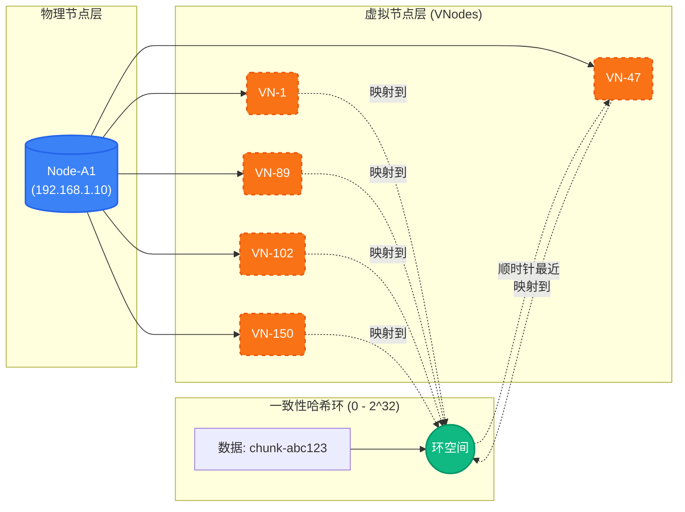
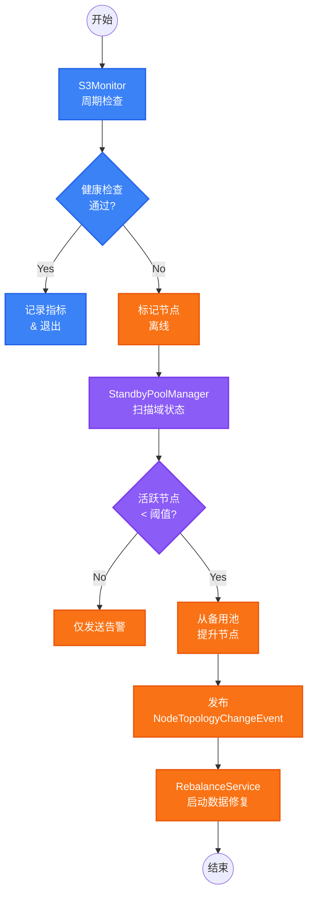

# 分布式存储

RecordPlatform 采用故障域感知的分布式存储架构以实现高可用。

## 故障域架构

### 域类型

系统支持 **N 个活跃域 + 1 个可选备用域** 的灵活配置：

| 域类型     | 说明                                    | 接受写入 | 用途         |
| ---------- | --------------------------------------- | -------- | ------------ |
| **活跃域** | 通过 `active-domains` 配置，支持 1~N 个 | 是       | 数据写入目标 |
| **备用域** | 通过 `standby-domain` 配置（可选）      | 否       | 热备节点池   |

### 部署模式

| 模式         | 活跃域数 | 副本因子 | 适用场景   |
| ------------ | -------- | -------- | ---------- |
| **单域模式** | 1        | 1        | 开发环境   |
| **双域模式** | 2        | 2        | 标准生产   |
| **多域模式** | 3+       | 可配置   | 高可用生产 |

### 工作原理

- 每个文件分片写入 **N 个活跃域**（每域一份）
- 副本因子默认等于活跃域数量，可通过 `storage.replication.factor` 调整
- **N-1 域容错**：任意 N-1 个域故障时系统仍可用
- 活跃域性能下降时，备用域节点自动提升

## 一致性哈希

### 虚拟节点机制



### 配置项

| 属性                  | 默认值     | 说明                         |
| --------------------- | ---------- | ---------------------------- |
| `virtualNodesPerNode` | 150        | 每个物理节点的虚拟节点数     |
| `replication.factor`  | 活跃域数量 | 总副本数（不超过活跃域数量） |
| `weight`              | 100        | 节点权重（影响虚拟节点数）   |

### 优势

- **均匀分布**：虚拟节点使数据分布均匀
- **最小迁移**：增删节点仅影响 ~1/N 的数据
- **加权分配**：权重越高 = 虚拟节点越多 = 数据越多

## 自动故障转移

### 故障转移流程



### 事件类型

| 事件                  | 触发条件     | 操作         |
| --------------------- | ------------ | ------------ |
| `NODE_ONLINE`         | 健康检查通过 | 更新状态     |
| `NODE_OFFLINE`        | 健康检查失败 | 触发故障转移 |
| `NODE_DOMAIN_CHANGED` | 备用节点提升 | 数据再平衡   |

## 数据再平衡

### 再平衡类型

| 类型                  | 触发条件     | 操作                     |
| --------------------- | ------------ | ------------------------ |
| `MIGRATE_FROM_FAILED` | 节点下线     | 从其他活跃域复制到新目标 |
| `COPY_TO_PROMOTED`    | 备用节点提升 | 复制相关数据到新节点     |
| `REBALANCE_TO_NEW`    | 新节点加入   | 重新分布数据             |

### 再平衡过程

```java
// 由 NodeTopologyChangeEvent 触发
@EventListener
public void onNodeTopologyChange(NodeTopologyChangeEvent event) {
    switch (event.getChangeType()) {
        case NODE_OFFLINE:
            migrateFromFailedNode(event.getNodeName());
            break;
        case NODE_DOMAIN_CHANGED:
            copyToPromotedNode(event.getNodeName());
            break;
    }
}
```

### 限流控制

- 默认：10 对象/秒
- 防止再平衡期间 I/O 饱和
- 可通过 Nacos 配置

### 再平衡配置

```yaml
storage:
  rebalance:
    enabled: true # 是否启用自动再平衡
    rate-limit-per-second: 10 # 每秒最大复制对象数（限流）
    cleanup-source: false # 再平衡后是否删除源数据（默认不删除）
```

### 状态持久化

再平衡状态通过 Redis 持久化，确保：

- 多实例部署时状态同步
- 服务重启后状态可恢复
- 状态 TTL：24 小时

## 副本一致性修复

定期扫描各域，检测并修复跨域副本不一致。

### 修复流程

1. 获取分布式锁（防止多实例并发）
2. 遍历所有活跃域，收集对象列表
3. 两两比较域间对象，找出缺失副本
4. 从健康副本复制到缺失的域

### 一致性配置

```yaml
storage:
  consistency:
    repair:
      enabled: true # 是否启用定时修复
      cron: "0 */15 * * * ?" # Cron 表达式（默认每 15 分钟）
      batch-size: 100 # 每批处理对象数
      lock-timeout-seconds: 600 # 分布式锁超时时间（秒）
```

## 节点配置

### 必需配置

```yaml
storage:
  # 必须配置：活跃域列表（按优先级排序）
  active-domains:
    - domain-a
    - domain-b

  # 可选：外部访问端点（v3.2.0 新增）
  # 用于生成预签名 URL 时替换内部端点地址，解决跨网段（如 VPN）访问问题
  external-endpoint: http://10.1.0.2:9000

  # 可选：备用域（用于故障转移）
  standby-domain: standby

  # 副本策略配置（v3.1.0 新增）
  replication:
    factor: 2                     # 副本数量，默认=活跃域数量
    quorum: auto                  # 仲裁策略: auto|majority|all|具体数字

  # 降级写入配置（v3.1.0 新增）
  degraded-write:
    enabled: true                 # 允许降级写入
    min-replicas: 1               # 降级模式下的最小副本数
    track-for-sync: true          # 记录降级写入以便后续同步
```

### NodeConfig 属性

```yaml
storage:
  nodes:
    - name: node-a1 # 唯一名称（同时作为桶名）
      endpoint: http://s3-a1:9000
      accessKey: ${S3_ACCESS_KEY}
      secretKey: ${S3_SECRET_KEY}
      faultDomain: domain-a # 必须匹配 active-domains 或 standby-domain
      weight: 100 # 影响数据分布
      enabled: true # 是否加入哈希环
      metricsPath: /minio/v2/metrics/node # 健康指标端点
```

### 域配置（可选）

```yaml
storage:
  domains:
    - name: domain-a
      minNodes: 1 # 触发提升的最少健康节点数
      replicaCount: 1 # 该域中每个分片的副本数
      acceptsWrites: true
    - name: domain-b
      minNodes: 1
      replicaCount: 1
      acceptsWrites: true
    - name: standby
      minNodes: 0
      replicaCount: 0
      acceptsWrites: false
```

### 完整配置示例

#### 开发环境（单域模式）

```yaml
storage:
  active-domains:
    - local
  nodes:
    - name: local-minio
      endpoint: http://localhost:9000
      accessKey: minioadmin
      secretKey: minioadmin
      faultDomain: local
```

#### 生产环境（三域 + 备用）

```yaml
storage:
  active-domains:
    - dc-beijing
    - dc-shanghai
    - dc-shenzhen
  standby-domain: standby
  replication:
    factor: 3

  nodes:
    - name: bj-node1
      endpoint: http://s3-bj:9000
      faultDomain: dc-beijing
    - name: sh-node1
      endpoint: http://s3-sh:9000
      faultDomain: dc-shanghai
    - name: sz-node1
      endpoint: http://s3-sz:9000
      faultDomain: dc-shenzhen
    - name: standby-node1
      endpoint: http://s3-standby:9000
      faultDomain: standby
```

## 负载感知读取选择

读取时，系统基于负载评分选择最优节点：

```txt
负载评分 = (磁盘使用率 × 0.4) + (在途请求 × 0.35) + (等待请求 × 0.25)
```

评分越低 = 优先用于读取。

## 监控

### 关键指标

| 指标                       | 说明              |
| -------------------------- | ----------------- |
| `s3_node_online_status`    | 节点在线/离线状态 |
| `s3_node_load_score`       | 计算的负载评分    |
| `s3_node_operations_total` | 操作计数器        |

### 健康检查间隔

- 节点健康检查：30 秒
- 备用节点提升检查：30 秒
- 指标缓存 TTL：60 秒
