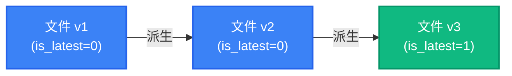
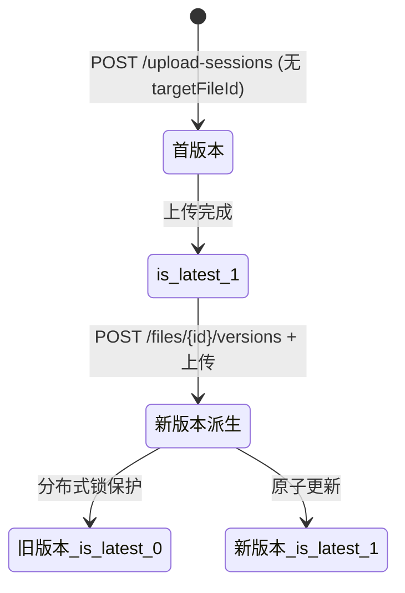

# 文件版本链

RecordPlatform 支持文件版本管理，允许用户从已有文件派生新版本，形成可追溯的版本历史链。

## 概念模型



同一版本链中的文件共享相同的 `version_group_id`，通过 `parent_version_id` 形成链式引用。`is_latest=1` 标记链中最新版本，文件列表默认只展示最新版本。

## 数据模型

版本链相关字段（`file_record` 表）：

| 字段 | 类型 | 说明 |
|------|------|------|
| `version` | INT | 当前版本号（从 1 开始） |
| `parent_version_id` | BIGINT | 父版本文件 ID（首版本为 NULL） |
| `version_group_id` | BIGINT | 版本组 ID（同组文件共享，等于链首文件 ID） |
| `is_latest` | TINYINT | 是否为当前最新版本（1=是，0=否） |

**并发控制**：创建新版本时使用 Redisson 分布式锁（锁 Key = `version-chain:{versionGroupId}`），防止同一版本链并发写入导致数据竞争。

## REST API

### 查询版本历史

```http
GET /api/v1/files/{id}/versions
Authorization: Bearer <token>
```

**响应示例：**

```json
{
  "code": 200,
  "data": [
    { "id": "abc123", "version": 3, "fileName": "report_v3.pdf", "isLatest": true, "createdAt": "2026-03-14T10:00:00Z" },
    { "id": "abc122", "version": 2, "fileName": "report_v2.pdf", "isLatest": false, "createdAt": "2026-03-10T08:00:00Z" },
    { "id": "abc121", "version": 1, "fileName": "report_v1.pdf", "isLatest": false, "createdAt": "2026-03-01T06:00:00Z" }
  ]
}
```

**权限规则**：文件所有者可查询完整版本历史；管理员可查询所有文件的版本历史。

### 创建新版本

```http
POST /api/v1/files/{id}/versions
Authorization: Bearer <token>
```

该接口将目标文件标记为"待续写版本"，前端在上传新文件时携带 `targetFileId` 参数触发版本续写流程。新版本上传完成后：

1. 原版本 `is_latest` 置为 0
2. 新版本继承相同的 `version_group_id`
3. 新版本 `parent_version_id` 指向前一版本
4. 新版本 `is_latest` 置为 1

## 与上传流程的集成

前端在调用 `POST /api/v1/upload-sessions` 时可传入 `targetFileId`，后端据此将新文件自动归入对应版本链：

```http
POST /api/v1/upload-sessions
Content-Type: application/json

{
  "fileName": "report_v4.pdf",
  "fileSize": 1048576,
  "targetFileId": "abc123"
}
```

## 版本链状态机



## 文件列表过滤

默认文件查询（`GET /api/v1/files`）自动过滤 `is_latest=1`，用户只看到每条版本链的最新版本。通过版本历史 API 可查看完整链。

## 数据库迁移

版本链 schema 由 Flyway 迁移 `V1.4.0__file_version_chain.sql` 负责：

- 为现有文件回填 `version=1`、`is_latest=1`、`version_group_id=id`
- 添加索引：`(version_group_id, version)`、`(parent_version_id)`、`is_latest`
