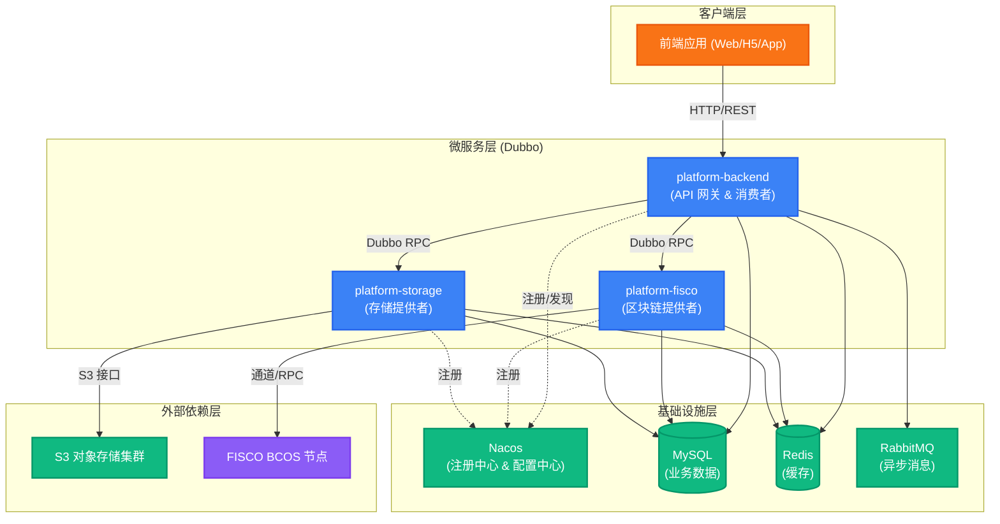
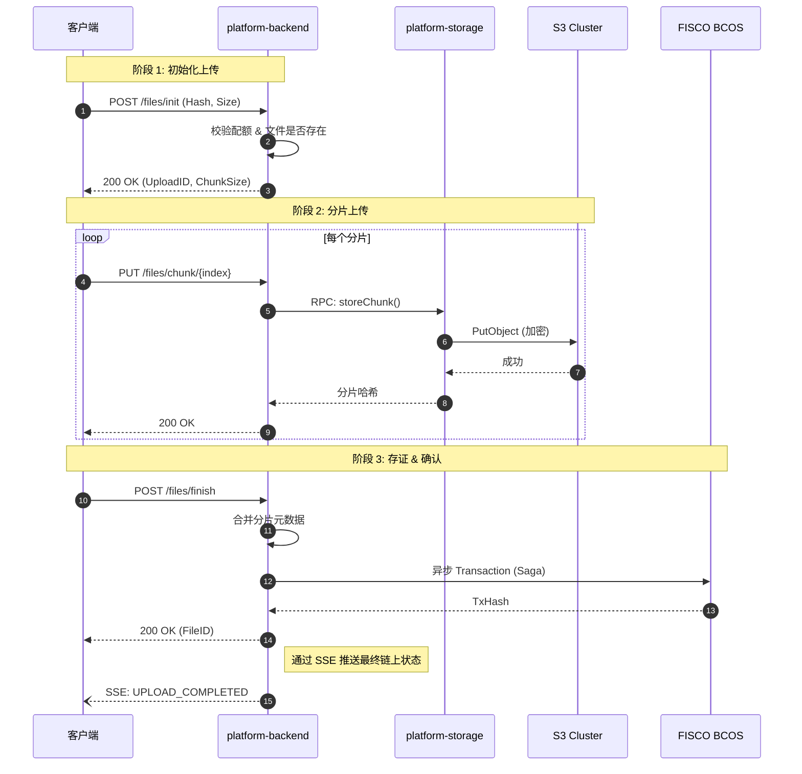
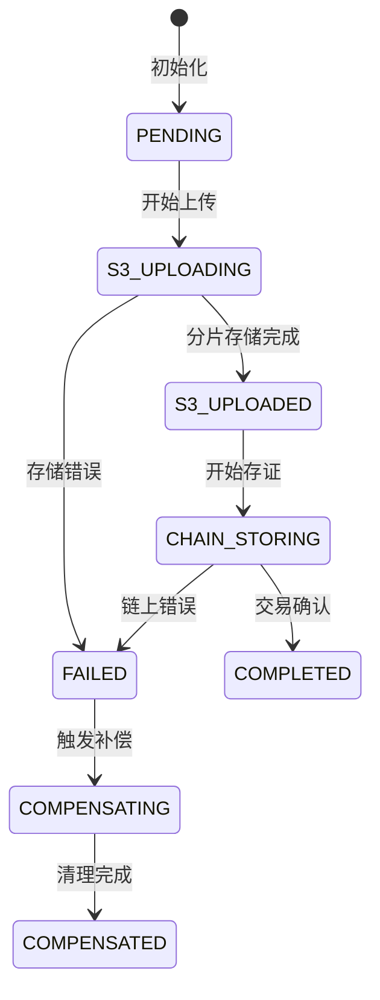
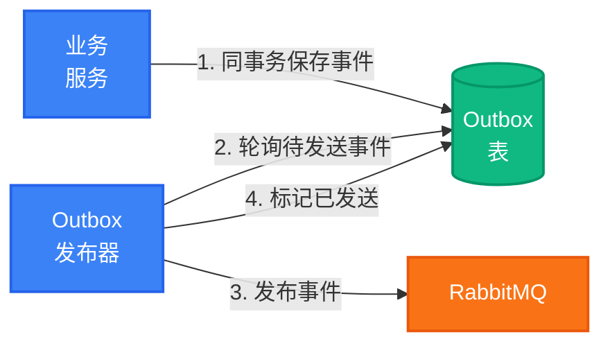
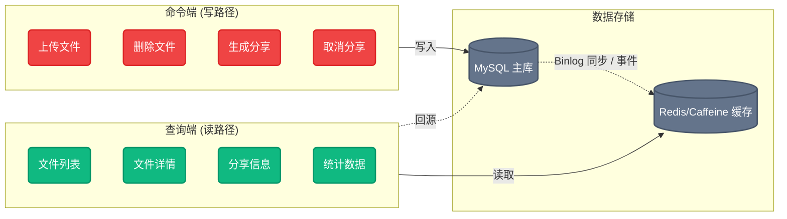
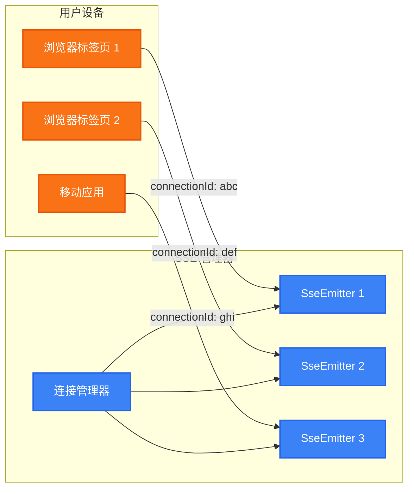

# 系统架构总览

## 架构图



## 模块职责

### platform-api

所有模块依赖的共享 Dubbo 接口定义：

- `FiscoExternalService` - 区块链操作
- `StorageExternalService` - 存储操作
- 公共 DTO 和响应类型

### platform-backend

多模块后端服务（Dubbo Consumer）：

| 子模块              | 职责                                |
| ------------------- | ----------------------------------- |
| **backend-web**     | REST 控制器、JWT 过滤器、限流、CORS |
| **backend-service** | 业务逻辑、Saga 编排、Outbox 发布    |
| **backend-dao**     | MyBatis Plus 映射、实体、VO         |
| **backend-common**  | 工具类、常量、注解                  |

### platform-fisco

区块链集成服务（Dubbo Provider）：

- 智能合约交互（Storage.sol, Sharing.sol）
- 多链适配器（本地 FISCO、BSN FISCO、Besu）
- 证书管理

### platform-storage

分布式存储服务（Dubbo Provider）：

- 多节点 S3 客户端管理
- 故障域管理
- 一致性哈希和再平衡
- 文件加密/解密

## 核心业务流程

### 文件上传存证



### Saga 补偿流程

| 步骤          | 正向操作     | 补偿操作         |
| ------------- | ------------ | ---------------- |
| PENDING       | 初始化       | -                |
| S3_UPLOADING  | 存储分片     | 清理已存储分片   |
| S3_UPLOADED   | 分片存储完成 | 删除 S3 文件     |
| CHAIN_STORING | 区块链存证   | 标记链上记录删除 |
| COMPLETED     | 提交         | -                |

**补偿策略**：指数退避重试（初始 1s，最多 5 次），失败后进入人工处理队列。

### Saga 状态机

`FileSagaOrchestrator` 管理完整的状态机：



## 事务性 Outbox 模式

RecordPlatform 使用 Outbox 模式实现到 RabbitMQ 的可靠事件发布。

### 工作原理



### 组件

| 组件 | 职责 |
|------|------|
| `OutboxService` | 在业务事务中追加事件 |
| `OutboxPublisher` | 后台轮询和发布（30秒间隔）|
| `outbox_event` 表 | 带租户隔离的持久化事件存储 |

### 保证

- **至少一次投递**：事件在消息队列不可用时仍能存活
- **事务一致性**：事件在同一数据库事务中与业务数据一起创建
- **租户感知轮询**：每个租户的事件独立处理

### 配置

```yaml
outbox:
  enabled: true
  poll-interval: 30s
  batch-size: 100
  retention-days: 7  # 7 天后自动清理
```

## CQRS 架构

文件模块采用命令查询职责分离：



### Virtual Thread 异步方法

查询服务使用 Java 21 Virtual Thread 提供异步方法：

- `getUserFilesListAsync()`
- `getFileAddressAsync()`
- `getFileDecryptInfoAsync()`

## 多租户

### 隔离策略

| 层级    | 隔离方式                           |
| ------- | ---------------------------------- |
| 数据库  | `tenant_id` 字段，MyBatis 自动注入 |
| Redis   | Key 前缀 `tenant:{tenantId}:`      |
| S3 存储 | 路径 `/{tenantId}/{userId}/`       |
| Dubbo   | Context 透传 `TenantContext`       |

### 租户上下文控制

`@TenantScope` 注解用于声明式租户隔离：

```java
// 跨租户查询（定时任务）
@TenantScope(ignoreIsolation = true)
@Scheduled(cron = "0 0 3 * * ?")
public void cleanupDeletedFiles() { ... }

// 切换到指定租户
@TenantScope(tenantId = 1)
public void migrateDataForTenant() { ... }
```

## 实时通知（SSE）

服务器推送事件（Server-Sent Events）为连接的客户端提供实时更新。

### 多连接架构

系统支持同一用户的多个同时连接：



### 连接配置

| 参数 | 默认值 | 说明 |
|------|--------|------|
| 每用户最大连接数 | 5 | 超出时关闭最旧连接 |
| 心跳间隔 | 30 秒 | 保活信号 |
| 连接超时 | 30 分钟 | 无活动后自动关闭 |
| 重连延迟 | 1 秒 | 客户端重连退避 |

### 事件类型

| 事件 | 载荷 | 说明 |
|------|------|------|
| `connected` | `{ connectionId }` | 连接确认 |
| `notification` | `{ title, content }` | 通用通知 |
| `message-received` | `{ conversationId, preview }` | 会话新消息 |
| `file-processed` | `{ fileId, status }` | 文件上传/处理完成 |
| `announcement-published` | `{ id, title }` | 系统公告 |
| `ticket-updated` | `{ ticketId, status }` | 工单状态变更 |
| `badge-update` | `{ unreadMessages, tickets }` | UI 徽章数量更新 |

### 前端 Leader 选举

对于多标签页场景，前端使用 `BroadcastChannel` 进行 Leader 选举：

- **Leader 标签页**：维护单一 SSE 连接
- **Follower 标签页**：通过 BroadcastChannel 接收事件
- **故障转移**：Leader 标签页关闭时自动选举新 Leader

这可以防止同一浏览器建立多个 SSE 连接，减少服务器负载。
