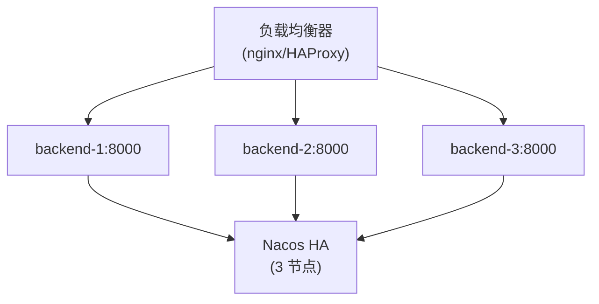

# 生产环境部署

RecordPlatform 生产环境部署最佳实践。

## 部署前检查清单

- [ ] 所有环境变量已配置
- [ ] `JWT_KEY` 具有高熵值（≥32 字符）
- [ ] SSL 证书已安装
- [ ] 数据库备份已配置
- [ ] 监控告警已设置
- [ ] 日志聚合已配置

## 使用部署脚本

RecordPlatform 在 `scripts/` 目录提供现成的脚本。

### 可用脚本

| 脚本 | 用途 |
|------|------|
| `start.sh` | 统一服务管理（start/stop/restart/status）|

### 启动所有服务（生产环境）

```bash
./scripts/start.sh start all --skywalking --profile=prod
```

按正确顺序启动所有服务并挂载 SkyWalking Agent。

### 启动单个服务

```bash
./scripts/start.sh start <service> --skywalking --profile=prod

# 示例
./scripts/start.sh start storage --skywalking --profile=prod
./scripts/start.sh start fisco --skywalking --profile=prod
./scripts/start.sh start backend --skywalking --profile=prod
```

### 停止所有服务

```bash
./scripts/start.sh stop all
```

## 高可用架构

### 推荐架构



### 组件配置建议

| 组件 | 最小 HA | 推荐配置 |
|------|---------|----------|
| backend | 2 实例 | 3+ 实例 |
| storage | 2 实例 | 3+ 实例 |
| fisco | 1 实例 | 2 实例 |
| MySQL | 1 主 + 1 从 | 1 主 + 2 从 + MHA |
| Redis | Sentinel (3 节点) | Cluster (6 节点) |
| S3 存储 | 2 节点 (A/B 域) | 3+ 节点 (A/B/STANDBY) |
| Nacos | 3 节点 | 3 节点 |
| RabbitMQ | 3 节点 (集群) | 3 节点 (镜像) |

### 存储故障域

生产环境建议配置至少 3 个存储节点，分布在 2 个活跃域 + 备用域：

```yaml
storage:
  # 活跃域配置（按优先级排序）
  active-domains:
    - A
    - B
  standby-domain: STANDBY

  # 副本策略
  replication:
    factor: 2              # 副本数量（默认=活跃域数量）
    quorum: auto           # 仲裁策略: auto|majority|all|数字

  # 降级写入（域故障时允许部分写入）
  degraded-write:
    enabled: true
    min-replicas: 1        # 降级模式下的最小副本数
    track-for-sync: true   # 记录以便域恢复后同步

  # 存储节点
  nodes:
    - name: s3-a1
      endpoint: http://s3-node-a1:9000
      accessKey: ${S3_ACCESS_KEY}
      secretKey: ${S3_SECRET_KEY}
      faultDomain: A
      weight: 100
      enabled: true
    - name: s3-b1
      endpoint: http://s3-node-b1:9000
      accessKey: ${S3_ACCESS_KEY}
      secretKey: ${S3_SECRET_KEY}
      faultDomain: B
      weight: 100
      enabled: true
    - name: s3-standby
      endpoint: http://s3-node-standby:9000
      accessKey: ${S3_ACCESS_KEY}
      secretKey: ${S3_SECRET_KEY}
      faultDomain: STANDBY
      weight: 100
      enabled: true

  # 域配置（可选，省略时使用默认值）
  domains:
    - name: A
      minNodes: 1          # 触发备用节点提升的最少健康节点数
      replicaCount: 1
      acceptsWrites: true
    - name: B
      minNodes: 1
      replicaCount: 1
      acceptsWrites: true
    - name: STANDBY
      minNodes: 0
      replicaCount: 0
      acceptsWrites: false
```

> 完整配置项请参阅 [Nacos 配置模板](/nacos-config-template.yaml)

## SSL/TLS 配置

### 生成自签名证书（测试用）

```bash
keytool -genkeypair -alias recordplatform \
  -keyalg RSA -keysize 2048 \
  -storetype PKCS12 \
  -keystore keystore.p12 \
  -validity 365
```

### 配置 SSL

```yaml
server:
  port: 443
  ssl:
    enabled: true
    key-store: classpath:keystore.p12
    key-store-password: ${SERVER_SSL_KEY_STORE_PASSWORD}
    key-store-type: PKCS12

security:
  require-ssl: true
  http-redirect-port: 80
```

## JVM 调优

### 推荐 JVM 参数

```bash
JAVA_OPTS="-Xms2g -Xmx4g \
  -XX:+UseG1GC \
  -XX:MaxGCPauseMillis=200 \
  -XX:+HeapDumpOnOutOfMemoryError \
  -XX:HeapDumpPath=/var/log/recordplatform/ \
  -Djava.security.egd=file:/dev/./urandom"
```

### 各服务配置建议

| 服务 | 最小堆 | 最大堆 | 说明 |
|------|--------|--------|------|
| backend | 2GB | 4GB | 主要工作负载 |
| storage | 1GB | 2GB | I/O 密集 |
| fisco | 512MB | 1GB | 轻量级 |

## 日志管理

### 日志位置

```
/var/log/recordplatform/
├── backend/
│   ├── app.log
│   └── error.log
├── storage/
│   └── app.log
└── fisco/
    └── app.log
```

### 日志轮转

生产环境配置 logrotate：

```
/var/log/recordplatform/*/*.log {
    daily
    rotate 30
    compress
    delaycompress
    missingok
    notifempty
    create 0640 app app
}
```

## 备份策略

### 数据库备份

```bash
# 每日全量备份
mysqldump -h <mysql-host> -u <mysql-user> -p \
  --single-transaction --routines --triggers \
  RecordPlatform > backup_$(date +%Y%m%d).sql

# 压缩
gzip backup_$(date +%Y%m%d).sql
```

### S3 数据同步

启用跨区域复制或定期同步 S3 数据。
