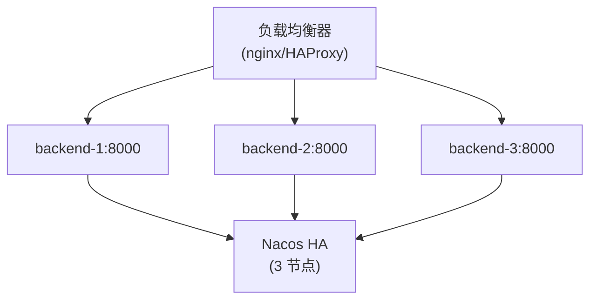

# 生产环境部署

RecordPlatform 生产环境部署最佳实践。

## 部署前检查清单

- [ ] 所有环境变量已配置
- [ ] `JWT_KEY` 具有高熵值（≥32 字符）
- [ ] 显式配置 `FILE_KEY_ENVELOPE_ACTIVE_PROVIDER` 与合同版本
- [ ] Vault 使用 HTTPS 和最小权限 token，或 local 使用独立且至少 32 字符的 master key
- [ ] 信封轮换完成前持续提供历史 provider/key 版本
- [ ] SSL 证书已安装
- [ ] 数据库备份已配置
- [ ] 监控告警已设置
- [ ] 日志聚合已配置

## 使用部署脚本

RecordPlatform 在 `scripts/` 目录提供现成的脚本。

### 可用脚本

| 脚本 | 用途 |
|------|------|
| `start.sh` | 统一服务管理（start/stop/restart/status）|

### 启动所有服务（生产环境）

```bash
./scripts/start.sh start all --skywalking --profile=prod
```

按正确顺序启动所有服务并挂载 SkyWalking Agent。

### 生产密钥包封

`application-prod.yml` 不设置默认 active provider，也不回退 `JWT_KEY`。provider 为空、未知、不可用，Vault 使用 HTTP，或显式选择的 local master key 缺失、过短、与 JWT key 相同时，应用会启动失败。

使用 `vault-transit` 时，通过部署 secret 系统注入 `FILE_KEY_ENVELOPE_VAULT_ADDRESS`、`FILE_KEY_ENVELOPE_VAULT_TOKEN`、`FILE_KEY_ENVELOPE_VAULT_KEY_NAME` 和显式 key 版本。禁止把 token 写入 Git 或 Nacos 明文。token 只需对目标 key 的 encrypt、decrypt、rewrap 路径拥有 `update` 能力。Vault Community 能提供外部集中式 KMS，但不构成 HSM 安全边界；HSM-backed 部署需要 Vault Enterprise PKCS#11 seal wrap 或 Managed Keys 及其运维前置条件。

### 启动单个服务

```bash
./scripts/start.sh start <service> --skywalking --profile=prod

# 示例
./scripts/start.sh start storage --skywalking --profile=prod
./scripts/start.sh start fisco --skywalking --profile=prod
./scripts/start.sh start backend --skywalking --profile=prod
```

### 停止所有服务

```bash
./scripts/start.sh stop all
```

## 高可用架构

### 推荐架构


```mermaid
flowchart TB
    LB["负载均衡器<br/>(nginx/HAProxy)"]

    LB --> B1["backend-1:8000"]
    LB --> B2["backend-2:8000"]
    LB --> B3["backend-3:8000"]

    B1 --> Nacos["Nacos HA<br/>(3 节点)"]
    B2 --> Nacos
    B3 --> Nacos
```

### 组件配置建议

| 组件 | 最小 HA | 推荐配置 |
|------|---------|----------|
| backend | 2 实例 | 3+ 实例 |
| storage | 2 实例 | 3+ 实例 |
| fisco | 每个 signer 1 个 active writer | BSN Besu 同 signer：1 active + 已 fencing 的冷备 |
| MySQL | 1 主 + 1 从 | 1 主 + 2 从 + MHA |
| Redis | Sentinel (3 节点) | Cluster (6 节点) |
| S3 存储 | 2 节点 (A/B 域) | 3+ 节点 (A/B/STANDBY) |
| Nacos | 3 节点 | 3 节点 |
| RabbitMQ | 3 节点 (集群) | 3 节点 (镜像) |

`fisco` 建议必须按链模式理解。`BLOCKCHAIN_ACTIVE=bsn-besu` 且使用同一份本地 signer key 时，一个 `(chainId, signer)` 只允许一个 active writer，并必须使用持久化的 `BSN_BESU_NONCE_STATE_DIRECTORY`。冷备只能在旧 writer 已从外部 fence 且能够使用同一个可靠锁/状态卷后启动。禁止把两个同 signer 实例放在负载均衡后，也禁止有新旧实例重叠的滚动更新。多主机 active-active 必须使用不同 signer，或另行实现分布式 nonce/租约；当前文件锁门禁不支持该拓扑。

### 存储故障域

生产环境建议配置至少 3 个存储节点，分布在 2 个活跃域 + 备用域：

```yaml
storage:
  # 活跃域配置（按优先级排序）
  active-domains:
    - A
    - B
  standby-domain: STANDBY

  # 副本策略
  replication:
    factor: 2              # 副本数量（默认=活跃域数量）
    quorum: auto           # 仲裁策略: auto|majority|all|数字

  # 降级写入（域故障时允许部分写入）
  degraded-write:
    enabled: true
    min-replicas: 1        # 降级模式下的最小副本数
    track-for-sync: true   # 记录以便域恢复后同步

  # 存储节点
  nodes:
    - name: s3-a1
      endpoint: http://s3-node-a1:9000
      accessKey: ${S3_ACCESS_KEY}
      secretKey: ${S3_SECRET_KEY}
      faultDomain: A
      weight: 100
      enabled: true
    - name: s3-b1
      endpoint: http://s3-node-b1:9000
      accessKey: ${S3_ACCESS_KEY}
      secretKey: ${S3_SECRET_KEY}
      faultDomain: B
      weight: 100
      enabled: true
    - name: s3-standby
      endpoint: http://s3-node-standby:9000
      accessKey: ${S3_ACCESS_KEY}
      secretKey: ${S3_SECRET_KEY}
      faultDomain: STANDBY
      weight: 100
      enabled: true

  # 域配置（可选，省略时使用默认值）
  domains:
    - name: A
      minNodes: 1          # 触发备用节点提升的最少健康节点数
      replicaCount: 1
      acceptsWrites: true
    - name: B
      minNodes: 1
      replicaCount: 1
      acceptsWrites: true
    - name: STANDBY
      minNodes: 0
      replicaCount: 0
      acceptsWrites: false
```

> 完整配置项请参阅 [Nacos 配置模板](/nacos-config-template.yaml)

## 公共限流与审计的可信客户端 IP

公共 proof 状态/历史公钥两个端点按规范化可信客户端 IP 共享一个固定 120 次/60 秒 Redis 桶。公开分享 chunks/decrypt 两个端点另行按规范化 IP 共享固定 30 次/60 秒桶。两个桶都不包含租户、端点方法、用户或 JWT 角色。匿名公开分享的系统审计与分享访问审计使用和分享桶相同的 resolver 输出。

### 直连部署

保持 `RATE_LIMIT_TRUSTED_PROXY_CIDRS=` 为空。后端只使用直接 socket peer，并忽略全部转发头。只要生产代理拓扑或 header 清洗行为尚未核验，也必须使用这个安全设置。如果立即 peer 是未配置的反向代理，所有客户端会安全地共享该代理的 proof 120/60 桶和公开分享 30/60 桶，并可能更早被拒绝；生产流量接入前应配置已核验 allowlist，或在边缘实施等效限流。

### 受控反向代理

设置变量前，先记录平台控制的每个立即/多跳代理 IP 或 CIDR，并确认每个代理都会覆盖调用者提供的转发头，或只追加从 socket 得到的 hop。例如：

```dotenv
RATE_LIMIT_TRUSTED_PROXY_CIDRS=10.20.0.0/16,2001:db8:20::/48
```

只有立即 peer 命中 allowlist 时才启用 header 解析。后端只接受一条有界 `X-Forwarded-For` 链，从右向左跳过已配置的可信 hop，并选择第一个不可信数字地址。仅在 XFF 缺失时使用单值 `X-Real-IP`；非法、重复、超长或超 hop header 都回退立即 peer。不支持 `Forwarded`、hostname、端口或 DNS 查询。

`server.forward-headers-strategy` 固定为 `none`，避免 Spring/Tomcat 在 resolver 前改写 `request.getRemoteAddr()`。应用还会拒绝 `server.tomcat.remoteip.remote-ip-header` 和 `server.tomcat.remoteip.protocol-header`，因为任一属性都可能独立安装 `RemoteIpValve`。不得配置会改写 remote address 的 `ForwardedHeaderFilter`、外部 `RemoteIpValve`、ingress sidecar 或 servlet-container 等价能力。由于框架不会推导转发后的 scheme/host，代理 TLS 终止以及绝对 URL/scheme 必须独立配置和验证；不能为解决这些问题重新启用转发头处理。

### 生产验证与回滚

生产发布前，先交替请求两个公共 proof 端点：同一客户端第 1–120 次必须成功，第 121 次必须拒绝，第二个客户端必须使用独立桶，Redis TTL 不超过 60 秒。proof namespace 为 `rate:limit:public:proof-verification:v2:ip:<canonical-ip>`。

为非 system tenant 创建公开分享，分别用无 `X-Tenant-ID`、`0`、其他租户和畸形值调用四条精确匿名 `GET`；所有 header 变体必须得到相同的合法结果。同时确认匿名分享写入和登录态分享下载/解密在没有 Bearer 时仍被拒绝。用同一规范化客户端交替调用公开 chunks 与 decrypt-info：合计第 1–30 次必须成功，第 31 次保持当前 HTTP 200 并返回业务码 `70005`；第二个客户端必须使用独立桶。第一个客户端在 Redis 中只能产生 `rate:limit:public:share-access:v2:ip:<canonical-ip>`，TTL 不超过 60 秒；修改租户头或不可信转发头不得产生额外 key。配置可信代理时，用合法代理链重复验证，并确认使用预期的规范化客户端地址。

放量前查询审计结果：匿名 `sys_operation_log.tenant_id` 必须为 `0`，`share_access_log.tenant_id` 必须为解析出的 owner tenant，两个 IP 字段都必须等于 Redis key 中的规范化 IP。监控限流业务码 `70005`、异常租户归属和公开分享授权失败。

旧计数不会复制，因此发布和回滚都可能重置一次最长 60 秒的窗口。应低峰发布并保留边缘 direct-source 限流（公共 proof 120/60，公开分享 chunks/decrypt 30/60）。公开分享的租户、服务、审计和限流改动必须整组回滚；部分回滚可能破坏非 system tenant 分享，或重新打开跨租户归属问题。回滚前保留边缘 30/60 限流；如果旧租户/审计边界会重新暴露，应临时限制四条匿名分享路由。回滚期间不得删除或改写历史可疑审计行，只做只读评估。

## SSL/TLS 配置

### 生成自签名证书（测试用）

```bash
keytool -genkeypair -alias recordplatform \
  -keyalg RSA -keysize 2048 \
  -storetype PKCS12 \
  -keystore keystore.p12 \
  -validity 365
```

### 配置 SSL

```yaml
server:
  port: 443
  ssl:
    enabled: ${SSL_ENABLED:true}
    key-store: ${SSL_KEY_STORE:classpath:keystore.p12}
    key-store-password: ${SSL_KEY_STORE_PASSWORD}
    key-store-type: ${SSL_KEY_STORE_TYPE:PKCS12}

security:
  require-ssl: ${REQUIRE_SSL:true}
  http-redirect-port: ${HTTP_REDIRECT_PORT:80}
```

## JVM 调优

### 推荐 JVM 参数

```bash
JAVA_OPTS="-Xms2g -Xmx4g \
  -XX:+UseG1GC \
  -XX:MaxGCPauseMillis=200 \
  -XX:+HeapDumpOnOutOfMemoryError \
  -XX:HeapDumpPath=/var/log/recordplatform/ \
  -Djava.security.egd=file:/dev/./urandom"
```

### 各服务配置建议

| 服务 | 最小堆 | 最大堆 | 说明 |
|------|--------|--------|------|
| backend | 2GB | 4GB | 主要工作负载 |
| storage | 1GB | 2GB | I/O 密集 |
| fisco | 512MB | 1GB | 轻量级 |

## 日志管理

### 日志位置

```
/var/log/recordplatform/
├── backend/
│   ├── app.log
│   └── error.log
├── storage/
│   └── app.log
└── fisco/
    └── app.log
```

### 日志轮转

生产环境配置 logrotate：

```
/var/log/recordplatform/*/*.log {
    daily
    rotate 30
    compress
    delaycompress
    missingok
    notifempty
    create 0640 app app
}
```

## 备份策略

### 数据库备份

```bash
# 每日全量备份
mysqldump -h <mysql-host> -u <mysql-user> -p \
  --single-transaction --routines --triggers \
  RecordPlatform > backup_$(date +%Y%m%d).sql

# 压缩
gzip backup_$(date +%Y%m%d).sql
```

### S3 数据同步

启用跨区域复制或定期同步 S3 数据。
